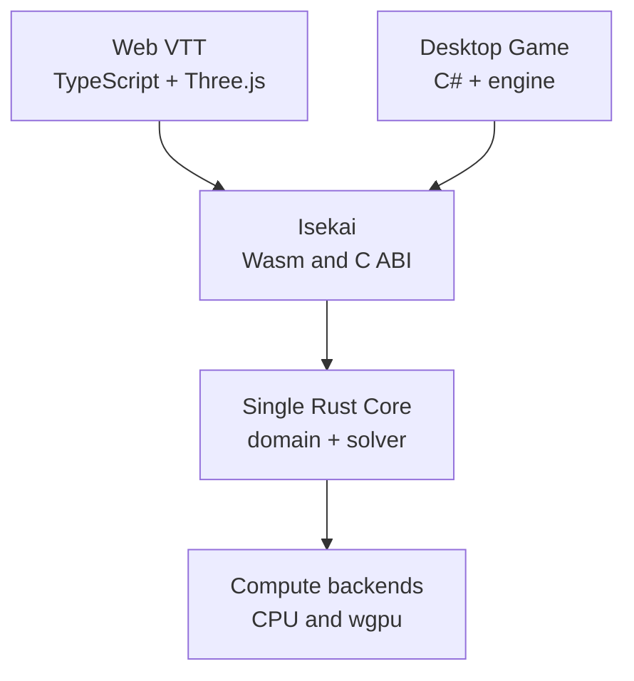

# Grafting Monorepo — Master Source of Architecture and Creation

> **Unified canonical document for product, architecture, creation, and AI Control Plane.**
>
> Version: `1.8.0`
> Original base date: July 23, 2026
> Consolidation date: July 26, 2026
> Last updated: 2026-07-29 — added DEC-049 for package autonomy, external dependency isolation, and authoritative reuse.
> State: `CANONICAL-UNIFIED`
> Next milestone: close the Decision Gates in Section 5 and execute the unified Phase 0 before the definitive scaffold.
>
> Project name: **Grafting Monorepo**
> Interoperability subsystem: **Isekai**
> AI Control Plane: **`.ai/`**
> Operational contract per scope: **`AGENTS.md`**
>

---

## 0. How to use this document

This file is not merely an architecture description. It is simultaneously:

1. the definition of the technical product;
2. the record of architectural decisions already made;
3. the master source for creating and evolving the monorepo;
4. the plan for incremental creation of the repository;
5. the initial backlog with acceptance criteria;
6. the basis for ADRs, runbooks, contracts, and generated documents;
7. the definition of the Knowledge & Automation Plane;
8. the definition of the AI Control Plane for Claude, GPT/Codex, and future providers.

Every human or agent must read this file before proposing or executing structural changes. `AGENTS.md` complements this document with scope-specific operational rules; `.ai/` contains the capabilities and policies of the AI system.

### 0.1 Normative language

The terms below have deliberate meaning:

- **MUST / MUST NOT:** mandatory rule.
- **SHOULD / SHOULD NOT:** recommended standard; exceptions need to be justified.
- **MAY:** locally permitted decision.
- **LOCKED:** closed architectural decision.
- **PROVISIONAL:** initial standard that needs to be validated by a spike.
- **OPEN:** human decision not yet made.

### 0.2 Precedence rule

In case of conflict:

1. the project owner's most recent explicit requirements;
2. the most recently accepted ADR;
3. this master document;
4. versioned contracts and schemas;
5. `AGENTS.md` applicable to the scope;
6. existing code, manifests, and pipelines;
7. `.ai/` for AI Control Plane policies and capabilities;
8. vendor adapters such as `CLAUDE.md`, `.claude/`, `.codex/`, and `.agents/`;
9. generated documentation and visualizations;
10. agent assumptions.

If code contradicts a `LOCKED` decision, the agent MUST NOT assume that the code won. It must report the deviation and request a decision. `.ai/` MUST NOT silently override an operational contract in `AGENTS.md`; vendor adapters MUST NOT contradict either layer.

### 0.3 What an agent cannot do silently

The agent MUST NOT:

- turn an `OPEN` decision into a definitive implementation;
- swap a `LOCKED` technology for its own preference;
- create a second implementation of proprietary logic in TypeScript, C#, or Python;
- expose Rust types directly through FFI;
- call state replication Event Sourcing;
- promise zero-copy between distinct memory domains;
- make a cacheable target execute external effects;
- add a new workspace root or a new lockfile without an ADR;
- introduce containers as a requirement for every local build;
- broadly rewrite files unrelated to the task;
- generate empty future directories just to "complete" the tree;
- create a second durable source of tasks;
- expand permissions, hooks, sandbox, or MCPs without approval;
- enable semantic caching for code, security, incidents, or mutable state;
- promote learning or self-rewriting without evidence, evaluation, and rollback.

---

## 1. Product vision

The repository will house two main products:

1. **Web Virtual Tabletop**

   - TypeScript;
   - Three.js;
   - web interface;
   - engine consumption via WebAssembly;
   - simulation and heavy computation off the main thread.
2. **Native Desktop Game**

   - C#/.NET;
   - graphics engine still to be decided;
   - engine consumption via native library;
   - initial priority support for Windows, with a design compatible with Linux and macOS.

Both products will consume the same proprietary Rust core.

### 1.1 Central objective

Build a logical, mathematical, and optimization engine that:

- is the single source of truth;
- is reusable on Web and Desktop;
- allows future implementation of a proprietary optimization solver;
- runs algorithms on CPU and, when advantageous, on GPU;
- maintains explicit control of memory and lifecycle;
- does not replicate proprietary logic in the hosts;
- can in the future operate locally or on an authoritative server.

### 1.2 What "single core" means

"Single core" means:

- a single mathematical model;
- a single implementation of the business rules;
- a single solver algorithm;
- a single collection of WGSL kernels;
- a single protocol for commands, events, and snapshots;
- thin bindings, without reimplementing behavior;
- interchangeable execution backends behind internal contracts.

"Single core" does not mean:

- a single process;
- a single binary for all systems;
- a single logical GPU device instance;
- a single Rust reference crossing any runtime;
- a single physical representation of memory across CPU, Wasm, Worker, GPU, and network.

### 1.3 Architectural success criteria

The project will be considered well structured when:

- a rule changed in Rust produces the same behavior in both products;
- Web and Desktop do not have copies of the solver;
- an incompatible contract change fails early in the build;
- an incompatible ABI fails at startup, not during gameplay;
- affected tasks are executed in the correct order by Nx;
- each compiler continues to be operated by its native toolchain;
- the cache never masks external effects or artifacts from another platform;
- the absence of WebGPU triggers a controlled CPU fallback;
- the renderer does not need to know the solver's internal implementation;
- the solver does not need to know about Three.js, the C# engine, or transport protocols.

### 1.4 Identity and taxonomy

The project is called **Grafting Monorepo**, inspired by the idea of grafting or connecting parts that originally belong to different places into a coherent system.

Conventions:

| Context                         | Name                  |
| -------------------------------- | --------------------- |
| Human project name           | `Grafting Monorepo` |
| Recommended repository slug | `grafting`          |
| Rust crate prefix           | `grafting-*`        |
| npm package scope            | `@grafting/*`       |
| C# root namespace                | `Grafting.*`        |
| Bridge between runtimes/languages  | `Isekai`            |

**Isekai** is the bounded context that transports data, commands, results, and lifecycles between execution "worlds":

- native Rust ↔ C#/.NET;
- Rust/Wasm ↔ TypeScript;
- Wasm linear memory ↔ TypedArrays;
- native memory ↔ C# spans/views.

The name does not replace technical terminology. Public APIs remain explicit:

```text
engine_submit
engine_job_poll
engine_buffer_release
```

and do not use metaphorical names such as `send_to_another_world`.

Boundaries:

- Isekai contains no business rules;
- Isekai does not implement the solver;
- Isekai has no rendering;
- Isekai is not the multiplayer system;
- Isekai depends on the engine; the engine does not depend on Isekai;
- networking remains in the `replication` and `transport` contexts.

This discipline allows using a memorable identity without harming the technical readability of the code.

Planned components:

| Artifact                     | Responsibility                         |
| ----------------------------- | ----------------------------------------- |
| `grafting-isekai-wasm`     | Rust crate that exposes the core to Wasm   |
| `grafting-isekai-capi`     | Rust crate that exposes the native C ABI     |
| `@grafting/isekai-wasm`    | npm package with Wasm, loader, and types      |
| `@grafting/isekai-web`     | idiomatic TypeScript/Worker client    |
| `Grafting.Isekai.Interop`  | safe C# wrapper for the native library   |
| `Grafting.Isekai.Protocol` | C# types generated from binary contracts |

In Nx, project names must remain unique, for example:

```text
isekai-wasm-bridge
isekai-capi-bridge
isekai-wasm-package
isekai-web-client
isekai-dotnet-interop
isekai-dotnet-protocol
```

---

## 2. Architectural principles

### 2.1 Single source of truth

All logic that needs to produce the same meaning on Web, Desktop, or server MUST live in Rust or in shared contracts.

TypeScript and C# are hosts:

- collect input;
- control UI and rendering;
- operate transport;
- convert errors to the host language;
- call batched operations;
- present results.

They MUST NOT reproduce the core's internal rules.

### 2.2 Meta-orchestration

Nx will be the higher-level orchestrator, not a replacement for the compilers.

| Ecosystem    | Native authority             | Nx's role                                                         |
| -------------- | ----------------------------- | ------------------------------------------------------------------- |
| TypeScript     | pnpm + Vite/tsc/test runner   | ordering, filtering affected, and caching                                 |
| Rust           | Cargo + rustup + wasm tooling | ordering targets, declaring inputs/outputs, and caching final artifacts |
| C#             | dotnet + MSBuild              | integrating projects into the graph and running targets                       |
| Python         | uv + Python                | preparing the environment and running packages/scripts                       |
| Contracts      | `flatc`                     | generating languages in the correct order                   |
| Documentation | dedicated generator           | orchestrating and validating drift                                   |

Nx will not resolve Python dependencies, will not replace Cargo, will not compile C# directly, and will not be the source of truth for those ecosystems' dependencies.

### 2.3 Native toolchains and native builds

Platform-dependent artifacts MUST be built on the corresponding system or runner:

- Wasm: Linux runner for the normal build;
- `.dll`: Windows;
- `.so`: Linux;
- `.dylib`: macOS;
- DirectX graphics tests: Windows with appropriate hardware;
- Metal graphics tests: macOS with appropriate hardware.

Containers MAY be used in CI, auxiliary services, and specific reproducible environments, but MUST NOT be the universal abstraction for development or replace native graphics runners.

### 2.4 Proven performance

The project MUST NOT use GPU, FlatBuffers, pinning, SharedArrayBuffer, or unsafe code merely for architectural prestige.

Every major optimization must have:

- a representative benchmark;
- a CPU baseline;
- an upload measurement;
- a compute measurement;
- a readback measurement;
- a batch size;
- memory consumption;
- fallback behavior.

### 2.5 Portability before low-level interop

In the first version:

- rendering devices and buffers will not be shared with `wgpu`;
- solver GPU resources will be private to Rust;
- results will cross an explicit CPU boundary;
- external resource interop via D3D12/Vulkan/Metal can only be introduced after benchmarking and an ADR.

### 2.6 Package autonomy and dependency isolation

Every reusable boundary owns one coherent capability and exposes
Grafting-owned contracts. The boundary may be an internal module tree, a
package, or a host application. Separate packages are created only for a real
cross-project reuse, public-API/dependency boundary, independent build/test
ownership, or maintained fork; applications compose capabilities, present UI,
and own host-specific integration.

A third-party runtime/library API may be imported only inside its smallest
useful owning boundary. Outside consumers use a Grafting facade, contract,
function, or component, and external types must not cross that boundary. Host
frameworks may remain inside their owning app, and native build/test toolchains
remain directly operated under DEC-002; the rule isolates runtime APIs rather
than wrapping commands mechanically or creating one package per dependency.

Cloned or modified third-party source may justify its own package/tree only
after a separate license, provenance, update, security, naming, and rollback
review. It remains in the existing workspace/lockfile unless an ADR explicitly
authorizes otherwise.

Repository meaning has one authoritative implementation or canonical source.
Independent tests, deterministic generated bindings, frozen compatibility
fixtures, thin boundary translations, and evidence-backed derived projections
are allowed; they must not become alternate implementations of the same rule.

Generic packages are created with a real capability and consumer, never as an
empty speculative tree. See DEC-049 and ADR-0011.

---

## 3. Summary decision log

### 3.1 `LOCKED` Decisions

| ID      | Decision                                                                                                                         |
| ------- | -------------------------------------------------------------------------------------------------------------------------------- |
| DEC-001 | Rust is the single source of proprietary logic, mathematics, and the solver.                                                           |
| DEC-002 | Nx acts as the meta-orchestrator; native toolchains remain sovereign.                                                         |
| DEC-003 | pnpm manages the Node/TypeScript workspace.                                                                                       |
| DEC-004 | Cargo manages Rust crates, features, targets, and dependencies.                                                                   |
| DEC-005 | uv manages Python, environments, and the lockfile.                                                                                        |
| DEC-006 | dotnet/MSBuild manages C# projects.                                                                                             |
| DEC-007 | Rust owns the GPU compute resources; the hosts own the rendering resources.                                                   |
| DEC-008 | The GPU backend will be based on `wgpu`; portable kernels will be written in WGSL.                                              |
| DEC-009 | The GPU backend has a functional CPU fallback.                                                                                     |
| DEC-010 | FFI calls will be batched; per-entity iterative operations are prohibited in the hot path.                                     |
| DEC-011 | The desktop ABI will be a versioned C ABI with opaque handles and fixed-width types.                                             |
| DEC-012 | ABI, network protocol, and product version are separate versioning axes.                                                     |
| DEC-013 | FlatBuffers will be used for structured data; hot numeric arrays will use explicit raw layouts.                     |
| DEC-014 | "Zero-copy" will not be described as an end-to-end property.                                                                   |
| DEC-015 | Web will run Wasm/simulation/compute in a Dedicated Worker.                                                                   |
| DEC-016 | Initial multiplayer will be authoritative replication with a journal and snapshots, not full Event Sourcing.                       |
| DEC-017 | Native builds will occur on runners of the target system.                                                                      |
| DEC-018 | Generated code will not be mandatorily committed; generation will be a deterministic task.                                |
| DEC-019 | `.venv` will never be shared between Windows, WSL, Linux, macOS, or different checkouts.                                    |
| DEC-020 | pnpm's experimental Global Virtual Store is not an architectural requirement.                                                      |
| DEC-021 | Nx graph export is derived structural context, not RAG.                                                              |
| DEC-022 | `AGENTS.md` will be the agent-agnostic contract; vendor-specific files will be short adapters.              |
| DEC-023 | The project is called Grafting; Isekai is exclusively the interoperability boundary between runtimes and languages.             |
| DEC-024 | The root and local `AGENTS.md` is the canonical operational contract per scope.                                                       |
| DEC-025 | `.ai/` is the canonical source of the AI Control Plane: skills, agents, prompts, policies, workflows, evals, catalog, and routing. |
| DEC-026 | `CLAUDE.md`, `.claude/`, `.codex/`, and `.agents/` are vendor adapters and not parallel architectural sources.       |
| DEC-027 | Knowledge & Automation Plane and a minimal Graph IR are P0.                                                                         |
| DEC-028 | Every Nx project is born with `project.json`, `README.md`, `AGENTS.md`, Graph IR metadata, and `src/`.                        |
| DEC-029 | Capabilities, skills, tools, and context are loaded on demand.                                                         |
| DEC-030 | Agent Skills is the base interoperable skill format.                                                                         |
| DEC-031 | There is a single durable source of executable task state: one validated record per task under `.ai/state/tasks/`. Architectural backlog definitions remain in this master source; provider chat and generated Graph IR are not task authority (ADR-0010). |
| DEC-032 | Each task has a single executing owner at a time; parallel executors use distinct worktrees.                      |
| DEC-033 | The implementer cannot be the sole reviewer of their own change.                                                             |
| DEC-034 | Continuous learning is evidence-driven, evaluated, and approval-gated.                                                             |
| DEC-035 | Post-tool maintenance is deterministic and does not call a model.                                                           |
| DEC-036 | Semantic caching remains disabled by default and is prohibited for code, security, incidents, and side effects.              |
| DEC-037 | Canonical prompts live in `.ai/prompts/`; external records are published projections.                                     |
| DEC-038 | External AI integrations enter via spike, quarantine, license, security, and evaluation.                                   |
| DEC-039 | No AI integration can create another workspace root, lockfile, or toolchain without an ADR.                                    |
| DEC-040 | The Grafting Graph IR also represents capabilities, skills, agents, prompts, tools, policies, evals, tasks, and runs.    |
| DEC-041 | The Web host is Next.js (React + SSR/edge); the VTT is a client-only route within it, not a standalone app (GATE-001, `docs/adr/ADR-0001-host-web.md`). |
| DEC-042 | Platform/environment differences (OS, Web runtime, RID) may only be inspected inside the Polymath package per runtime (`polymath` Rust, `@grafting/polymath` TS, `Grafting.Polymath` C# in the future); no other module performs this inspection directly (`docs/adr/ADR-0006-polymath-platform-abstraction.md`). |
| DEC-043 | The V1 desktop client is Windows x64 only; Linux/macOS remain core compilation targets, validated progressively, with no published client in V1 (GATE-003, `docs/adr/ADR-0003-platforms-v1.md`). Future expansion is absorbed by Polymath (DEC-042), not by rewriting the core. |
| DEC-044 | The V1 authoritative path requires replay determinism on the same platform/build (command ordering, RNG, DomainEvents, snapshots, state hash); "same platform" fixes build ID, target, protocol/schema versions, features, numeric configuration, and RNG algorithm. Numeric/GPU subsystems use mathematical tolerance; GPU results are validated, canonicalized, and deterministically tie-broken on the CPU before touching the state hash. Non-authoritative rendering/effects require only semantic determinism. Bit-for-bit cross-platform matching is not a V1 requirement; the authoritative host stays fixed to one target per session (GATE-005, `docs/adr/ADR-0004-determinism.md`; to be reviewed when closing GATE-004/GATE-009). |
| DEC-045 | Monorepo distribution is monolithic: a single workspace, multiple products as distinct `apps/`, with no satellite repositories per product. "Selling" a product means packaging that app's build artifact (`dist/<app>`), not splitting repositories (GATE-007, `docs/adr/ADR-0007-repo-distribution-strategy.md`). |
| DEC-046 | A capability is born in `libs/domains` or `packages/` — never duplicated inside an `app` — whenever more than one product needs it or it is reasonable to foresee that it will; an `app` only composes domains, presents UI, and integrates the host. Initial map: `narrative` and `session` are generic domains (`libs/domains`); the VTT's interactive map is product-specific, sharing only the `packages/x6-canvas` wrapper with the Architecture Studio; Discord and transcription are external integrations that consume contracts, never internal domains (`docs/adr/ADR-0008-libs-boundary-and-domain-map.md`). |
| DEC-047 | English is the default documentation language for the entire repository, effective 2026-07-26. All pre-existing Portuguese documents (`GRAFTING_MASTER_SOURCE.md`, `CURRENT_PLANNING_STATE.md`, `AGENTS.md`, `CLAUDE.md`, `GEMINI.md`, `README.md`, `docs/adr/*.md`) were translated to English in full as part of this decision. This supersedes the earlier informal rule that only required new files to be written in English going forward. New files, package names, comments, and READMEs continue to be written in English. |
| DEC-048 | Phase 1 communication between Claude, Codex, Gemini, and future providers uses provider-neutral, versioned files under `.ai/state/`: one active owner per task, immutable structured handoffs, deterministic validation without model calls, and short vendor adapters that point to the canonical protocol instead of duplicating it (`docs/adr/ADR-0010-multi-agent-coordination.md`). |
| DEC-049 | Reusable capabilities use the smallest useful consumer-agnostic boundary (internal tree, package, or host app); third-party runtime/library APIs remain inside that boundary and are exposed through Grafting-owned surfaces without vendor-type leakage; separate packages require real reuse/build/ownership/fork evidence; authoritative behavior has one implementation or canonical source, with explicit allowances for independent tests, generated bindings, frozen fixtures, thin boundary translations, and derived evidence (`docs/adr/ADR-0011-package-autonomy-and-external-isolation.md`). |

### 3.2 `PROVISIONAL` Decisions

| ID       | Decision to validate                                                                            |
| -------- | --------------------------------------------------------------------------------------------- |
| PROV-001 | Re-evaluate the official `@nx/dotnet` plugin when GATE-002 resumes or manual .NET metadata becomes costly. A-010 validated that the plugin is available and compatible, but the current small, generic C# surface deliberately retains explicit `nx:run-commands` targets as its documented fallback (`docs/benchmarks/toolchain-nx-validation-2026-07-28.md`). |
| PROV-002 | Use `wasm-pack` as the initial packager for the Wasm binding.                                   |
| PROV-003 | Use FlatBuffers for Commands, DomainEvents, ReplicationDeltas, and Snapshots.                  |
| PROV-004 | Maintain a single `uv.lock` for the workspace's compatible Python packages.                 |
| PROV-005 | Use a single product version while artifacts remain internal.                      |
| PROV-006 | Keep the Web `wgpu::Device` inside the same Worker that holds the Wasm instance.          |
| PROV-007 | Use Bifrost as the central gateway, initially as a pinned container or external service.    |
| PROV-008 | Use BAML as the typed prompt compiler.                                                                  |
| PROV-009 | Use Langfuse for tracing, datasets, and published prompt versions.                        |
| PROV-010 | Use Promptfoo for quick evals and regressions.                                             |
| PROV-011 | Use LangMem for extracting and consolidating learning candidates.                         |
| PROV-012 | Use GEPA/DSPy for offline optimization of variants.                                        |
| PROV-013 | Use LLMLingua only for selective compression of non-normative content.                 |
| PROV-014 | Use Serena and ast-grep as complements to repository intelligence.                    |

### 3.3 `OPEN` Decisions

| Gate     | Human decision needed                        | Impact                                              |
| -------- | ------------------------------------------------------------------ | ----------------------------------------------------- |
| GATE-002 | C# engine: Unity, Godot C#, MonoGame, Stride, or a custom engine    | native integration, packaging, and thread ownership — **formally deferred until there is a concrete C# game project; see `docs/adr/ADR-0002-engine-desktop.md`. Does not block the generic development of `isekai-capi`, only the desktop app scaffold and the engine-specific wrapper.** |
| GATE-004 | Authoritative server host language                         | future tree and deployment — **formally deferred to the start of Phase 6/Epic H; see `docs/adr/ADR-0005-authoritative-host-deferral.md`.** |
| GATE-006 | Support policy when WebGPU is unavailable           | UX, fallback, and minimum requirements                   |
| GATE-008 | Proprietary code license and policy                      | publication and distribution of symbols           |
| GATE-009 | Multiplayer persistence                                       | journal, snapshots, and operation                      |

`GATE-001` has been closed — see DEC-041 and `docs/adr/ADR-0001-host-web.md`.
`GATE-003` has been closed — see DEC-043 and `docs/adr/ADR-0003-platforms-v1.md`.
`GATE-005` has been closed — see DEC-044 and `docs/adr/ADR-0004-determinism.md`.
`GATE-007` has been closed — see DEC-045 and `docs/adr/ADR-0007-repo-distribution-strategy.md`.

No gate prevents creating isolated proofs of concept. Of the gates that were blocking the definitive scaffold of the applications, only `GATE-002` remains open (GATE-001 and GATE-003 closed).

---

## 4. Logical architecture

### 4.1 Overview



### 4.2 Engine layers

#### `domain-core`

Responsible for:

- business rules;
- authoritative state;
- state machine;
- Command validation;
- applying changes;
- generating DomainEvents;
- controlled RNG;
- state hashes;
- APIs independent of transport and rendering.

Cannot depend on:

- Three.js;
- C#;
- Web APIs;
- sockets;
- database;
- `wgpu`;
- the host's file system;
- a non-injected global clock.

#### `polymath` (Rust) / `@grafting/polymath` (TypeScript) / `Grafting.Polymath` (C#, future)

Infrastructure layer, not a domain layer (DEC-042). Responsible for:

- centralizing all OS/runtime/RID inspection (`polymath::os` in Rust: paths, dynamic
  library extension `.dll`/`.so`/`.dylib`, config/cache/temp dirs, process/thread
  differences; `@grafting/polymath`'s `env`: Node vs. Edge vs. Browser);
- exposing graphics capability facts to the rest of the system (`polymath::gpu` in Rust:
  which backends the OS/driver exposes — Vulkan/DX12/Metal; `@grafting/polymath`'s `gpu`:
  WebGPU support in the browser) and Worker facts (`@grafting/polymath`'s `worker`:
  `SharedArrayBuffer`/Worker);
- serving as the single boundary that `compute-wgpu`, `isekai-capi`, `isekai-wasm`, and the
  hosts consult for platform-dependent decisions.

Cannot contain:

- domain logic or business rules (that would duplicate DEC-001);
- the compute contract itself (that remains in `compute-api`) — Polymath supplies environment
  facts that `compute-wgpu` consumes, never the other way around;
- Worker/Wasm orchestration (that remains in `isekai-wasm`/`packages/isekai-web-client`).

No other module should inspect `cfg(target_os)`, `navigator.gpu`,
`process.platform`, or RID directly outside Polymath (DEC-042).

#### `compute-api`

Defines:

- mathematical operations;
- job types;
- capabilities;
- fallback policies;
- contracts between the domain and backends;
- batch execution plans.

Must not expose concrete `wgpu` types.

#### `compute-cpu`

Responsible for:

- the reference implementation;
- execution on machines without WebGPU;
- differential tests;
- final result verification;
- small workloads where the GPU would be slower.

#### `compute-wgpu`

Responsible for:

- adapter/device/queue creation;
- pipelines;
- pipeline cache;
- persistent buffers;
- upload arenas;
- asynchronous readback;
- WGSL kernels;
- capability negotiation;
- device loss recovery;
- upload/dispatch/readback metrics.

#### `projection-core`

Responsible for:

- transforming authoritative state/events into a view allowed for each client;
- hiding private information;
- producing `ReplicationDelta`;
- not knowing about WebSocket, UDP, TCP, or concrete authentication.

#### `isekai-wasm`

Responsible for:

- adapting linear memory offsets and lengths;
- exposing numeric handles;
- asynchronous initialization;
- Worker integration;
- converting errors into stable codes/structures;
- never duplicating rules.

#### `isekai-capi`

Responsible for:

- `extern "C"` exports;
- versioned ABI;
- pointer validation;
- `catch_unwind` at the boundary;
- generational handles;
- status codes;
- creation/release functions;
- never exposing `Vec`, `String`, trait objects, or Rust enums.

### 4.3 Future domains

Domains such as physics, pathfinding, AI, and optimization should be added by feature slice.

A domain may contain:

- its own contracts;
- a Rust crate;
- tests;
- benchmarks;
- local documentation;
- integration with `domain-core` or `compute-api`.

Empty directories must not be created ahead of time. The local generator will create each slice when a real feature exists.

### 4.4 `libs/` boundary rule and multi-product domains (DEC-046)

A capability is born in `libs/domains` (Rust) or `packages/` (TypeScript) —
never duplicated inside an `app` — whenever more than one product needs
it, or it is reasonable to foresee that it will. An `app` (`apps/*`) should
only contain: domain composition, presentation/UI, and integration specific
to that host. This extends DEC-001 (Rust as the single source of logic) to
the multi-product axis: DEC-001 prevents duplicating Rust logic in another
language; this rule prevents duplicating domain logic between different
products of the same monorepo (DEC-045, single monorepo).

Initial domain map (see `docs/adr/ADR-0008-libs-boundary-and-domain-map.md`):

| Capability | Classification | Where it is born |
| --- | --- | --- |
| Narrative / story creation | generic domain | `libs/domains/narrative` |
| Session / campaign organization | generic domain | `libs/domains/session` |
| VTT interactive map (X6) | product-specific + generic wrapper | `apps/web-vtt` consumes `packages/x6-canvas`, shared with `apps/architecture-studio` (section 16.8) |
| Discord bot | external integration | its own service consuming `session`/`narrative` contracts, never internals |
| Session transcription | external integration (likely Python) | `python/` or a dedicated service, feeding `narrative` via contract |

The map above follows the rule in section 4.3: `narrative` and `session` are
born because there is already a declared intention for more than one
product to need them; the VTT map remains within the app until a second
product requires a map.

DEC-049 strengthens this boundary: reusable capabilities expose Grafting-owned
interfaces and isolate third-party runtime APIs inside the smallest useful
owning module/project boundary. It does not require one package per dependency.
Shared behavior is reused from its authoritative implementation rather than
copied into a second module, package, or application.

---

## 5. Decision Gates to close

This section must be answered by the owner before the final scaffold. The agent can prepare comparisons and spikes, but cannot choose silently.

### GATE-001 — Web Host — CLOSED

Status: **CLOSED on 2026-07-26.** Decision recorded in DEC-041 and detailed in
`docs/adr/ADR-0001-host-web.md`.

Questions that drove the decision:

- Is the VTT a client SPA or does it need SSR?
- Will there be indexable public pages?
- Does the application need server routes from the same framework?
- Will the deploy be static, Node, or edge?

Decision: **Next.js (React + SSR/edge)**. The VTT is just one of the product's planned
pages; the other pages benefit from SSR/server routes in the same framework.

The default originally considered in this section (React + Vite + Three.js as an isolated
SPA, with separate backend services) was discarded because it assumed a single-page
product, which is not the case. The Worker/Wasm bootstrap (DEC-015) must occur within a
client-only Next.js route, without participating in SSR.

### GATE-002 — Desktop Engine

Status: **open and in indefinite standby until the owner explicitly resumes C# game
development** (see `docs/adr/ADR-0002-engine-desktop.md`). The generic C ABI and .NET
interop feasibility work is complete; there is currently no specific game or engine to
evaluate, and no further engine-specific work is planned while the gate is in standby.

The choice, when resumed, needs to evaluate:

- the possibility of distributing a Rust DLL;
- the threading model;
- P/Invoke support;
- packaging control per RID;
- native plugin policy;
- window/input access;
- license restrictions;
- the ability to run tests without an editor.

The core must not assume Unity, Godot, or another engine until the gate closes.

The deferral does not block generic work: `isekai-capi` (C ABI, opaque handles,
DEC-011) is designed to be engine-agnostic by construction, and can be developed
and validated with a generic .NET harness (console app or tests with direct P/Invoke),
without choosing an engine. What remains blocked is the desktop app scaffold itself and the
engine-specific threading/window/input wrapper (section 12.6).

### GATE-003 — V1 Platforms — CLOSED

Status: **CLOSED on 2026-07-26.** Decision recorded in DEC-043 and detailed in
`docs/adr/ADR-0003-platforms-v1.md`.

Decision (pragmatic default originally suggested, adopted unchanged):

- Web: modern browsers with WebAssembly;
- Web GPU: WebGPU when available;
- Desktop V1: Windows x64;
- Linux/macOS: core compilable and progressively validated, with no published client in
  the first milestone.

Rationale: the Polymath package (DEC-042) already isolates platform differences, so
restricting the desktop client to Windows in V1 is a publication sequencing decision,
not an architectural limitation — Linux/macOS come later as new implementations
inside Polymath, without rewriting the core or hosts.

### GATE-004 — Authoritative server

Acceptable options:

- a TypeScript/Node host loading Wasm or a native addon;
- a C# host loading a native library;
- a Rust host calling the core directly.

Main criterion:

- host operation, observability, and scale;
- not the solver's language, which will remain Rust.

### GATE-005 — Determinism — CLOSED

Status: **CLOSED on 2026-07-26.** Decision recorded in DEC-044 and detailed in
`docs/adr/ADR-0004-determinism.md`.

Differentiated levels (reference):

1. semantic determinism;
2. same-platform replay determinism;
3. cross-platform bit-for-bit determinism;
4. mathematical validity within tolerance.

Floating-point GPU must not be used for decisions that require bit-for-bit equality between machines. A solver may use GPU for search and CPU to validate the final solution.

Decision: V1 adopts **level 2 (replay on the same platform/build)** for the
authoritative path (command ordering, RNG, DomainEvents, snapshots, state hash). "Same
platform" fixes build ID, target, protocol/schema versions, features, numeric
configuration, and RNG algorithm. Numeric and GPU subsystems use **level 4 (mathematical
tolerance)**; GPU results never enter the state hash raw — they are validated,
canonicalized, and deterministically tie-broken on the CPU before touching the
authoritative path. Non-authoritative rendering and effects require only **level 1
(semantic)**. **Level 3 (cross-platform bit-for-bit) is not a V1 requirement**; the
authoritative host stays fixed to a single target during a session. This decision will be
reviewed when closing `GATE-004` and `GATE-009`.

---

## 6. Proposed physical topology

### 6.1 Initial tree

```text
/
├── GRAFTING_MASTER_SOURCE.md
├── AGENTS.md
├── CLAUDE.md
├── README.md
├── grafting.graph.json
├── .mcp.json
├── .ai/
│   ├── README.md
│   ├── registry/
│   ├── policies/
│   ├── skills/
│   ├── agents/
│   ├── prompts/
│   ├── workflows/
│   ├── context/
│   ├── contracts/
│   ├── adapters/
│   ├── evals/
│   ├── catalog/
│   ├── state/
│   ├── reports/
│   └── scripts/
├── .claude/
├── .codex/
├── .agents/
├── nx.json
├── package.json
├── pnpm-lock.yaml
├── pnpm-workspace.yaml
├── Cargo.toml
├── Cargo.lock
├── rust-toolchain.toml
├── pyproject.toml
├── uv.lock
├── .python-version
├── global.json
├── Directory.Build.props
├── Directory.Packages.props
├── System.sln
├── apps/
│   ├── web-vtt/
│   ├── desktop-game/
│   └── architecture-studio/
├── libs/
│   ├── engine/
│   │   ├── contracts/
│   │   ├── domain-core/
│   │   ├── compute-api/
│   │   ├── compute-cpu/
│   │   ├── compute-wgpu/
│   │   └── projection-core/
│   ├── isekai/
│   │   ├── wasm-bridge/
│   │   └── capi-bridge/
│   ├── platform/
│   │   └── polymath/
│   └── domains/
│       ├── narrative/
│       └── session/
├── packages/
│   ├── isekai-wasm/
│   ├── isekai-web-client/
│   ├── polymath/
│   ├── x6-canvas/
│   ├── graph-model/
│   ├── graph-query/
│   ├── graph-workflow/
│   └── graph-x6/
├── dotnet/
│   ├── Grafting.Isekai.Interop/
│   ├── Grafting.Isekai.Protocol/
│   └── Grafting.Polymath/
├── python/
│   ├── automation/
│   ├── data-tools/
│   └── experiments/
├── tools/
│   ├── ai-gateway/
│   ├── nx-plugin/
│   ├── generators/
│   ├── graph-extractors/
│   └── scripts/
├── graphs/
│   ├── authored/
│   ├── schemas/
│   └── views/
├── backlog/
├── docs/
│   ├── architecture/
│   ├── adr/
│   ├── runbooks/
│   ├── benchmarks/
│   ├── generated/
│   └── archive/superseded/
└── dist/
```

Directories associated with `OPEN` decisions must not be definitively populated before the corresponding gate closes. The tree is a direction; it is not authorization to create every empty directory.

Every Nx project created must contain:

```text
project.json
README.md
AGENTS.md
Graph IR metadata
src/
```

A local `CLAUDE.md` will only be created when there is a specific need for the Claude adapter.

### 6.2 Correct rule for manifests

There will be a single **workspace root and lockfile** per ecosystem, but local manifests will continue to exist when the toolchain requires them.

| Ecosystem | Unique at the root                              | Allowed/required in members                                             |
| ----------- | ------------------------------------------- | ----------------------------------------------------------------------------- |
| Rust        | workspace `Cargo.toml`, `Cargo.lock`     | one `Cargo.toml` per crate                                                    |
| Node        | `pnpm-workspace.yaml`, `pnpm-lock.yaml` | one `package.json` per package/app                                             |
| Python      | workspace `pyproject.toml`, `uv.lock`    | one `pyproject.toml` per packaged member                                    |
| .NET        | `System.sln`, central props and packages   | one `.csproj` and, if lock mode is adopted, `packages.lock.json` per project |

It is forbidden to create:

- a second `Cargo.lock` inside a member crate;
- a second `pnpm-lock.yaml`;
- another independent uv workspace without an ADR;
- a parallel .NET solution without explicit reason;
- committed virtual environments.

### 6.3 Deterministic outputs

Consumable artifacts must converge into:

```text
dist/
├── wasm/
│   └── engine/
├── native/
│   ├── win-x64/
│   ├── linux-x64/
│   └── osx-arm64/
├── dotnet/
├── python/
├── contracts/
└── docs/
```

Internal build directories are not public artifacts:

- `target/`;
- `bin/`;
- `obj/`;
- `.venv/`;
- `node_modules/`;
- local caches.

Nx must cache final artifacts or deterministic outputs, not entire environments.

---

## 7. Nx orchestration

### 7.1 Role

Nx must:

- know the projects;
- know the dependencies;
- build the task DAG;
- execute in order;
- parallelize independent tasks;
- compute hashes from inputs;
- restore outputs and logs;
- run only affected tasks in PRs;
- provide local generators;
- export the structural graph.

Nx must not:

- install toolchains during every target;
- sync `.venv` across multiple parallel tasks;
- hide undeclared external dependencies;
- cache actions with side effects;
- fake hermeticity the workspace doesn't have.

### 7.2 Cache rule

A task can only use `cache: true` when:

\[
f(\text, \text, \text)
======================
\text{deterministic outputs}
\]

Cacheable targets:

- compile;
- build;
- lint;
- deterministic unit test;
- codegen;
- generated documentation;
- benchmarks only when treated as artifacts, not as an absolute time comparison.

Non-cacheable targets:

- install/bootstrap;
- deploy;
- publish;
- signing;
- database migration;
- calls to external services;
- end-to-end tests against a mutable environment;
- lockfile update;
- mutable download without checksum.

Nx restores both declared files and terminal output. Inputs and outputs need to be adjusted per project, per the official documentation:

- [https://nx.dev/docs/features/cache-task-results](https://nx.dev/docs/features/cache-task-results)
- [https://nx.dev/docs/reference/project-configuration](https://nx.dev/docs/reference/project-configuration)

### 7.3 Minimal target convention

Every applicable project should expose:

| Target           | Function                       |
| ---------------- | ------------------------------ |
| `format:check` | check formatting         |
| `lint`         | static analysis             |
| `typecheck`    | type checking              |
| `test`         | unit tests              |
| `build`        | produce artifact              |
| `codegen`      | generate derived sources         |
| `bench`        | local benchmark                |
| `package`      | organize publishable artifact |

Specific targets:

- `build:wasm`;
- `build:native`;
- `test:abi`;
- `test:protocol`;
- `test:differential`;
- `test:gpu`;
- `docs:generate`;
- `docs:check`.

### 7.4 Conceptual dependencies

```text
contracts:codegen
    ├──> domain-core:build
    ├──> isekai-web-client:build
    └──> isekai-dotnet-protocol:build

domain-core:build
    ├──> isekai-wasm-bridge:build
    └──> isekai-capi-bridge:build

isekai-wasm-bridge:build
    └──> isekai-wasm-package:package

isekai-capi-bridge:build
    └──> isekai-dotnet-interop:build

isekai-wasm-package:package
    └──> web-vtt:build

isekai-dotnet-interop:build
    └──> desktop-game:build
```

### 7.5 Explicit project before sophisticated plugins

In the initial phase, Rust, Python, and utilities must be representable with `project.json` and native commands.

A local Nx plugin should only abstract something after:

- there are at least two real occurrences;
- the inputs/outputs are well understood;
- the manual command has been tested;
- the abstraction reduces maintenance.

Do not create a "universal" generic executor that recreates Cargo, uv, or MSBuild.

### 7.6 .NET integration

The official `@nx/dotnet` plugin must be evaluated in a spike:

- `.csproj` detection;
- project dependencies;
- inferred targets;
- outputs;
- compatibility with the chosen engine;
- behavior on machines without the .NET SDK;
- migration cost.

If the spike fails, the fallback is:

- explicit projects;
- `dotnet restore/build/test/publish`;
- dependencies declared in the graph;
- without abandoning Nx.

For deterministic restore:

- NuGet versions are centralized in `Directory.Packages.props`;
- `RestorePackagesWithLockFile` must be enabled;
- `packages.lock.json` must be committed per project;
- CI uses `dotnet restore --locked-mode`;
- `bin/` and `obj/` files are neither sources nor lockfiles.

References:

- [https://nx.dev/docs/technologies/dotnet/introduction](https://nx.dev/docs/technologies/dotnet/introduction)
- [https://nx.dev/docs/technologies/dotnet/guides/migrate-from-nx-dotnet-core](https://nx.dev/docs/technologies/dotnet/guides/migrate-from-nx-dotnet-core)

### 7.7 Project identity and tags

Nx projects must use stable names and predictable tags.

Initial categories:

```text
scope:engine
scope:domain
scope:host
scope:tooling
scope:contracts

lang:rust
lang:typescript
lang:csharp
lang:python
lang:schema

platform:web
platform:desktop
platform:server
platform:cross

type:app
type:lib
type:binding
type:generator
type:test
```

Boundary rules:

- `scope:engine` does not depend on `scope:host`;
- `scope:domain` does not depend on bindings;
- hosts depend on wrappers/bindings, not on the core's internal details;
- `compute-api` does not depend on `compute-wgpu`;
- contracts do not depend on generated consumer code;
- tools can read manifests, but do not enter the product's runtime.

### 7.8 Polyglot dependencies in the graph

Nx must not "guess" Rust or Python dependencies from TypeScript imports.

Initial phase:

- declare `implicitDependencies` between polyglot projects;
- use generators to update those dependencies;
- validate the graph in CI.

Later phase:

- a local plugin can read `cargo metadata`;
- a local plugin can read uv's members and sources;
- `@nx/dotnet` can provide `.csproj` dependencies;
- generated dependencies must be compared against the declared graph.

The local plugin must not implement a new resolver. It only translates toolchain metadata into Nx's project model.

### 7.9 Explicit Rust project example

```json
{
  "name": "engine-compute-wgpu",
  "root": "libs/engine/compute-wgpu",
  "projectType": "library",
  "tags": [
    "scope:engine",
    "lang:rust",
    "platform:cross",
    "type:lib"
  ],
  "implicitDependencies": [
    "engine-compute-api"
  ],
  "targets": {
    "check": {
      "executor": "nx:run-commands",
      "options": {
        "command": "cargo check -p engine-compute-wgpu"
      },
      "cache": true,
      "inputs": [
        "{projectRoot}/**/*",
        "{workspaceRoot}/Cargo.toml",
        "{workspaceRoot}/Cargo.lock",
        "{workspaceRoot}/rust-toolchain.toml"
      ]
    }
  }
}
```

The example is conceptual. The real crate name and shared inputs must be defined via `namedInputs`.

### 7.10 Build directories and concurrency

Rust:

- `target/` can continue to be shared by Cargo locally;
- Nx must not publish `target/` as an artifact;
- publishable builds copy only final files into `dist/`;
- overly fragmented Cargo targets can contend for the same lock;
- prefer Cargo tasks with enough granularity to avoid dozens of redundant processes.

Python:

- `uv sync` happens before parallel execution;
- parallel tasks use `--no-sync`.

.NET:

- restore happens before the build matrix;
- targets should not perform implicit restore when `--no-restore` is safe.

Node:

- `pnpm install` happens before Nx;
- targets do not modify the lockfile or `node_modules`.

### 7.11 Global inputs

Build hashes must consider, depending on the target:

- the ecosystem's lockfile;
- the root manifest;
- the member manifest;
- the pinned toolchain;
- the schema;
- the build profile;
- the target triple/RID;
- features;
- environment variables that change output;
- scripts actually executed.

Do not depend on a hidden external variable, such as `RUSTFLAGS`, without declaring it as an input or neutralizing it in CI.

---

## 8. Python management with uv and Nx

### 8.1 Model

Python will be used heavily for:

- HTTP requests;
- automation;
- data generation;
- experimentation;
- AI;
- analysis;
- CI tools;
- documentation;
- maintenance scripts.

uv is the source of truth for:

- dependency resolution;
- lock;
- environment creation;
- execution;
- package build.

Nx only schedules these operations.

### 8.2 Workspace

The uv workspace will have:

- a root `pyproject.toml`;
- a cross-platform `uv.lock`;
- members with their own `pyproject.toml`;
- local dependencies declared as workspace sources;
- dependency groups where appropriate.

uv workspaces share a single lockfile, but each package keeps its own declaration:

- [https://docs.astral.sh/uv/concepts/projects/workspaces/](https://docs.astral.sh/uv/concepts/projects/workspaces/)

### 8.3 `.venv`

The rule is:

> one environment per checkout and per operating system, reconstructible from `uv.lock`.

`.venv`:

- is not universal;
- is not an Nx artifact;
- is not shared Windows ↔ WSL;
- is not sent to the remote cache;
- is not run in parallel by `sync` jobs;
- is not committed.

### 8.4 Avoiding races in parallel tasks

Local and CI flow:

1. run `uv sync --locked` once during bootstrap;
2. run Nx tasks in parallel;
3. within tasks use:

```bash
uv run --locked --no-sync --package <package> <command>
```

This prevents multiple targets from trying to mutate `.venv` simultaneously.

In CI:

```bash
uv lock --check
uv sync --locked
pnpm nx affected -t lint test build
```

The behavior of `--locked`, `--frozen`, and `--no-sync` is documented at:

- [https://docs.astral.sh/uv/concepts/projects/sync/](https://docs.astral.sh/uv/concepts/projects/sync/)

### 8.5 Packages with native builds

Python packages that depend on native wheels must:

- use pinned versions;
- prefer official wheels;
- declare platform markers;
- be tested in the OS/architecture matrix;
- never reuse `.venv` from another platform;
- produce their own wheels on native runners when necessary.

The Nx cache may store:

```text
dist/python/<package>/<version>/<platform-tag>/*.whl
```

It must not store the installed environment.

### 8.6 HTTP requests

Libraries such as `requests` must be a dependency of the package that actually uses them.

Example:

```bash
uv add --package automation requests
```

Do not manually install dependencies with `pip` inside `.venv`.

### 8.7 Throwaway scripts versus production automation

- Small experiments can use inline metadata recognized by uv.
- Automation used by CI or release must be a tested member package.
- Scripts must not implicitly depend on the current directory.
- Input, output, and side effects must be explicit.

---

## 9. Node, pnpm, and the Wasm package

### 9.1 pnpm policy

Use:

- the standard content-addressed store;
- workspace protocol;
- a single lockfile;
- Corepack or a pinned version;
- frozen install in CI.

Do not make the experimental Global Virtual Store a requirement.

### 9.2 Wasm package

`packages/isekai-wasm` will be the technical package containing:

- `.wasm`;
- loader;
- TypeScript definitions;
- ABI/protocol metadata;
- strictly necessary glue.

The web client must depend on:

```json
{
  "dependencies": {
    "@grafting/isekai-wasm": "workspace:*"
  }
}
```

The package must not contain domain logic rewritten in TypeScript.

### 9.3 Web wrapper

`packages/isekai-web-client` must offer an idiomatic API:

- Worker creation/termination;
- batch submission;
- Promise per job;
- cooperative cancellation;
- device loss handling;
- structured result decoding;
- transferables management.

The wrapper must not expose memory offsets to React components.

---

## 10. Data contracts

### 10.1 Two data paths

#### Structured path

Use FlatBuffers for:

- Commands;
- DomainEvents;
- ReplicationDeltas;
- Snapshots;
- transport envelopes;
- heterogeneous results;
- versionable messages.

#### Hot numeric path

Use raw arrays, preferably Structure of Arrays, for:

- positions;
- matrices;
- vectors;
- costs;
- gradients;
- candidates;
- indices;
- large homogeneous batches.

Example:

```text
positions_x: Float32Array
positions_y: Float32Array
positions_z: Float32Array
entity_ids:  Uint32Array
```

Do not wrap millions of floats in individual FlatBuffers objects.

### 10.2 Location

- Contracts exclusive to a domain live in the domain.
- Global envelopes live in `libs/engine/contracts`.
- Generated code goes into fixed consumer directories.

Example:

```text
libs/domains/physics/contracts/*.fbs
packages/isekai-web-client/src/generated/
dotnet/Grafting.Isekai.Protocol/Generated/
libs/engine/domain-core/src/generated/
```

### 10.3 Generation

`flatc` must:

- have a pinned version;
- be invoked by a deterministic Nx target;
- produce TS, C#, and Rust;
- fail on invalid schema;
- produce declared outputs;
- run during bootstrap.

Generated code:

- is not the source of truth;
- does not need to be committed by default;
- must be ignored when always reproducible;
- must exist before typechecking/IDE use;
- must be regenerated automatically in build/CI.

If a consumer or IDE requires committed code, the exception must be recorded via an ADR and validated with `codegen:check`.

### 10.4 Evolution

Minimum rules:

- new table fields are added at the end or use explicit IDs;
- removed fields are marked deprecated, not erased;
- existing defaults are not changed without migration;
- FlatBuffers `struct` is reserved for truly stable layouts;
- untrusted messages are verified before use;
- protocol version stays in the envelope.

References:

- [https://flatbuffers.dev/](https://flatbuffers.dev/)
- [https://flatbuffers.dev/evolution/](https://flatbuffers.dev/evolution/)
- [https://flatbuffers.dev/languages/typescript/](https://flatbuffers.dev/languages/typescript/)
- [https://flatbuffers.dev/languages/c_sharp/](https://flatbuffers.dev/languages/c_sharp/)
- [https://flatbuffers.dev/languages/rust/](https://flatbuffers.dev/languages/rust/)

---

## 11. FFI and memory

### 11.1 Main rule

> Whoever allocates controls the lifecycle and offers the compatible release operation.

This does not mean all memory needs to be copied. It means ownership cannot be implicit.

### 11.2 What can cross the C ABI

Allowed:

- fixed-width integers;
- fixed-width floats;
- pointer + length;
- opaque handles;
- versioned `#[repr(C)]` structs;
- status codes;
- callbacks with an explicit contract.

Forbidden:

- `Vec<T>`;
- `String`;
- `&str`;
- `Box<T>` without an opaque API;
- Rust enum without a fixed representation;
- trait object;
- panic;
- C# exception;
- ABI-dependent `usize`, `long`, or `bool`.

### 11.3 Handles

Use 64-bit generational handles:

```text
EngineHandle
ProblemHandle
JobHandle
BufferHandle
```

Properties:

- `0` is invalid;
- index and generation prevent trivial use-after-free;
- the logical type is validated;
- duplicate release returns an error;
- handles are not public pointers.

### 11.4 Synchronous call

For small data or short work:

```text
host lends pointer + length
Rust processes during the call
Rust does not retain the pointer
call returns
host can move/free the memory
```

In C#, managed memory must remain pinned only during the call.

### 11.5 Asynchronous call

For long CPU work or GPU:

```text
host submits batch
Rust copies to its own arena or receives explicit ownership
Rust returns JobHandle
host polls/waits on status
Rust delivers BufferHandle
host reads within a lease
host releases BufferHandle
```

A pinned C# pointer MUST NOT be retained after the `submit` call returns.

### 11.6 Conceptual API

```c
EngineStatus engine_get_abi_info(EngineAbiInfo* out_info);

EngineStatus engine_create(
    const EngineCreateInfo* create_info,
    EngineHandle* out_engine
);

EngineStatus engine_submit(
    EngineHandle engine,
    const uint8_t* command_data,
    uint64_t command_length,
    JobHandle* out_job
);

EngineStatus engine_job_poll(
    JobHandle job,
    JobState* out_state
);

EngineStatus engine_job_take_result(
    JobHandle job,
    BufferHandle* out_buffer
);

EngineStatus engine_buffer_view(
    BufferHandle buffer,
    const uint8_t** out_data,
    uint64_t* out_length
);

EngineStatus engine_buffer_release(BufferHandle buffer);
EngineStatus engine_job_release(JobHandle job);
EngineStatus engine_shutdown(EngineHandle engine);
EngineStatus engine_destroy(EngineHandle engine);
```

### 11.7 Wasm

In Wasm:

- public references are offsets and lengths;
- TypedArrays are views into linear memory;
- `memory.grow` can invalidate previous views;
- views must be recreated after growth;
- arenas should reduce frequent growth;
- the Worker must own the Wasm instance.

Conceptual API:

```text
reserve_input(length) -> offset
commit_input(offset, length) -> JobHandle
job_poll(job) -> state
job_result(job) -> { offset, length, BufferHandle }
buffer_release(handle)
```

### 11.8 Copy budget

| Boundary                 | V1 target                                                        |
| ------------------------- | -------------------------------------------------------------- |
| C# → Rust synchronous      | zero copy, memory pinned during the call                 |
| C# → Rust asynchronous    | one copy into native memory                                |
| Rust → C# synchronous view | zero copy within lease                                    |
| Main thread → Worker     | `ArrayBuffer` ownership transfer when possible |
| JS → Wasm arena          | one copy when data originated outside Wasm                  |
| Wasm view → Rust         | zero copy within linear memory                          |
| CPU/Wasm → GPU           | one explicit upload                                           |
| GPU → CPU                | one explicit readback                                           |
| network                      | copies depend on the runtime and transport                       |

Correct formulation:

> The system aims to avoid full deserialization and redundant copies, keeping at most the intentional copies required by each memory domain.

---

## 12. ABI: version and lifecycle

### 12.1 Version axes

| Axis            | Example                      | What it protects                           |
| --------------- | ----------------------------- | ---------------------------------------- |
| Product         | `1.4.0`                    | user-perceived release         |
| ABI             | `2.1`                      | native library layout and functions |
| Wire protocol   | `3.0`                      | client/server messages              |
| Schema revision | per-contract identifiers | FlatBuffers evolution                  |
| Save format     | `5`                        | persisted snapshots/savegames         |

Do not infer protocol compatibility solely from the product version.

### 12.2 ABI policy

- `ABI_MAJOR`: incompatible break.
- `ABI_MINOR`: compatible append-only extension.
- product patch: internal implementation without contractual change.

Every public struct begins with:

```c
uint32_t struct_size;
```

New fields are added only at the end.

### 12.3 Capability negotiation

`EngineAbiInfo` must report:

- major;
- minor;
- size;
- build ID;
- target;
- feature flags;
- CPU backend;
- GPU backend;
- async support;
- supported protocol version.

The C# wrapper validates this at startup.

### 12.4 Lifecycle

#### Engine

```text
Creating → Ready → ShuttingDown → Destroyed
                  ↘
                   Poisoned → Destroyed
```

#### Job

```text
Pending → Running → Completed → Released
                  ↘ Failed ───→ Released
                  ↘ Cancelled → Released
```

#### Buffer

```text
OwnedByRust → ViewLeased → OwnedByRust → Released
```

### 12.5 Panic

Every `extern "C"` export must protect the boundary.

If a recoverable panic occurs:

- convert to status;
- log internal diagnostics;
- mark the engine as poisoned when the state cannot be guaranteed;
- allow querying the error and destruction;
- do not continue simulating in a doubtful state.

`catch_unwind` does not capture builds with `panic=abort`; the compilation policy must be deliberate.

Reference:

- [https://doc.rust-lang.org/nomicon/ffi.html](https://doc.rust-lang.org/nomicon/ffi.html)

### 12.6 C# wrapper

The wrapper must use:

- `LibraryImport` when compatible;
- `SafeHandle`;
- `Span<T>` only within a valid lifetime;
- centralized status translation;
- idempotent shutdown;
- packaging per RID;
- ABI test before first real use.

---

## 13. GPU and the single solver

### 13.1 Ownership

Closed rule:

> Rust is the sole owner of GPU resources for mathematical computation. Three.js and the C# engine own the rendering resources.

This produces:

- one solver;
- one Rust dispatcher;
- one WGSL collection;
- two distribution formats;
- separate logical devices when the renderer also uses GPU.

### 13.2 The same backend on Web and Desktop

`wgpu` runs:

- natively on Vulkan, Metal, D3D12, and OpenGL;
- on Wasm over WebGPU or WebGL2.

General compute requires WebGPU; WebGL2 must not be treated as an equivalent fallback for compute. When WebGPU is unavailable, the CPU backend must take over.

Reference:

- [https://github.com/gfx-rs/wgpu](https://github.com/gfx-rs/wgpu)

### 13.3 Backend contents

`compute-wgpu` must control:

- `Instance`;
- `Adapter`;
- `Device`;
- `Queue`;
- shader modules;
- bind groups;
- compute pipelines;
- persistent buffers;
- staging buffers;
- ring buffers;
- submission IDs;
- readback pool;
- device loss.

### 13.4 Resident data

For a future solver:

1. the model is loaded;
2. matrices and vectors persist on the GPU;
3. each iteration sends only parameters/deltas;
4. multiple kernels are chained;
5. readback occurs only for scalars or the final solution;
6. the solution is validated on the CPU.

Avoid:

```text
upload matrix → dispatch → readback matrix
```

on every iteration.

### 13.5 Solver versus kernel division

Rust:

- modeling;
- search policy;
- macro control of iterations;
- stopping criteria;
- memory management;
- scheduling;
- validation.

WGSL:

- parallel evaluation;
- matvec;
- reductions;
- scoring;
- constraint evaluation;
- vector update;
- dense or massively parallel operations.

`wgpu` does not automatically turn a regular Rust function into a compute shader. WGSL kernels are the single source for GPU.

### 13.6 Async jobs

Conceptual internal API:

```rust
trait ComputeBackend {
    fn capabilities(&self) -> ComputeCapabilities;
    fn upload_problem(&mut self, problem: &ProblemData) -> ProblemHandle;
    fn submit(&mut self, plan: ComputePlan) -> JobHandle;
    fn poll(&mut self, job: JobHandle) -> JobState;
    fn take_result(&mut self, job: JobHandle) -> Result<ComputeResult, ComputeError>;
    fn release_problem(&mut self, problem: ProblemHandle);
}
```

Avoid one FFI call per numeric operation. `ComputePlan` must represent a batch large enough to amortize dispatch.

### 13.7 Suitable workloads

Good candidates:

- thousands of independent evaluations;
- linear algebra;
- distance fields;
- AI scoring;
- relaxations;
- reduction of large vectors;
- offline generation;
- a solver with resident state and compact response.

Bad candidates:

- business rules;
- highly branched and small flows;
- tasks smaller than the upload cost;
- logic that requires bit-for-bit determinism;
- huge output consumed by the renderer every frame.

### 13.8 Limit of device separation

If Rust computes millions of positions that Three.js needs to render every frame:

```text
Rust GPU → CPU → renderer GPU
```

the readback/upload can dominate.

In that case, a future ADR will choose between:

1. running the visual compute in the renderer;
2. moving rendering to Rust;
3. implementing external-memory interop per backend.

Do not generalize this exception to pathfinding, AI, or a solver with compact output.

---

## 14. Threads and asynchrony

### 14.1 Web

Main thread:

- React/UI;
- Three.js;
- input;
- presentation;
- frame loop.

Worker:

- Wasm instance;
- simulation state;
- `wgpu` compute;
- jobs;
- protocol decode/encode;
- optionally WebSocket in a future phase.

Rules:

- do not block the main thread;
- do not use busy polling;
- communicate via messages;
- transfer `ArrayBuffer` when ownership can change;
- do not introduce `SharedArrayBuffer` in V1;
- handle Worker termination and crash.

### 14.2 Desktop

The C# host must not run heavy jobs on the UI/render thread.

Model:

- C# submits;
- Rust schedules;
- GPU/worker executes;
- C# receives completion;
- the result is consumed at a safe point in the frame.

Do not call `device.poll(Wait)` on the main thread.

### 14.3 Readback

GPU readback must use:

- staging buffer;
- submission;
- callback/future;
- buffer pool;
- short signaling;
- later consumption.

While a buffer is mapped by the CPU, it must not be used simultaneously by the GPU.

Reference:

- [https://docs.rs/wgpu/latest/wgpu/struct.CommandBuffer.html](https://docs.rs/wgpu/latest/wgpu/struct.CommandBuffer.html)

---

## 15. Multiplayer

### 15.1 Correct architecture name

V1:

> Authoritative replication with a journal of accepted commands and periodic snapshots.

Do not call it Event Sourcing.

### 15.2 Distinct types

| Type                 | Meaning                                           |
| -------------------- | ----------------------------------------------------- |
| `ClientCommand`    | intent sent by the client                       |
| `AcceptedCommand`  | authenticated, ordered, and accepted command                |
| `DomainEvent`      | semantic fact produced by the domain               |
| `ReplicationDelta` | projection transmissible to a specific client |
| `Snapshot`         | persistable authoritative state                      |

`DomainEvent` is not `ReplicationDelta`.

### 15.3 Flow

```text
ClientCommand
  → authentication/authorization on the host
  → ordering and deduplication
  → batch to Rust
  → DomainEvents + state hash
  → journal
  → per-client projection
  → ReplicationDelta
  → transport
```

### 15.4 Agnostic core

The core does not know about:

- sockets;
- IP;
- reconnection;
- TLS;
- database;
- queues;
- concrete authentication.

The host injects commands and collects results.

### 15.5 Journal

Minimum record:

- tick;
- sequence;
- command ID;
- logical client ID;
- AcceptedCommand;
- DomainEvents;
- state hash;
- core version;
- protocol version.

### 15.6 Snapshot

Minimum content:

- authoritative state;
- RNG state;
- last sequence;
- state hash;
- core version;
- protocol/save version.

### 15.7 Recovery

```text
load the most recent snapshot
→ apply subsequent AcceptedCommands
→ recompute state hash
→ compare
→ release the session
```

Full Event Sourcing will only be adopted if events become the primary source and there is a formal upcasting/migration policy.

---

## 16. Knowledge, documentation, and context for AI

### 16.1 Sources of truth

Authority is divided without circular generation:

- this document: global architecture;
- ADRs: specific changes;
- `AGENTS.md`: operational contract per scope;
- `.ai/`: AI Control Plane;
- code/manifests/schemas: implemented facts;
- Graph IR and generated docs: projections with evidence.

```text
docs/
├── architecture/
│   ├── overview.md
│   ├── boundaries.md
│   ├── memory-model.md
│   ├── gpu-model.md
│   ├── abi.md
│   └── multiplayer.md
├── adr/
│   ├── 0001-*.md
│   └── ...
├── runbooks/
├── benchmarks/
└── generated/
    ├── project-graph.json
    ├── project-graph.html
    ├── artifact-manifest.json
    └── repo-map.md
```

### 16.2 `AGENTS.md`

`AGENTS.md` is the agnostic and canonical operational contract per scope:

- purpose and public surface;
- official commands;
- invariants and ownership;
- allowed and forbidden dependencies;
- acceptance criteria;
- boundaries;
- generated files;
- mandatory tests;
- ADRs;
- change checklist;
- documentation map.

Local `AGENTS.md` files restrict the subtree. `.ai/` can index them and validate consistency, but does not silently override them.

### 16.3 `CLAUDE.md` and adapters

`CLAUDE.md` must be short:

- direct to read `AGENTS.md`;
- direct to read this document;
- point to applicable context packs and skills;
- list validation commands;
- explain how to report open decisions;
- contain only Claude-specific behavior.

`.claude/`, `.codex/`, and `.agents/` adapt the same canonical source. Do not duplicate the entire blueprint in these files, as this creates drift and increases context.

### 16.4 Cursor and other vendors

Specific rules can exist in:

- `.cursor/rules/*.mdc`;
- equivalent files from other tools.

They must adapt, not contradict, `AGENTS.md`.

### 16.5 Nx graph

The graph will be generated on demand or in CI:

```bash
pnpm nx graph --file=docs/generated/project-graph.json
```

This file is:

- structural context;
- input for tools;
- derived snapshot.

It is not RAG by itself.

RAG only exists when there is:

- a corpus;
- chunking;
- embeddings or an index;
- a retrieval mechanism;
- an update policy;
- relevance evaluation.

### 16.6 Automated documentation

Automation must generate:

- the project graph;
- an artifact matrix;
- a contract inventory;
- a list of ABI exports;
- toolchain versions;
- benchmark summary;
- target compatibility.

Automation must not silently generate:

- architectural decisions;
- ADR rationale;
- support promises;
- product requirements.

---

### 16.7 Grafting Graph IR

The Graph IR represents projects, targets, modules, symbols, contracts, ABI, artifacts, runtimes, threads, documents, ADRs, workflows, skills, agents, prompts, tools, MCPs, policies, evals, tasks, runs, and handoffs.

Derived relations record extractor, version, file, symbol, hash, confidence, and evidence. The Graph IR is the canonical model for interchange and querying; the authority for a fact remains in the originating code, manifest, schema, or ADR.

Levels:

| Level | Content                                    |
| ------ | -------------------------------------------- |
| L0     | apps, packages, crates, and projects            |
| L1     | modules and imports                           |
| L2     | classes, traits, interfaces, and public APIs |
| L3     | call graph, dataflow, and runtime tracing       |

Approximate call graphs are not normative truth.

### 16.8 AntV X6 and Architecture Studio

X6 is a controlled viewer/editor. Normative, derived, authored, and visual information remains separate. Derived graphs are read-only. Authored workflows go through schema, policy, plan/diff, and the Nx/CI executor.

V1 views:

1. Project Map;
2. Task Pipeline;
3. Interop/Isekai;
4. Contract Map;
5. Documentation Map;
6. AI Capability Map.

Per DEC-046, the X6 library itself is accessed through a generic wrapper
(`packages/x6-canvas`), of which `graph-x6` (the Architecture Studio's Graph IR)
is one specific consumer. A second consumer (a product's interactive map,
such as the VTT's) reuses `x6-canvas` without reusing `graph-x6` — the
two X6 applications have different domains and must not share
schema or logic beyond the canvas layer.

Per DEC-049, `packages/x6-canvas` is the designated owner of the external X6
API in this TypeScript visualization path. Its public surface uses Grafting
types and must not expose the mutable vendor graph or other X6-owned types.

### 16.9 Context packs

Each task receives a small, reproducible, versioned, and validated context pack containing task, criteria, capabilities, policies, context, allowed/forbidden tools, output schema, artifacts, handoffs, graph scope, and token budget. The context pack is an index, not a substitute for reading the code.

## 17. Generators and scaffolding

### 17.1 Local plugin

A local Nx plugin will be created after the initial scaffold stabilizes.

Planned generators:

- `domain`;
- `rust-crate`;
- `flatbuffer-contract`;
- `python-package`;
- `web-package`;
- `dotnet-wrapper`;
- `adr`;
- `benchmark`.

### 17.2 Domain generator

Input:

- name;
- tags;
- needs a contract?;
- needs compute?;
- needs a public binding?;

Minimum output:

- directory;
- member manifest;
- `project.json`;
- tests;
- local documentation;
- workspace update;
- graph dependencies.

Do not create bindings for every domain automatically. Prefer an aggregated engine API.

### 17.3 Adoption rule

During the bootstrap phase, the first structure can be created manually by the agent.

After the generator passes its tests:

- new standardized projects must use the generator;
- manual topology changes must be justified;
- the generator must be updated when the convention changes.

---

## 18. CI/CD

### 18.1 Principles

- installation happens before Nx;
- cacheable tasks do not perform installation;
- runners use lockfiles;
- cache is partitioned by OS, architecture, profile, and toolchain;
- real GPU is tested separately from CPU CI;
- publish/sign/deploy are never restored from cache.

### 18.2 Pull Request pipeline

Steps:

1. checkout;
2. validate toolchain versions;
3. `pnpm install --frozen-lockfile`;
4. `uv lock --check`;
5. `uv sync --locked`;
6. `cargo metadata` and lock check;
7. `dotnet restore --locked-mode`, when applicable;
8. codegen;
9. `nx affected` for format/lint/typecheck/test/build;
10. validate ABI and protocol;
11. extract and validate Graph IR;
12. block forbidden architectural relations;
13. generate context packs and documentation;
14. validate `.ai/`, registries, skills, and references;
15. compile prompts and generate adapters;
16. detect drift;
17. run quick evals;
18. review permission and MCP expansion;
19. check for unexpected artifacts.

### 18.3 Native matrix

| Runner      | Artifacts                                 |
| ----------- | ----------------------------------------- |
| Linux x64   | Wasm, `.so`, Rust/Python/TS tests       |
| Windows x64 | `.dll`, C# wrapper, desktop V1          |
| macOS arm64 | `.dylib`, future Metal/wgpu validation |

Do not assume a Linux build is equivalent to validating DirectX or Metal.

### 18.4 GPU tests

Normal pipeline:

- validates WGSL;
- compiles the backend;
- tests CPU fallback;
- runs tests without requiring a dedicated GPU.

GPU pipeline, nightly/manual:

- runs on known hardware;
- collects adapter/features/limits;
- runs benchmarks;
- tests device loss when possible;
- compares result against CPU within tolerance;
- publishes a report, not cached as eternal truth.

### 18.5 Release

While everything is internal:

- one product version;
- artifact manifest;
- separate ABI/protocol versions;
- build ID and git SHA;
- checksums.

Manifest:

```json
{
  "productVersion": "0.1.0",
  "coreVersion": "0.1.0",
  "abi": { "major": 1, "minor": 0 },
  "protocol": { "major": 1, "minor": 0 },
  "gitSha": "<sha>",
  "target": "x86_64-pc-windows-msvc",
  "profile": "release",
  "features": ["cpu", "wgpu"]
}
```

Nx Release may coordinate versions and changelogs, but Cargo/NuGet/Python publication will require explicit adapters. Do not assume automatic polyglot publication.

---

## 19. Testing

### 19.1 Pyramid

1. pure domain tests;
2. property-based tests;
3. CPU versus GPU differential tests;
4. contract tests;
5. ABI tests;
6. binding integration tests;
7. host tests;
8. e2e;
9. benchmarks.

### 19.2 Domain

Test:

- invariants;
- invalid commands;
- transitions;
- controlled RNG;
- replay;
- state hash;
- snapshots.

### 19.3 CPU versus GPU

For each kernel:

- generate small cases;
- run on CPU;
- run on GPU;
- compare within tolerance;
- include NaN, infinity, empty, boundary cases;
- test devices with minimal features.

Do not require bit-for-bit floating-point equality without mathematical justification.

### 19.4 ABI

Test:

- compatible version;
- incompatible major;
- smaller/larger `struct_size`;
- invalid handle;
- double release;
- use-after-release;
- null pointer;
- empty buffer;
- internal panic;
- shutdown with pending jobs;
- missing library;
- wrong architecture.

### 19.5 Memory

Test:

- leaks;
- arena growth;
- leases;
- short pinning;
- Worker termination;
- `memory.grow`;
- device loss;
- release after cancellation.

---

## 20. Observability

The core must produce structured diagnostic events, not write directly to the UI.

Fields:

- severity;
- subsystem;
- code;
- message ID;
- job ID;
- tick;
- duration;
- bytes uploaded;
- bytes read back;
- backend;
- adapter;
- build ID.

Hosts decide:

- console;
- file;
- telemetry;
- overlay;
- distributed tracing.

Sensitive or secret data must not appear in logs.

---

## 21. Security and robustness

### 21.1 Untrusted data

Every network payload must:

- have a size limit;
- be verified;
- validate version;
- validate command type;
- validate authorization on the host;
- validate semantics in the core;
- reject invalid offsets.

### 21.2 FFI

Every export must:

- validate null;
- validate length;
- validate overflow;
- validate alignment when necessary;
- return a status;
- never unwind across the boundary.

### 21.3 GPU

Limit:

- buffer size;
- number of jobs;
- workgroups;
- resident memory;
- maximum cooperative time;
- queue per origin;
- device loss retries.

### 21.4 Supply chain

- committed lockfiles;
- pinned toolchains;
- checksums for downloaded binaries;
- reviewed new dependencies;
- Nx plugins treated as executable code;
- remote cache only in a trusted domain.

---

## 22. Implementation phases

The unified mandatory order is:

```text
decisions
→ Knowledge Plane + minimal Graph IR
→ minimal AI Control Plane
→ spikes
→ context-oriented workspace
→ CPU core
→ Isekai bindings
→ GPU compute
→ hosts
→ multiplayer
→ proprietary solver
→ advanced AI Control Plane
```

### Phase 0 — Architectural closure and knowledge foundation

Objective:

- resolve gates;
- prove P0 risks;
- create contracts for humans and agents;
- not build the product yet.

Deliverables:

- Knowledge & Automation Plane ADR;
- minimal Grafting Graph IR v1;
- `GRAFTING_MASTER_SOURCE.md`;
- root `AGENTS.md`;
- `README.md` + `AGENTS.md` + per-project metadata template;
- minimal `.ai/`;
- AI System Maintainer;
- hooks via `uv`;
- first context pack;
- `ai:validate` and drift check;
- initial ADRs;
- Rust → Wasm spike;
- Rust DLL → C# spike;
- native and Web `wgpu` spike;
- boundary benchmark;
- engine and Web host decision.

### Phase 1 — Minimal context-oriented workspace

Objective:

- create toolchains;
- create Nx;
- create a pure Rust project;
- validate cache;
- validate the graph and operational contracts.

Deliverables:

- root manifests;
- pinned versions;
- bootstrap;
- `nx graph`;
- Nx → Graph IR extractor;
- minimal read-only Studio;
- initial capabilities and agents registry;
- `domain-core` project;
- basic Linux CI.

### Phase 2 — Contracts, CPU core, Prompt IR, and minimal evals

Objective:

- implement a vertical slice without GPU;
- prove the AI Control Plane's basic flow.

Deliverables:

- Command;
- DomainEvent;
- Snapshot;
- codegen;
- state hash;
- pure tests;
- CPU backend;
- minimal Prompt IR;
- initial compiler/snapshot;
- Promptfoo;
- compile cache.

### Phase 3 — Isekai: bindings between worlds

Objective:

- consume the same vertical slice on Web and C#.

Deliverables:

- C ABI v1;
- C# wrapper;
- Wasm Worker;
- job API;
- lifecycle tests.

### Phase 4 — GPU compute

Objective:

- accelerate a workload proven to be appropriate.

Deliverables:

- `compute-api`;
- `compute-wgpu`;
- WGSL kernel;
- resident buffers;
- async readback;
- CPU/GPU comparison;
- fallback.

### Phase 5 — Minimal hosts

Objective:

- minimal UI/render consuming the core.

Deliverables:

- VTT shows the core's state;
- Desktop shows the same state;
- no duplicated domain.

### Phase 6 — Multiplayer

Objective:

- minimal authoritative host.

Deliverables:

- AcceptedCommand;
- journal;
- snapshot/recovery;
- projection;
- per-client delta;
- reconnection.

### Phase 7 — Proprietary solver

Objective:

- reusable optimization framework.

Deliverables:

- problem model;
- CPU backend;
- GPU kernels;
- stopping criteria;
- benchmark;
- validation;
- resident problem persistence.

### Phase 8 — Advanced AI Control Plane

Objective:

- add gateway, observability, learning, and direct communication only after the foundation has been measured.

Deliverables subject to spike:

- Bifrost;
- Langfuse;
- LangMem;
- GEPA/DSPy;
- selective LLMLingua;
- Context Broker MCP;
- provider routing;
- advanced Graph IR;
- AI views in the Architecture Studio.

## 23. Initial backlog

### Epic A — Decisions and proofs of concept

| ID    | Work              | Depends on  | Acceptance criteria                           |
| ----- | ---------------------- | ----------- | --------------------------------------------- |
| A-001 | Web host ADR       | —          | GATE-001 closed with justification            |
| A-002 | C# engine ADR      | —          | GATE-002 closed and P/Invoke risk assessed |
| A-003 | V1 platforms ADR | —          | explicit OS/arch matrix                  |
| A-004 | Determinism ADR   | —          | required levels defined                    |
| A-005 | Rust/C# C ABI spike   | A-002       | create/execute/destroy and error work       |
| A-006 | Wasm/Worker spike   | A-001       | batch processed off the main thread          |
| A-007 | Native `wgpu` spike  | —          | compute + async readback                |
| A-008 | Web `wgpu` spike     | A-006       | same WGSL runs on WebGPU                  |
| A-009 | Copy benchmark  | A-005,A-006 | copy budget measured                  |
| A-010 | Evaluate `@nx/dotnet` | A-002       | adopt or record fallback                  |

### Epic B — Workspace foundation

| ID    | Work                | Depends on   | Acceptance criteria                       |
| ----- | ----------------------- | ------------ | ----------------------------------------- |
| B-001 | Create pnpm/Nx workspace | A-001        | executable graph                         |
| B-002 | Create Cargo workspace   | —           | `cargo check --workspace`               |
| B-003 | Create uv workspace      | —           | `uv lock --check` and example package      |
| B-004 | Create .NET solution    | A-002        | minimal restore/build                     |
| B-005 | Pin toolchains        | B-001..B-004 | reproducible versions                   |
| B-006 | Create bootstrap         | B-005        | installs/syncs once                |
| B-007 | Configure Nx cache     | B-001        | second build restores output               |
| B-008 | Configure affected     | B-007        | local change runs only dependents |
| B-009 | Initial Linux CI        | B-006        | green PR on clean checkout                |
| B-010 | Initial Windows CI      | B-004,B-006  | DLL and C# tests green                |

### Epic C — Core and contracts

| ID    | Work                     | Depends on        | Acceptance criteria             |
| ----- | ---------------------------- | ----------------- | ------------------------------- |
| C-001 | Create `domain-core`         | B-002             | pure crate with no host/network/GPU |
| C-002 | Define minimal Command      | C-001             | validation and test             |
| C-003 | Define minimal DomainEvent  | C-002             | tested semantic event       |
| C-004 | Define minimal Snapshot     | C-001             | round trip and hash               |
| C-005 | Configure `flatc`          | B-001,B-002,B-004 | TS/C#/Rust generated              |
| C-006 | Define schema evolution | C-005             | compatibility test        |
| C-007 | Implement state hash       | C-001             | replay reproduces hash             |
| C-008 | Create property tests         | C-002..C-004      | invariants covered            |

### Epic D — Isekai, ABI, and bindings

| ID    | Work                         | Depends on   | Acceptance criteria                 |
| ----- | -------------------------------- | ------------ | ----------------------------------- |
| D-001 | Define `EngineAbiInfo`         | A-005        | compatibility tested             |
| D-002 | Implement handles              | C-001        | generation and double-release tested |
| D-003 | Implement engine lifecycle     | D-002        | states and poison tested           |
| D-004 | Implement buffer lease         | D-002        | view/release without leak               |
| D-005 | Export `isekai-capi` v1       | D-001..D-004 | header and DLL                        |
| D-006 | Create `Grafting.Isekai.Interop` | D-005        | `SafeHandle` and smoke test         |
| D-007 | Create `isekai-wasm`             | C-001,D-002  | offsets/handles tested            |
| D-008 | Create `isekai-web-client`       | D-007        | Promise/job/cancel/shutdown         |
| D-009 | Memory test                | D-006,D-008  | no leak in the target scenario           |

### Epic E — Compute

| ID    | Work                 | Depends on  | Acceptance criteria              |
| ----- | ------------------------ | ----------- | -------------------------------- |
| E-001 | Create `compute-api`     | C-001       | domain does not depend on `wgpu` |
| E-002 | Create `compute-cpu`     | E-001       | correct baseline                 |
| E-003 | Choose pilot workload | A-007,A-008 | dataset and metric defined     |
| E-004 | Create single WGSL        | E-003       | validates native and Web              |
| E-005 | Create `compute-wgpu`    | E-001,E-004 | device/pipeline/job              |
| E-006 | Persistent buffers     | E-005       | amortized upload                |
| E-007 | Async readback     | E-005       | no wait on UI             |
| E-008 | CPU fallback             | E-002,E-005 | capability switch tested        |
| E-009 | Differential test        | E-002,E-005 | tolerance approved             |
| E-010 | Decision benchmark     | E-006,E-007 | range in which GPU wins           |

### Epic F — Hosts

| ID    | Work                     | Depends on  | Acceptance criteria          |
| ----- | ---------------------------- | ----------- | ---------------------------- |
| F-001 | Web scaffold                 | A-001,B-001 | app starts                   |
| F-002 | Integrate Worker/Wasm         | D-008,F-001 | state comes from Rust           |
| F-003 | Integrate Three.js            | F-001       | renderer separate from compute |
| F-004 | Desktop scaffold             | A-002,B-004 | app starts                   |
| F-005 | Integrate DLL                 | D-006,F-004 | state comes from Rust           |
| F-006 | Native packaging             | F-005       | correct DLL per RID          |
| F-007 | Shared vertical slice | F-002,F-005 | equivalent behavior    |

### Epic G — Automation and documentation

| ID    | Work                | Depends on  | Acceptance criteria               |
| ----- | ----------------------- | ----------- | --------------------------------- |
| G-001 | Create `AGENTS.md`      | B-001       | correct rules and commands        |
| G-002 | Create `CLAUDE.md`      | G-001       | short adapter, no duplication |
| G-003 | Generate repo map          | B-001       | reproducible derived file    |
| G-004 | Generate artifact manifest | D-001       | correct versions and target        |
| G-005 | ADR template         | —          | standardized new ADR              |
| G-006 | Crate generator      | B-001,B-002 | valid crate and graph            |
| G-007 | Domain generator   | G-006,C-005 | complete slice                    |
| G-008 | `docs:check`          | G-003,G-004 | CI detects drift                 |

### Epic H — Future multiplayer

| ID    | Work                 | Depends on  | Acceptance criteria           |
| ----- | ------------------------ | ----------- | ----------------------------- |
| H-001 | Authoritative host ADR | GATE-004    | GATE-004 closed              |
| H-002 | AcceptedCommand          | C-002       | order/dedup tested          |
| H-003 | Journal                  | H-002       | append/recovery               |
| H-004 | Snapshot recovery        | C-004,H-003 | validated hash                 |
| H-005 | Projection core          | C-003       | private information isolated  |
| H-006 | ReplicationDelta         | H-005       | client-specific delta |
| H-007 | Transport adapter        | H-001,H-006 | core remains agnostic      |

---

### Epic I — Knowledge Plane and Graph IR

| ID    | Work                            | Depends on  | Acceptance criteria                            |
| ----- | ----------------------------------- | ----------- | ---------------------------------------------- |
| I-001 | Knowledge & Automation Plane ADR | —          | authority and documentary lifecycle defined    |
| I-002 | Graph IR v1                         | I-001       | schemas, IDs, and evidence validated            |
| I-003 | Per-project operational template    | I-001       | README, AGENTS, and metadata generated              |
| I-004 | Nx → Graph IR extractor             | I-002,B-001 | reproducible projects/targets/edges          |
| I-005 | Context pack v1                     | I-002,G-001 | task generates a small, traceable package         |
| I-006 | Read-only Architecture Studio       | I-002,I-004 | navigable subgraph without editing derived facts |
| I-007 | Drift check                         | I-003,I-004 | CI detects outdated documentation/graph  |

### Epic J — AI Control Plane

| ID    | Work                          | Depends on        | Acceptance criteria                                 |
| ----- | --------------------------------- | ----------------- | ----------------------------------------------------- |
| J-001 | Create `.ai/` structure           | I-001             | valid registry, policies, contracts, and state      |
| J-002 | Install AI System Maintainer     | J-001,B-003       | observe/audit tested via uv                       |
| J-003 | Capabilities and agents registry | J-001             | unique IDs and valid schemas                      |
| J-004 | Skill lifecycle and adapters        | J-003,G-001,G-002 | same skill locatable by Claude and Codex         |
| J-005 | Prompt IR v1                      | J-001             | compiled prompt with reproducible hash               |
| J-006 | Promptfoo                         | J-005       | evaluated regressions and triggers               |
| J-007 | Bifrost gateway spike             | J-005,J-006       | routing/cost/exact cache measured                |
| J-008 | Langfuse spike                    | J-005,J-006       | tracing with validated data policy             |
| J-009 | Learning candidates               | J-002,J-006       | evidence becomes a proposal, not an automatic change |
| J-010 | LangMem/GEPA/DSPy spikes          | J-009             | variant evaluated in a branch with rollback            |
| J-011 | Context Broker MCP                | I-005,J-003       | minimal tools tested in MCP Inspector            |
| J-012 | AI Graph IR extension             | I-002,J-003,J-005 | skills/prompts/runs appear with evidence         |

## 24. Definition of Done

A task is only complete when:

- the requested scope has been implemented;
- relevant tests pass;
- lint/format/typecheck pass;
- Nx inputs and outputs are correct;
- no cacheable task gained a side effect;
- affected documentation has been updated;
- an ADR was created when there was a decision;
- a contract/ABI was versioned when necessary;
- generated code is reproducible;
- there is no duplicated authoritative logic across hosts, apps, or packages;
- third-party runtime APIs and types do not leak outside their designated
  owning module/project boundary;
- error and cleanup were considered;
- the agent reported the files and commands executed;
- the change was small enough for review;
- `AGENTS.md`, `.ai/`, adapters, and Graph IR did not drift;
- skill, prompt, or agent changes have an applicable eval;
- tokens, cache, and cost were recorded when there was a model call;
- no permission or tool was silently expanded.

For performance:

- benchmark attached;
- comparable baseline;
- hardware and versions recorded;
- the result is not based on an irrelevant microbenchmark.

---

## 25. Working protocol for Claude and GPT/Codex agents

### 25.1 Before writing

Every agent must:

1. read `AGENTS.md`;
2. read this document;
3. read related ADRs;
4. inspect the actual tree;
5. consult the Nx graph;
6. identify the exact task ID;
7. list blocking `OPEN` decisions;
8. propose a small plan;
9. wait for a decision only when truly blocking.

### 25.2 During implementation

Every agent must:

- work on one backlog ID at a time, unless authorized otherwise;
- use native toolchains;
- preserve existing changes;
- not refactor unrelated areas;
- add a test alongside the implementation;
- record assumptions;
- make small checkpoint commits when authorized;
- update the plan upon discovering a risk.

### 25.3 Completion format

Upon completing a task, respond with:

```text
Task:
Result:
Files changed:
Validations run:
Decisions made:
Risks or pending items:
Next unblocked task:
```

### 25.4 Stop conditions

The agent must stop and request a decision when:

- an unchosen engine/framework changes the structure;
- the action would change the ABI major version;
- the action would break the persisted protocol;
- it would be necessary to share GPU resources between runtimes;
- a second lockfile/workspace would be necessary;
- external credentials or publication are needed;
- a test shows that a `LOCKED` architecture is unviable;
- the scope grows materially beyond the selected ID.

### 25.5 Recommended bootstrap prompt

```text
Read GRAFTING_MASTER_SOURCE.md in full.

Your current mission is to work only on Phase 0. Do not yet create the
definitive tree of the applications and do not silently turn OPEN decisions
into choices.

1. Extract the table of LOCKED, PROVISIONAL, and OPEN decisions.
2. Perform an adversarial analysis of the P0 decisions:
   - GPU ownership;
   - copy budget;
   - ABI/lifecycle;
   - multiplayer.
3. Propose the ADRs needed to close GATE-001 through GATE-005.
4. Propose four minimal spikes:
   - Rust → Wasm in a Worker;
   - Rust DLL → C#;
   - the same WGSL on native and Web wgpu;
   - a batching/copy benchmark.
5. For each spike, define the minimal tree, commands, test, and objective
   success criteria.
6. Do not implement anything until you present the plan and the points that
   require a decision.

When you find a conflict, cite the section and present the smallest possible change.
```

### 25.6 Prompt after gates close

```text
Read GRAFTING_MASTER_SOURCE.md, root and local AGENTS.md, the context pack, and all accepted ADRs.

Execute only task <ID>.

Before editing:
- confirm dependencies;
- show the files that will be created/changed;
- declare Nx inputs and outputs;
- list validations.

During implementation:
- keep native toolchains as the source of truth;
- do not replicate Rust logic;
- do not make silent architectural changes;
- preserve others' changes.

At the end, use the completion format defined in Section 25.3.
```

---

### 25.7 Providers, agents, and review

Claude and Codex share skills, contracts, context packs, and tasks. Vendor-specific definitions remain adapters. Do not permanently fix that one provider always plans or implements. Use `primary_agent`, `review_agent`, `verification_agent`, and `synthesis_agent` according to local evals.

The agent that implemented cannot be the sole reviewer. For parallel work, use one worktree per executor and a single owner per task.

### 25.8 Structured handoff format

Every handoff must record task ID, sender, recipient, objective, context, criteria, constraints, uncertainties, artifacts, current owner, return schema, and next responsible party.

## 26. Strategy for making the most of agent credit

Credit should be spent reducing uncertainty and on verifiable work, in this order:

### Step 1 — Adversarial review

Ask Claude to try to break this blueprint:

- contradictions;
- toolchain incompatibilities;
- hidden costs;
- threading risks;
- ABI risk;
- device loss risk;
- missing tasks.

Do not allow editing in this pass.

### Step 2 — ADRs

One session per major decision:

- Web;
- C# engine;
- platforms;
- determinism;
- server.

Each session must end in an ADR, not in code.

### Step 3 — Throwaway spikes

Spikes must be small and measurable. They do not automatically become the foundation.

After the result:

- accept;
- reject;
- rewrite as production code.

### Step 4 — Scaffold

Only afterward:

- manifests;
- workspace;
- Nx;
- minimal core;
- CI.

### Step 5 — Vertical slice

Deliver one complete action:

```text
Web/C# input
→ binding
→ Rust
→ event/result
→ host
```

Before creating dozens of packages.

### Step 6 — Automation

Automate only conventions already proven:

- generators;
- docs;
- manifests;
- release.

### Practices to reduce waste

- provide a task ID in every prompt;
- do not ask to "build the whole monorepo";
- ask for a plan and expected diff;
- keep `repo-map.md` up to date;
- separate review from implementation;
- require acceptance criteria;
- create checkpoints;
- do not repeat the entire blueprint in agent files.

---

## 27. Creation checklist

### Before the scaffold

- [x] GATE-001 closed (`docs/adr/ADR-0001-host-web.md`, DEC-041).
- [ ] GATE-002 closed — **indefinite standby confirmed 2026-07-28.** Generic
      C ABI/.NET feasibility is proven; the desktop scaffold, engine choice,
      and engine-specific wrapper resume only on the owner's explicit request
      (`docs/adr/ADR-0002-engine-desktop.md`).
- [x] GATE-003 closed (`docs/adr/ADR-0003-platforms-v1.md`, DEC-043).
- [x] GATE-004 at least formally deferred (`docs/adr/ADR-0005-authoritative-host-deferral.md`).
- [x] GATE-005 closed (`docs/adr/ADR-0004-determinism.md`, DEC-044).
- [x] Wasm spike approved (2026-07-27, `spikes/wasm-worker-nextjs/README.md`).
- [x] C ABI spike approved (2026-07-27, `spikes/rust-capi-dotnet/README.md`).
- [x] Web/native wgpu spike approved (2026-07-27, `spikes/wgpu-native-web/README.md`).
- [x] Copy budget measured — **accepted 2026-07-29:** native,
      managed/unmanaged, and real-browser Web/Worker clone-vs-transfer paths
      have recorded evidence and a provisional budget. See
      `docs/benchmarks/copy-budget-2026-07-28.md`.

### Workspace

- [x] pnpm and Nx pinned (root `package.json` pins `pnpm@11.17.0`; Nx
      resolved and installed 2026-07-27).
- [x] valid Cargo workspace (`cargo check --workspace` passes; members as
      of 2026-07-27: `domain-core`, `compute-api`, `compute-cpu`,
      `isekai-capi-bridge`).
- [x] valid uv workspace and lock (`uv lock --check` and `uv sync --locked`
      pass; one example member, `python/automation`).
- [x] valid .NET solution (`System.sln`, created 2026-07-27 alongside Epic
      D once real projects — `Grafting.Isekai.Interop` +
      `Grafting.Isekai.Interop.Tests` — existed to justify it; `dotnet
      build`/`dotnet test` both pass).
- [x] `flatc` pinned (C-005, 2026-07-28; `tools/flatc-version.txt`,
      `25.12.19`, checked by `bootstrap.ps1`; installed locally via
      `winget`, on Linux CI via the matching GitHub release asset —
      that CI step is written from verified real release-asset names
      but not executed on a real runner during this task, flagged not
      hidden. C# generation uses a *second*, older, separately-pinned
      `flatc` — `Google.FlatBuffers` on NuGet lags the primary pin; see
      `libs/engine/domain-core/contracts/README.md`).
- [x] idempotent bootstrap (`tools/scripts/bootstrap.ps1`, verified by
      running it twice).
- [x] `.venv` outside the cache (uv-managed, gitignored, per-checkout as
      DEC-019 requires).
- [ ] deterministic publishable outputs — `dist/architecture-studio` is now
      exercised by the Graph IR/X6 spike, but no product release artifact or
      artifact manifest exists yet.
- [x] Polymath rule (DEC-042) documented in `AGENTS.md` (2026-07-27). Not
      yet lint/ast-grep-verified — deferred until CI has something to
      check it against, per the rule's own text ("when there is CI").

### Core

- [x] pure domain (`libs/engine/domain-core`, zero host/network/GPU deps;
      example domain is deliberately generic, not real game content —
      2026-07-27).
- [x] CPU backend (`libs/engine/compute-cpu`, E-001/E-002, 2026-07-27;
      synchronous reference implementation of `compute-api`'s
      `ComputeBackend`; CPU-vs-GPU differential testing still structurally
      unreachable — no `compute-wgpu` exists yet).
- [x] command/event/snapshot (C-002/C-003/C-004, 2026-07-27; C-005/C-006,
      2026-07-28, added the real FlatBuffers wire format —
      `contracts/*.fbs`, generated Rust/TS/C#, a round-trip test
      covering every `Command`/`DomainEvent` variant plus `Snapshot`,
      and a real schema-evolution/compatibility test using a frozen
      `command_v1.fbs` fixture, C-006. `Snapshot.core_version` changed
      `&'static str` → `String` — a decoded snapshot's version is real
      data read from bytes, never `'static`. `ReplicationDelta` still
      not modeled anywhere — Phase 6/Epic H, not silently dropped from
      DEC-013's list. The generic `engine_submit(bytes)` FFI entry point
      (§11.6) stays deliberately out of scope — C-005/C-006's own
      criteria are schema generation + an evolution test, not that).
- [x] state hash (C-007, SHA-256 over an explicit byte encoding,
      2026-07-27).
- [x] invariant tests (C-008, `proptest` property tests covering replay
      determinism, no-panics, and snapshot-resume, 2026-07-27).
- [x] no host imported (verified: crate's only dependencies are `rand`,
      `rand_chacha`, `sha2`, plus `proptest` as a dev-dependency).

### FFI

- [x] ABI major/minor (`EngineAbiInfo`, D-001, 2026-07-27; scoped-down v1
      -- no build ID/target fields yet, see `isekai-capi-bridge/README.md`).
- [x] `struct_size` (checked on `EngineCreateInfo` input; `engine_create`
      rejects a mismatch with `StructSizeMismatch`, tested).
- [x] generational handles (D-002; kind-tagged -- `Engine`/`Job`/`Buffer`
      packed into one `u64` with a kind tag, not just index+generation,
      so cross-kind handle reuse can't silently misvalidate).
- [x] status codes (`EngineStatus`, fixed-width `#[repr(i32)]`).
- [x] protected panic (D-003; `catch_unwind` around domain-logic calls
      only, engine `Poisoned` explicitly on a caught panic, never
      mutex-poison recover-and-continue -- see `engine.rs` module docs).
- [x] shutdown (idempotent `engine_shutdown`, tested with a pending
      unpolled job).
- [x] leases (D-004, 2026-07-27; buffer view/release, tested for a
      *single* leak-free round trip -- D-009, below, extends this to
      repeated cycles).
- [x] Worker (D-007/D-008, 2026-07-28; `isekai-wasm-bridge`'s `WasmEngine`
      + `@grafting/isekai-web-client`'s `IsekaiEngine`, one Worker per
      engine for V1; panic handling differs fundamentally from the native
      side here -- empirically verified, see `isekai-wasm-bridge/src/engine.rs`
      module docs -- `catch_unwind` does not work on `wasm32-unknown-unknown`;
      poisoning is per-object via `wasm-bindgen`'s own guard, classified
      in TypeScript, not a Rust-side `Poisoned` enum variant).
- [x] C# wrapper (`Grafting.Isekai.Interop`, D-006; `SafeHandle` per kind,
      centralized status→exception translation, 13 smoke tests against
      the real DLL).
- [x] memory test (D-009, 2026-07-28; "no leak in the target scenario" --
      repeated submit/poll/take/view/release cycles, not just the single
      pass D-004/D-007 already proved. Covers S19.5's leaks, arena growth
      (a table's total slot count, not just its occupied count -- a
      broken free-slot-reuse scan could otherwise hide behind a flat
      occupied count), leases, Worker termination, and `memory.grow`
      (linear memory's `byteLength` plateaus under repetition, checked
      directly since Wasm pages are never returned to the browser even
      after Rust frees what grew them -- the logical handle counts alone
      can't speak to this). Native side adds a GC-finalizer test proving
      a *forgotten* `Dispose()` still releases the handle (via new
      `engine_debug_job_count`/`engine_debug_buffer_count` debug exports,
      since nothing else could observe that). Not covered, flagged not
      hidden: device loss (no `wgpu::Device` yet, PROV-006 open) and
      release-after-cancellation (nothing to cancel with a synchronous
      backend) -- both already N/A elsewhere; short pinning (enforced by
      `WithBufferView<T>`'s callback-scoped signature, not a runtime
      check to regression-test); and whether a terminated Worker's OS
      memory is actually reclaimed by the browser, which has no reliable
      non-experimental JS API to verify from a test page).

### GPU

- [ ] private ownership.
- [ ] capability negotiation.
- [ ] CPU fallback.
- [ ] persistent buffers.
- [ ] async readback.
- [ ] benchmark.
- [ ] differential test.

### CI and documentation

- [x] affected (representative `domain-core` and `compute-api` file sets select
      only their real dependents locally; CI wiring remains separate).
- [ ] cache per platform.
- [ ] native runners.
- [ ] generated docs.
- [ ] ADRs.
- [ ] artifact manifest.
- [x] `AGENTS.md` (canonical provider-neutral contract, including coordination).
- [x] `CLAUDE.md` (short adapter; drift checked alongside `GEMINI.md`).

---

### Knowledge & AI Control Plane

- [ ] master document adopted;
- [ ] superseded documents archived;
- [ ] Graph IR v1;
- [ ] `grafting.graph.json`;
- [ ] README/AGENTS/metadata template;
- [x] minimal `.ai/` (task-completion skill plus Phase 1 coordination protocol,
      contracts, registries, tasks/handoffs, capabilities, and workflows;
      unused canonical directories remain absent);
- [ ] AI System Maintainer tested via uv;
- [ ] hooks with no model call;
- [x] valid registry and schemas (standard-library validator, no model call);
- [ ] first context pack;
- [x] Claude/Codex/Gemini adapters without drift (Codex consumes `AGENTS.md`
      directly; Claude/Gemini short adapters are audited by hash and required
      canonical references);
- [ ] Prompt IR and reproducible snapshot;
- [ ] Promptfoo;
- [x] semantic cache disabled (no cache implementation exists; DEC-036 remains
      the enforced policy);
- [x] a single durable source of tasks (`.ai/state/tasks/`, one file/owner per
      task; replaces the earlier unimplemented `Backlog.md` default);
- [x] approval for control changes (ADR-0010 and the coordination protocol
      require a separate task and explicit owner approval);
- [ ] tested rollback.

## 28. Future matters deliberately out of V1

Do not implement without demand and an ADR:

- texture/buffer sharing between `wgpu` and the renderer;
- SharedArrayBuffer;
- full Event Sourcing;
- microservices per domain;
- hermetic Bazel;
- Kubernetes;
- independent publication of every crate/package;
- a universal Nx plugin for all languages;
- transpiling regular Rust directly to WGSL;
- a single renderer in Rust;
- distributed solver execution;
- hot reload of the native library;
- automatic migration of arbitrarily old savegames.

---

## 29. AI Control Plane in detail

### 29.1 Structure

```text
.ai/
├── README.md
├── registry/
│   ├── capabilities.yaml
│   ├── agents.yaml
│   ├── tools.yaml
│   ├── models.yaml
│   ├── prompts.yaml
│   ├── policies.yaml
│   └── workflows.yaml
├── policies/
├── skills/
├── agents/
├── prompts/
├── workflows/
├── context/
├── contracts/
├── adapters/
├── evals/
├── catalog/
├── state/
├── reports/
└── scripts/
```

`.ai/` is the canonical source of the control plane, but it does not replace `AGENTS.md` as the project's operational contract.

### 29.2 Progressive disclosure

Initially load only ID, name, summary, triggers, risk, cost, and dependencies. Skill body, references, scripts, schemas, and tools are loaded only after selection.

### 29.3 Agent Skills

Canonical format:

```text
skill-name/
├── SKILL.md
├── manifest.yaml
├── references/
├── scripts/
├── templates/
├── examples/
├── evals/
├── tests/
└── assets/
```

Lifecycle:

```text
discovered
→ quarantined
→ inspected
→ adapted
→ evaluated
→ approved
→ active
→ monitored
→ deprecated
→ archived
```

External skills never enter directly as active.

### 29.4 Initial control plane agents

- capability-curator;
- skill-engineer;
- context-engineer;
- agent-evaluator;
- repository-intelligence-agent;
- graph-ir-architect.

Each agent defines responsibilities, permissions, limits, tools, context, output schema, and evals.

### 29.5 AI System Maintainer

Modes:

- `observe`: after tools, without a model and without a canonical change;
- `audit`: end of turn, validation, and report;
- `evolve`: evidence-driven, with eval, review, approval, and rollback.

Hooks:

```text
PostToolUse → observe
Stop        → audit
SessionEnd  → finalize
```

Python execution:

```bash
uv run --locked --no-sync python <script>
```

The skill itself, hooks, permissions, sandbox, and MCPs only change in a separate task with human approval.

### 29.6 Prompt IR

Canonical prompts live in `.ai/prompts/`. The compiler validates schema, resolves fragments, deduplicates, preserves priority, generates adapters and snapshots, computes hash, and records provenance.

BAML is an optional spike; it does not replace the Git source.

### 29.7 Gateway and cache

Bifrost is a priority spike, initially run as a pinned container or external service and configured in `tools/ai-gateway/`.

Distinct caches:

- prompt compilation;
- the provider's native prompt caching;
- exact response cache;
- semantic cache.

Semantic cache is disabled by default and prohibited for implementation, debugging, review, security, incidents, architecture, side effects, and mutable state.

### 29.8 Token economy

Use progressive disclosure, tool search, namespaces, context packs, deduplication, structured summaries, cache, and selective compression.

LLMLingua must not compress policies, permissions, AGENTS, CLAUDE, contracts, schemas, code, ABI, acceptance criteria, critical messages, or configurations.

### 29.9 Observability and evals

Langfuse is a spike for tracing and datasets; `.ai/prompts/` remains the canonical source.

Promptfoo is the default for quick evals. Record correctness, scope, regression, rework, cost, latency, tokens, cache hit, tools, files, and side effects.

### 29.10 Continuous learning

Pipeline:

```text
execution
→ observation
→ evidence
→ grouping
→ learning candidate
→ proposal
→ eval
→ variant
→ comparison
→ review
→ approval
→ promotion
→ monitoring
```

Minimum evidence: explicit request, the same fix twice, a critical incident, a reproducible eval, an equivalent workflow three times, or objective drift.

LangMem, Hermes, GEPA, and DSPy are references/spikes; they do not promote changes directly.

### 29.11 Communication between agents

Phase 1: files in `.ai/state/`.

Phase 2: Context Broker MCP with minimal tools:

```text
capabilities.search
capabilities.describe
context.build_pack
tasks.get
tasks.update
handoffs.create
handoffs.respond
artifacts.publish
events.append
```

Phase 3: Claude and Codex call each other via MCP/wrappers with limits, tracing, schemas, and approval for effects.

## 30. Primary technical references

### Nx

- [https://nx.dev/docs/getting-started/intro](https://nx.dev/docs/getting-started/intro)
- [https://nx.dev/docs/features/cache-task-results](https://nx.dev/docs/features/cache-task-results)
- [https://nx.dev/docs/reference/project-configuration](https://nx.dev/docs/reference/project-configuration)
- [https://nx.dev/docs/technologies/dotnet/introduction](https://nx.dev/docs/technologies/dotnet/introduction)

### uv

- [https://docs.astral.sh/uv/concepts/projects/](https://docs.astral.sh/uv/concepts/projects/)
- [https://docs.astral.sh/uv/concepts/projects/workspaces/](https://docs.astral.sh/uv/concepts/projects/workspaces/)
- [https://docs.astral.sh/uv/concepts/projects/sync/](https://docs.astral.sh/uv/concepts/projects/sync/)

### wgpu/WebGPU

- [https://github.com/gfx-rs/wgpu](https://github.com/gfx-rs/wgpu)
- [https://docs.rs/wgpu/latest/wgpu/struct.Adapter.html](https://docs.rs/wgpu/latest/wgpu/struct.Adapter.html)
- [https://docs.rs/wgpu/latest/wgpu/struct.CommandBuffer.html](https://docs.rs/wgpu/latest/wgpu/struct.CommandBuffer.html)
- [https://www.w3.org/TR/webgpu/](https://www.w3.org/TR/webgpu/)

### FlatBuffers

- [https://flatbuffers.dev/](https://flatbuffers.dev/)
- [https://flatbuffers.dev/evolution/](https://flatbuffers.dev/evolution/)
- [https://flatbuffers.dev/flatc/](https://flatbuffers.dev/flatc/)

### Rust FFI

- [https://doc.rust-lang.org/nomicon/ffi.html](https://doc.rust-lang.org/nomicon/ffi.html)

---

## 31. Final executive summary

The intended architecture is viable:

- a single proprietary core in Rust;
- one solver implementation;
- WGSL kernels reused on Web and Desktop;
- CPU fallback;
- thin bindings;
- Nx coordinating native toolchains;
- Python managed by uv;
- structured contracts and hot numeric arrays;
- explicit ABI;
- GPU compute private to the core;
- rendering private to the hosts;
- authoritative multiplayer without falsely calling it Event Sourcing.

The biggest risk is not technological. It is trying to build all layers simultaneously before validating:

- the C# engine;
- the Wasm Worker;
- the C ABI;
- Web `wgpu`;
- the real cost of transfers.

That is why the mandatory order is:

```text
decisions
→ Knowledge Plane + minimal Graph IR
→ minimal AI Control Plane
→ spikes
→ workspace
→ CPU core
→ bindings
→ GPU
→ hosts
→ multiplayer
→ solver
→ advanced AI Control Plane
```

This sequence preserves the main objective: creating a truly reusable mathematical core without turning the monorepo into a build-maintenance project.

---

## 32. Maintenance of this master source

Every architectural change must:

1. identify the affected section;
2. cite the task and ADR;
3. update the version;
4. classify the decision as `LOCKED`, `PROVISIONAL`, or `OPEN`;
5. update the Graph IR;
6. update `AGENTS.md` when operational behavior changes;
7. update `.ai/` when the AI Control Plane changes;
8. regenerate adapters;
9. run drift checks;
10. preserve Git history.

Superseded documents must go to:

```text
docs/archive/superseded/
```

with:

```text
SUPERSEDED BY: GRAFTING_MASTER_SOURCE.md
DO NOT USE AS CURRENT ARCHITECTURAL AUTHORITY
```
