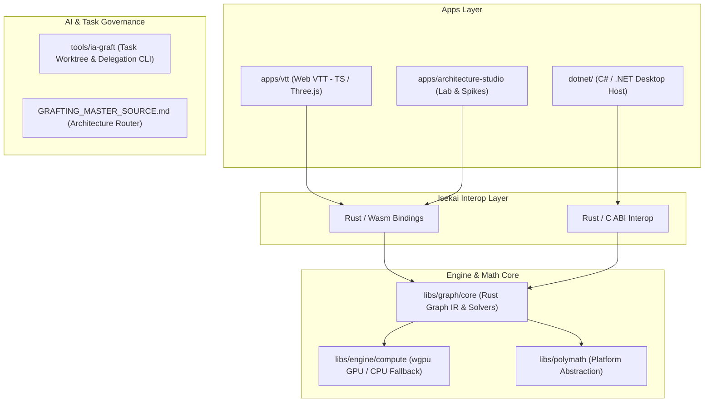

# Grafting Monorepo

> **Polyglot high-performance virtual tabletop, procedural generation engine, and AI control plane.**

Grafting is a modular monorepo unifying domain simulation, GPU/CPU acceleration, web interfaces, and desktop hosts around a canonical Rust engine core.

---

## 🏛️ System Architecture



---

## 🚀 Key Subsystems

| Subsystem | Stack | Purpose |
| :--- | :--- | :--- |
| **Rust Graph Core** (`libs/graph/core`) | Rust | Single source of truth for domain logic, pathfinding, graph IR, and algorithms. |
| **Web VTT** (`apps/vtt`) | TS / Vite / Vanilla CSS | 3D interactive Virtual Tabletop built with modular UI and dynamic layout math. |
| **Architecture Studio** (`apps/architecture-studio`) | TS / Web | Laboratory surface (`/lab`) for benchmarking, spikes, and visual trials. |
| **Isekai Interop** (`dotnet/` & Rust) | Rust C-ABI / Wasm | Zero-overhead bindings connecting Rust core to .NET and Browser hosts. |
| **Polymath** (`libs/polymath`) | Polyglot | Centralized platform, GPU (`wgpu`), OS, and runtime capability abstraction. |
| **AI Control Plane** (`tools/ia-graft`) | Node / TS | CLI orchestrating isolated Git worktrees, tests, PRs, and multi-agent delegation. |

---

## 🛠️ Human Developer Quickstart

### Prerequisites
- **Node.js**: `v22+` (with `pnpm`)
- **Rust**: `1.80+` (with `cargo` and `wasm-pack`)
- **.NET SDK**: `8.0+`
- **Python**: `3.11+` (managed via `uv`)

### Running Locally

1. **Install JavaScript dependencies:**
   ```bash
   pnpm install
   ```

2. **Run Web VTT in development mode:**
   ```bash
   pnpm --filter @grafting/vtt dev
   ```

3. **Run AI Task CLI checks:**
   ```bash
   node --experimental-strip-types tools/ia-graft/src/bin.ts doc-check
   ```

---

## 📚 Documentation Map

- [`GRAFTING_MASTER_SOURCE.md`](GRAFTING_MASTER_SOURCE.md) — Canonical architectural blueprint & Section Router (§0.4).
- [`AGENTS.md`](AGENTS.md) — Machine-first operational contract for AI coding assistants.
- [`docs/adr/`](docs/adr/) — Architectural Decision Records.
- [`docs/decisions/GATES.md`](docs/decisions/GATES.md) — Decision Gate tracker.
- [`THIRD_PARTY_NOTICES.md`](THIRD_PARTY_NOTICES.md) — Third-party license attributions.

---

## ⚙️ Core Philosophy

- **Single Engine Source:** Heavy computations and graph math strictly belong in Rust (`grafting-graph-core`). Presentation layers consume, never duplicate.
- **Isolated Worktree Tasks:** Every code change is developed in an isolated Git worktree managed via `ia-graft`.
- **Less, but better:** Function-driven, high-performance, token-efficient architecture.
