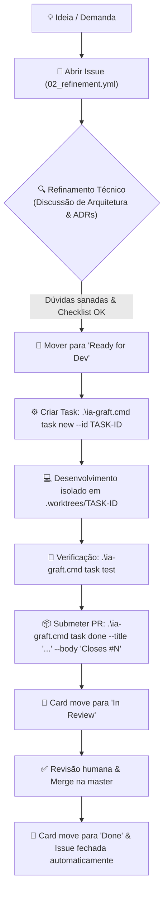

# Guia de Gestão: GitHub Projects e GitHub Issues no Grafting Monorepo

Este documento estabelece o padrão oficial para gestão de tarefas, refinamentos técnicos, manutenções e defeitos no **Grafting Monorepo**, integrando **GitHub Issues**, **GitHub Projects (v2)** e o fluxo de desenvolvimento do CLI [`ia-graft`](../tools/ia-graft/README.md).

---

## 1. Por que migrar do controle manual em `.md` para GitHub Projects?

| Aspecto | Arquivos `.md` soltos | GitHub Projects + Issues |
| :--- | :--- | :--- |
| **Visibilidade** | Difícil acompanhar o estado em tempo real sem ler diffs e arquivos. | Quadro Kanban, Tabela e Roadmap visíveis para todo o time em tempo real. |
| **Rastreabilidade** | Links manuais para commits e PRs, propensos a esquecimento. | Vínculo bidirecional nativo entre Issue, Branch, Pull Request e Commits. |
| **Fluxo de Refinamento** | Discussões fragmentadas em notas ou commits. | Formulário dedicado de Refinamento com checklist de *Ready for Dev* e histórico de discussões. |
| **Automação** | Nenhuma automação nativa. | Movimentação automática de colunas ao abrir PR, mesclar ou fechar tasks. |
| **Campos Customizados** | Texto livre sem padronização. | Campos tipados (Status, Prioridade, Área/Módulo, Estimativa/Tamanho, Iteração). |

---

## 2. Tipologia de Issues e Templates Disponíveis

O repositório conta com **Issue Forms** estruturados em `.github/ISSUE_TEMPLATE/`:

### 🚀 1. Tarefa / Feature (`[Task]`) — `01_task.yml`
- **Uso:** Implementação de nova funcionalidade, componente ou tarefa técnica bem delimitada.
- **Campos obrigatórios:** Objetivo, Módulo/Área, Escopo Técnico, Critérios de Aceite e Checklist de Conformidade com [`GRAFTING_MASTER_SOURCE.md`](../GRAFTING_MASTER_SOURCE.md) e [`AGENTS.md`](../AGENTS.md).
- **Labels padrão:** `type: task`, `status: backlog`.

### 🔍 2. Refinamento / RFC / Spike (`[Refine]`) — `02_refinement.yml`
- **Uso:** Discussão arquitetural, exploração de trade-offs, spikes em `/lab` ou definição de contratos de dados antes de iniciar o código.
- **Campos obrigatórios:** Declaração do Problema, Proposta Técnica & Alternativas, Impacto Arquitetural, Dúvidas Abertas e Checklist de *Ready for Dev*.
- **Labels padrão:** `type: refinement`, `status: refinement`.

### 🛠️ 3. Manutenção / Tooling (`[Chore]`) — `03_chore.yml`
- **Uso:** Atualização de dependências (Cargo, pnpm, uv, .NET), melhorias no CLI `ia-graft`, automações de CI/CD ou refatoração interna.
- **Campos obrigatórios:** Motivação, Escopo, Mudanças Planejadas e Checklist de Validação.
- **Labels padrão:** `type: chore`, `status: backlog`.

### 🐛 4. Relato de Bug (`[Bug]`) — `04_bug_report.yml`
- **Uso:** Defeitos, falhas de compilação, quebra de contratos de API/ABI ou erros de teste.
- **Campos obrigatórios:** Resumo, Passos de Reprodução, Esperado vs Observado, Severidade (P0 a P3) e Logs/Stacktrace.
- **Labels padrão:** `type: bug`, `status: triage`.

---

## 3. Configuração do GitHub Projects (Passo a Passo)

Para criar o quadro central do projeto:

### Passo 1: Criar o Projeto no GitHub
1. No repositório ou organização no GitHub, acesse a aba **Projects** -> **New project**.
2. Selecione o template **Board** (ou **Team Planning**) e nomeie como `Grafting Monorepo Board`.

### Passo 2: Configurar os Campos Customizados (Custom Fields)
Acesse as configurações do projeto (**⚙️ Project Settings** -> **Fields**) e crie os seguintes campos:

1. **`Status`** (Single select - padrão):
   - 📥 `Triage` (Itens recém-chegados)
   - 🔍 `Refinement` (Em discussão/refinamento técnico)
   - 🚦 `Ready for Dev` (Refinado e pronto para execução)
   - 🚧 `In Progress` (Em desenvolvimento ativo)
   - 🧐 `In Review` (PR aberto / em revisão)
   - ⛔ `Blocked` (Bloqueado por decisão ou dependência)
   - ✅ `Done` (Mesclado e concluído)

2. **`Area`** (Single select):
   - `libs/graph`
   - `libs/engine`
   - `libs/isekai`
   - `libs/domains`
   - `apps/architecture-studio`
   - `apps/vtt`
   - `tools/*`
   - `docs`

3. **`Priority`** (Single select):
   - 🔴 `P0 - Critical`
   - 🟠 `P1 - High`
   - 🟡 `P2 - Medium`
   - 🟢 `P3 - Low`

4. **`Size`** (Single select):
   - `XS` (Até 2h / ajuste pontual)
   - `S` (Meio dia / 1 pacote)
   - `M` (1 a 2 dias / módulo)
   - `L` (3 a 5 dias / multi-pacote)
   - `XL` (Spike grande ou Epic)

5. **`Iteration / Sprint`** (Iteration field):
   - Ciclos quinzenais de entrega.

---

## 4. Estrutura das 4 Views Essenciais no GitHub Projects

No topo do Project, configure as 4 abas/visões recomendadas:

```
┌─────────────────┬──────────────────────────┬──────────────────────┬─────────────────┐
│ 1. 📋 Kanban    │ 2. 🔍 Refinement Table   │ 3. 🗺️ Roadmap & Sprints│ 4. 🐛 Bugs      │
└─────────────────┴──────────────────────────┴──────────────────────┴─────────────────┘
```

1. **📋 1. Kanban Flow (Board View)**
   - Layout: **Board**
   - Agrupado por: **`Status`** (colunas da esquerda para a direita: `Refinement` → `Ready for Dev` → `In Progress` → `In Review` → `Done`).
   - Visibilidade: Visão do dia a dia do desenvolvimento.

2. **🔍 2. Refinement & Backlog (Table View)**
   - Layout: **Table**
   - Filtro: `Status: Refinement, Ready for Dev` ou `is:issue`
   - Campos visíveis: `Title`, `Area`, `Priority`, `Size`, `Assignees`.
   - Ordenado por: `Priority` desc.
   - Visibilidade: Sessões de planejamento e refinamento técnico de arquitetura.

3. **🗺️ 3. Roadmap / Milestones (Roadmap View)**
   - Layout: **Roadmap**
   - Agrupado por: **Iteration** ou **Milestone**.
   - Visibilidade: Planejamento temporal e entregas futuras.

4. **🐛 4. Bugs & Triagem (Table / Board)**
   - Layout: **Table**
   - Filtro: `label:"type: bug"`
   - Visibilidade: Monitoramento de estabilidade e débitos críticos.

---

## 5. Automações Nativas do GitHub Projects

Nas configurações do GitHub Project (**Workflows** no menu do projeto), ative as automações nativas:

1. **Auto-add to project**:
   - Adicionar automaticamente qualquer nova Issue ou PR do repositório `Grafting-Monorepo` ao Project com status `Triage` ou `Backlog`.
2. **Item closed**:
   - Quando uma Issue for fechada, mover automaticamente para `Done`.
3. **Pull Request merged**:
   - Quando um PR vinculado for mesclado na `master`, mover a Issue correspondente para `Done`.
4. **Pull Request opened**:
   - Quando um PR vinculado for aberto, mover o card para `In Review`.

---

## 6. Ciclo de Vida e Integração com o `ia-graft`

O fluxo entre o GitHub Projects e o desenvolvimento de código respeita rigorosamente o contrato do [`AGENTS.md`](../AGENTS.md):



### Exemplo Prático de Nomenclatura:
- **Issue no GitHub:** `#42 - Adicionar serialização FlatBuffers para nós de grafo`
- **Comando `ia-graft`:**
  ```cmd
  .\ia-graft.cmd task new --id TASK-42-GRAPH-FLATBUFFERS
  ```
- **Finalização e PR:**
  ```cmd
  .\ia-graft.cmd task done --id TASK-42-GRAPH-FLATBUFFERS --title "feat(graph): add flatbuffers node serialization" --body "Closes #42"
  ```
- **Resultado:** O GitHub vincula a branch, o PR e a Issue, fechando o card e atualizando o quadro sem intervenção manual.
