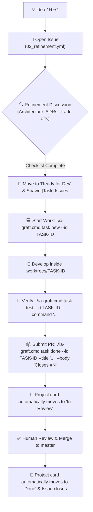

# Project Management Guide: GitHub Projects & Issues in Grafting Monorepo

This guide establishes the standard project management and task lifecycle architecture for **Grafting Monorepo**, integrating **GitHub Issues (Issue Forms)**, **GitHub Projects (v2)**, and the [`ia-graft`](../tools/ia-graft/README.md) CLI developer workflow.

---

## 1. Replacing Scattered `.md` Tracking with GitHub Projects

### What is Replaced vs. What Stays in Markdown

```
┌───────────────────────────────────────────────────────────┐
│                    PROJECT ARTIFACTS                      │
├─────────────────────────────┬─────────────────────────────┤
│     OPERATIONAL / DYNAMIC   │    CANONICAL / INVARIANT    │
│   (Migrate to GitHub Proj)  │   (MUST stay in Git .md)    │
├─────────────────────────────┼─────────────────────────────┤
│ • Epics, Tasks & Chores     │ • GRAFTING_MASTER_SOURCE.md │
│ • Sprints & Backlog lists   │ • Architectural Decisions   │
│ • Ticket Refinement threads │   (docs/adr/ADR-*.md)       │
│ • Bug triage & severity     │ • Agent Policy (AGENTS.md)  │
│ • Assignees & PR linkages   │ • Schema / ABI contracts    │
└─────────────────────────────┴─────────────────────────────┘
```

- **Ephemeral / Dynamic Tracking (Moved to GitHub Projects & Issues):**
  - Task backlogs, sprint planning, ticket status, assignment, PR linking, and refinement discussions belong in GitHub Issues and Projects. Managing these in `.md` files creates merge conflicts, stale text, and poor visibility.
- **Durable / Architectural Truth (Retained in Git `.md` files):**
  - Core architecture (`GRAFTING_MASTER_SOURCE.md`), Architecture Decision Records (`docs/adr/`), and agent operational policies (`AGENTS.md`) **must remain committed in git** to guarantee versioned immutability alongside source code.
  - When an issue refinement settles a new architectural standard, the conclusion is committed as an ADR (e.g. `docs/adr/ADR-0018-xyz.md`) and linked to the issue.

---

## 2. Issue Taxonomy & Issue Forms

All work items are created via structured **GitHub Issue Forms** in [`.github/ISSUE_TEMPLATE/`](../.github/ISSUE_TEMPLATE/):

### 🚀 1. Feature / Implementation Task (`[Task]`) — `01_task.yml`
- **Purpose:** Concrete implementation tasks and new features.
- **Required fields:** Context & Objective, Target Module/Area, Technical Scope, Acceptance Criteria, and DoD Checklist.
- **Default labels:** `type: task`, `status: backlog`.

### 🔍 2. Technical Refinement / RFC / Spike (`[Refine]`) — `02_refinement.yml`
- **Purpose:** Architecture discussions, trade-off evaluations, spike research, or contract drafting before writing code.
- **Required fields:** Problem Statement, Proposed Design & Alternatives, Architectural Impact (ADRs/ABIs), Open Questions & Risks, and *Ready for Dev* checklist.
- **Default labels:** `type: refinement`, `status: refinement`.

### 🛠️ 3. Maintenance / Tooling (`[Chore]`) — `03_chore.yml`
- **Purpose:** Dependency bumps (Cargo, pnpm, uv, .NET), `ia-graft` CLI enhancements, CI/CD workflow updates, or internal refactoring.
- **Required fields:** Motivation, Scope, Planned Changes, and Validation Checklist.
- **Default labels:** `type: chore`, `status: backlog`.

### 🐛 4. Bug Report (`[Bug]`) — `04_bug_report.yml`
- **Purpose:** Defect reporting, test failures, compilation breaks, or contract regressions.
- **Required fields:** Summary, Reproduction Steps, Expected vs. Actual Behavior, Severity (P0-P3), and Logs/Stacktrace.
- **Default labels:** `type: bug`, `status: triage`.

---

## 3. GitHub Projects (v2) Setup Guide

To create and configure the board in GitHub:

### Step 1: Create the Project Board
1. In the GitHub repository or organization, navigate to the **Projects** tab.
2. Click **New project** -> Select **Board** (or **Team Planning**).
3. Name it **`Grafting Monorepo Board`**.

### Step 2: Configure Custom Fields
Go to **⚙️ Project Settings** -> **Fields** and define the following custom fields:

1. **`Status`** (Single select - default):
   - 📥 `Triage` (Newly filed items)
   - 🔍 `Refinement` (Under active technical refinement)
   - 🚦 `Ready for Dev` (Refined, acceptance criteria set, ready for implementation)
   - 🚧 `In Progress` (Actively being developed in a task branch/worktree)
   - 🧐 `In Review` (PR opened, CI running, awaiting review)
   - ⛔ `Blocked` (Blocked by dependency or open decision gate)
   - ✅ `Done` (Merged into master and verified)

2. **`Area`** (Single select):
   - `libs/graph`
   - `libs/engine`
   - `libs/isekai`
   - `libs/domains`
   - `apps/architecture-studio`
   - `apps/vtt`
   - `tools/*`
   - `docs`

3. **`Priority`** (Single select):
   - 🔴 `P0 - Critical`
   - 🟠 `P1 - High`
   - 🟡 `P2 - Medium`
   - 🟢 `P3 - Low`

4. **`Size`** (Single select):
   - `XS` (< 2 hours / localized tweak)
   - `S` (Half day / single package)
   - `M` (1–2 days / module feature)
   - `L` (3–5 days / multi-package)
   - `XL` (Major initiative / epic)

5. **`Iteration`** (Iteration field):
   - 2-week sprint cycles (e.g. `Sprint 1`, `Sprint 2`).

---

## 4. The 4 Essential Project Views

Configure the following 4 tabs at the top of your GitHub Project:

```
┌─────────────────┬──────────────────────────┬──────────────────────┬─────────────────┐
│ 1. 📋 Kanban    │ 2. 🔍 Refinement Table   │ 3. 🗺️ Roadmap & Sprints│ 4. 🐛 Bugs      │
└─────────────────┴──────────────────────────┴──────────────────────┴─────────────────┘
```

1. **📋 1. Kanban Flow (Board View)**
   - **Layout:** Board
   - **Group by:** `Status` (`Refinement` → `Ready for Dev` → `In Progress` → `In Review` → `Done`)
   - **Use case:** Daily development and task progression.

2. **🔍 2. Refinement & Backlog (Table View)**
   - **Layout:** Table
   - **Filter:** `Status: Refinement, Ready for Dev`
   - **Visible Fields:** `Title`, `Area`, `Priority`, `Size`, `Assignees`
   - **Sort by:** `Priority` descending
   - **Use case:** Planning sessions, architecture spikes, and estimating work.

3. **🗺️ 3. Roadmap & Iterations (Roadmap View)**
   - **Layout:** Roadmap
   - **Group by:** `Iteration` or `Milestone`
   - **Use case:** Milestone delivery tracking and long-term scheduling.

4. **🐛 4. Bugs & Triaging (Table View)**
   - **Layout:** Table
   - **Filter:** `label:"type: bug"`
   - **Use case:** Tracking defects, broken builds, and regression resolution.

---

## 5. What Else Does GitHub Support for Full Automation?

Having issue templates and a project board is the foundation. GitHub provides several native capabilities to achieve **100% automation**:

### 1. Built-in Project Workflows (No Code / Configured in GitHub UI)
Inside the Project Board (**⚙️ Project Settings** -> **Workflows**):
- **Auto-add to project:** Automatically adds any new Issue or PR created in `TassoossaT/Grafting-Monorepo` to the board with status `Triage` or `Backlog`.
- **Auto-move on PR open:** Automatically moves the card to `In Review` when a linked PR is submitted.
- **Auto-close on PR merge:** Automatically moves the card to `Done` when the PR is merged into `master`.

### 2. Task Lists & Sub-issue Hierarchy (GitHub Markdown)
You can break large Epics into sub-tasks using GitHub task list syntax in any issue description:
```markdown
### Sub-tasks
- [ ] #101 Implement Rust core graph traversal
- [ ] #102 Add FlatBuffers schema for graph nodes
- [ ] #103 Expose WASM bindings in libs/isekai
```
GitHub renders a live progress bar (e.g. `2 of 3 tasks completed`) and tracks child issue completion directly in the Project board.

### 3. GitHub Discussions (RFCs & Early Ideation)
For open-ended brainstorming, RFC community feedback, and Q&A *before* an issue is ready for structured refinement, use **GitHub Discussions**. Discussions can be converted to an Issue with a single click once they solidify into an actionable proposal.

### 4. GitHub Project Insights & Burn-down Charts
Under the **Insights** tab in Projects v2, you can configure real-time charts:
- **Burn-down / Burn-up:** Track completed story points or issue count over an iteration.
- **Velocity:** Measure completed items per sprint.
- **Work by Area:** Cumulative bar chart of issues grouped by `Area` (`libs/graph`, `libs/engine`, etc.).

---

## 6. End-to-End Workflow with `ia-graft`

The following diagram illustrates how an item moves from an idea to merged code:



### Command Reference:
```cmd
:: 1. Create a task branch and isolated worktree linked to Issue #42
.\ia-graft.cmd task new --id TASK-42-GRAPH-TRAVERSAL

:: 2. Incremental atomic commit with AI co-authorship
.\ia-graft.cmd task commit --id TASK-42-GRAPH-TRAVERSAL --message "feat(graph): add BFS node traversal" --agent gemini

:: 3. Run validation tests
.\ia-graft.cmd task test --id TASK-42-GRAPH-TRAVERSAL --command "cargo test --workspace"

:: 4. Submit stacked/direct PR referencing the issue
.\ia-graft.cmd task done --id TASK-42-GRAPH-TRAVERSAL --title "feat(graph): add BFS node traversal" --body "Closes #42"
```
