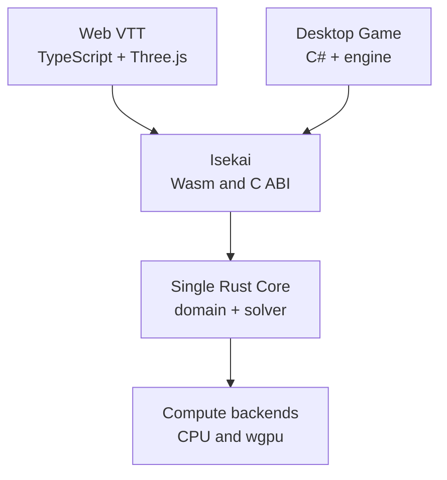

# Logical architecture and boundaries

Relocated verbatim from `GRAFTING_MASTER_SOURCE.md` section 4 on 2026-08-07,
as the router table in that document's S0.4 had scheduled. The section
numbering is preserved because `S<n>.<n>` is the stable citation key used from
real source comments and manifests; those citations resolve here now,
unchanged. Precedence and normative language remain in
`GRAFTING_MASTER_SOURCE.md` section 0 and govern everything below.

---

## 4. Logical architecture

### 4.1 Overview

### 4.2 Engine layers

#### `domain-core`

Responsible for:

- business rules;
- authoritative state;
- state machine;
- Command validation;
- applying changes;
- generating DomainEvents;
- controlled RNG;
- state hashes;
- APIs independent of transport and rendering.

Cannot depend on:

- Three.js;
- C#;
- Web APIs;
- sockets;
- database;
- `wgpu`;
- the host's file system;
- a non-injected global clock.

#### `polymath` (Rust) / `@grafting/polymath` (TypeScript) / `Grafting.Polymath` (C#, future)

Infrastructure layer, not a domain layer (DEC-042). Responsible for:

- centralizing all OS/runtime/RID inspection (`polymath::os` in Rust: paths, dynamic
  library extension `.dll`/`.so`/`.dylib`, config/cache/temp dirs, process/thread
  differences; `@grafting/polymath`'s `env`: Node vs. Edge vs. Browser);
- exposing graphics capability facts to the rest of the system (`polymath::gpu` in Rust:
  which backends the OS/driver exposes — Vulkan/DX12/Metal; `@grafting/polymath`'s `gpu`:
  WebGPU support in the browser) and Worker facts (`@grafting/polymath`'s `worker`:
  `SharedArrayBuffer`/Worker);
- serving as the single boundary that `compute-wgpu`, `isekai-capi`, `isekai-wasm`, and the
  hosts consult for platform-dependent decisions.

Cannot contain:

- domain logic or business rules (that would duplicate DEC-001);
- the compute contract itself (that remains in `compute-api`) — Polymath supplies environment
  facts that `compute-wgpu` consumes, never the other way around;
- Worker/Wasm orchestration (that remains in `isekai-wasm`/`packages/isekai-web-client`).

No other module should inspect `cfg(target_os)`, `navigator.gpu`,
`process.platform`, or RID directly outside Polymath (DEC-042).

#### `compute-api`

Defines:

- mathematical operations;
- job types;
- capabilities;
- fallback policies;
- contracts between the domain and backends;
- batch execution plans.

Must not expose concrete `wgpu` types.

#### `compute-cpu`

Responsible for:

- the reference implementation;
- execution on machines without WebGPU;
- differential tests;
- final result verification;
- small workloads where the GPU would be slower.

#### `compute-wgpu`

Responsible for:

- adapter/device/queue creation;
- pipelines;
- pipeline cache;
- persistent buffers;
- upload arenas;
- asynchronous readback;
- WGSL kernels;
- capability negotiation;
- device loss recovery;
- upload/dispatch/readback metrics.

#### `projection-core`

Responsible for:

- transforming authoritative state/events into a view allowed for each client;
- hiding private information;
- producing `ReplicationDelta`;
- not knowing about WebSocket, UDP, TCP, or concrete authentication.

#### `isekai-wasm`

Responsible for:

- adapting linear memory offsets and lengths;
- exposing numeric handles;
- asynchronous initialization;
- Worker integration;
- converting errors into stable codes/structures;
- never duplicating rules.

#### `isekai-capi`

Responsible for:

- `extern "C"` exports;
- versioned ABI;
- pointer validation;
- `catch_unwind` at the boundary;
- generational handles;
- status codes;
- creation/release functions;
- never exposing `Vec`, `String`, trait objects, or Rust enums.

### 4.3 Future domains

Domains such as physics, pathfinding, AI, and optimization should be added by feature slice.

A domain may contain:

- its own contracts;
- a Rust crate;
- tests;
- benchmarks;
- local documentation;
- integration with `domain-core` or `compute-api`.

Empty directories must not be created ahead of time. The local generator will create each slice when a real feature exists.

### 4.4 `libs/` boundary rule and multi-product domains (DEC-046)

A capability is born in `libs/domains` (Rust) or `packages/` (TypeScript) —
never duplicated inside an `app` — whenever more than one product needs
it, or it is reasonable to foresee that it will. An `app` (`apps/*`) should
only contain: domain composition, presentation/UI, and integration specific
to that host. This extends DEC-001 (Rust as the single source of logic) to
the multi-product axis: DEC-001 prevents duplicating Rust logic in another
language; this rule prevents duplicating domain logic between different
products of the same monorepo (DEC-045, single monorepo).

Initial domain map (see `docs/adr/ADR-0008-libs-boundary-and-domain-map.md`):

| Capability | Classification | Where it is born |
| --- | --- | --- |
| Narrative / story creation | generic domain | `libs/domains/narrative` |
| Session / campaign organization | generic domain | `libs/domains/session` |
| VTT interactive map | product-specific presentation | The Web host composes `@grafting/ui`; Three.js remains private inside that package and the VTT does not reuse the graph canvas (DEC-056, ADR-0018) |
| Procedural heightmap generation + generic value discretization | generic domain | `libs/domains/procgen` (`generation-wasm`, `discretize` Rust/Wasm crates) — designed against the VTT's map-generation pipeline (`docs/research/vtt-map-and-terrain-construction-options.md`) but reclassified from an initial VTT-scoped `libs/vtt/` location (owner direction, 2026-08-04): not exclusive to the VTT, any product needing procedural heightmap generation or continuous-to-discrete value binning can depend on it. `discretize` was itself renamed from `terrain-quantization` (owner direction, 2026-08-04) since it has no concept of terrain -- it bins any `[-1.0, 1.0]` float array into N levels |
| Discord bot | external integration | its own service consuming `session`/`narrative` contracts, never internals |
| Session transcription | external integration (likely Python) | `python/` or a dedicated service, feeding `narrative` via contract |

The map above follows the rule in section 4.3: `narrative` and `session` are
born because there is already a declared intention for more than one
product to need them; the VTT map remains within the app until a second
product requires a map.

> **Amendment (2026-08-04, DEC-056/ADR-0018):** the VTT is a route in the
> Web host, not a standalone app. Its interactive map and Architecture Studio's
> heightfield surface use the private Three.js renderer inside `@grafting/ui`.
> Active graph canvases use private Rete.js integration through the same
> vendor-neutral package. `@grafting/x6-canvas` is retired and dormant.

> **Clarification (2026-08-11, DEC-061/ADR-0023):** `apps/vtt` is the Next.js
> host for the VTT product. The interactive tabletop is a client-only route
> inside that host, so DEC-041's route boundary and DEC-045's distinct-app
> product boundary both hold. VTT concepts and policies remain inside the app;
> it reaches generic capabilities through app-owned ports and adapters. See
> `docs/architecture/vtt-application-architecture.md`.

DEC-049 strengthens this boundary: reusable capabilities expose Grafting-owned
interfaces and isolate third-party runtime APIs inside the smallest useful
owning module/project boundary. It does not require one package per dependency.
Shared behavior is reused from its authoritative implementation rather than
copied into a second module, package, or application.
