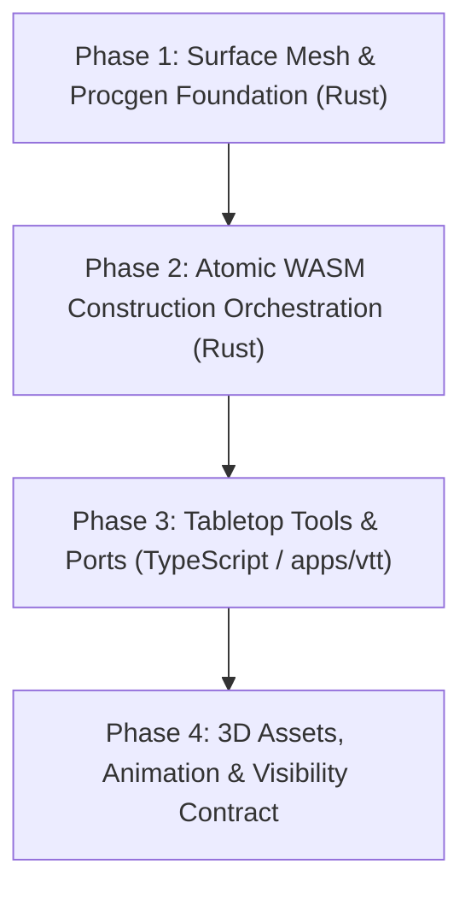

# VTT Wall Apertures (Doors & Windows) & Interactive Entities: Architectural Execution Plan

> **Authoritative Execution Plan**  
> **Status:** Open for execution (Scheduled for upcoming tasks / Roadmap E7.4)  
> **Governed by:** `GRAFTING_MASTER_SOURCE.md`, DEC-049, DEC-052, DEC-060, [ADR-0022](docs/adr/ADR-0022-wall-representation-free-geometry.md), `VTT-VISIBILITY-001`.  
> **Related Roadmaps:** `docs/architecture/vtt-roadmap.md` (Task E7.4), `docs/architecture/vtt-reactive-construction-execution-plan.md`.

---

## 1. Overview & Architectural Rationale

This document establishes the authoritative engineering plan for representing **doors, windows, archways, and interactive structural elements** within the Grafting Monorepo VTT.

### The Host-Region $\leftrightarrow$ Aperture-Surface Dual Model

In accordance with **`ADR-0022`** (DEC-060), construction surfaces are defined by stable sets of graph nodes (`NodeId` cycles), while domain-specific product semantics (`type`, `physical`) reside strictly in the `Surface` and `RegionSurface` records.

Today, a `hole` in `grafting-graph-core` is purely an unmaterialized geometric cutout inside a host `SurfaceRegion` (`holes: Vec<ContourLoop>`). To elevate a hole into an interactive, selectable, and stylable **Door or Window**, the system uses a **zero-duplication dual registration**:

```
PAREDE HOSPEDEIRA (Host Region: "wall")
N0 -------------------------------------------------------- N1
|                                                          |
|            N4 ---------------------- N5                  |
|            |   CICLO COMPARTILHADO  |                    |
|            |   Sentido Horário (CW) | -> HOLE na parede  |
|            |   Sentido Anti-Horário | -> FACE da porta   |
|            |   (CCW)                |                    |
|            N7 ---------------------- N6                  |
|                                                          |
N3 -------------------------------------------------------- N2
```

1. **Host Wall Region:** Registers the cycle `[N4, N5, N6, N7]` as an inner `hole` (clockwise), subtracting geometry during triangulation so masonry/brick does not render in the opening.
2. **Aperture Surface:** Registers the same cycle `[N4, N7, N6, N5]` (counter-clockwise) in `SurfaceRegistry` with its own stable `SurfaceKey`, `SurfaceType` (`"door"`, `"window"`), and `physical: bool`.
3. **Asset & Animation Layer:** Visual 3D frames, glass panes, and pivoting door leaves attach to the 4 aperture nodes. Animations (hinge rotation, sliding) run **exclusively on the client renderer at 60 FPS**, without mutating the underlying graph topology.

---

## 2. Gap Analysis (Current State vs. Required Capabilities)

| Layer | Current Status in Codebase | Required Work for Aperture Pipeline |
| :--- | :--- | :--- |
| **`grafting-graph-core`** | `add_hole`, `remove_hole`, `ContourTopology`, `SurfaceRegistry` already implemented. | **Complete.** Core topology already supports manifold loops sharing opposite edges. |
| **`grafting-procgen-surface-mesh`** | `triangulate_region` supports holes using `earcut`, but `point_in_loop_xz` assumes horizontal plane. | **Gap:** Generalize hole nesting test from XZ-only to 3D best-fit plane projection for vertical and angled walls. |
| **`grafting-procgen-structure-generation`** | Extrudes simple walls and primitive full-height slices (`EdgeNotch`). | **Gap:** Implement parametric aperture generator (`aperture.rs`) supporting sill and header heights. |
| **`grafting-procgen-construction-wasm`** | Exposes raw `add_hole_json` and `remove_hole_json`. | **Gap:** Implement atomic commands: `add_wall_opening_json`, `move_wall_opening_json`, and `remove_wall_opening_json`. |
| **`apps/vtt`** | `ConstructionSessionPort` has primitive `addHole`. | **Gap:** Authoring tool (`door-window-tool.ts`), wall-edge raycast snapping, selection inspector, and 3D asset toggle. |

---

## 3. Sequenced Implementation Phases



---

### Phase 1: Surface Mesh & Procgen Foundation (`libs/domains/procgen`)

- **Objective:** Enable robust 3D triangulation of vertical walls with holes and provide pure geometric aperture generators.
- **Tasks & Deliverables:**
  - **T1.1 (`surface-mesh` 3D Planar Hole Nesting):**
    - Update `triangulate_region` in `libs/domains/procgen/surface-mesh/src/lib.rs`.
    - Replace the 2D horizontal `point_in_loop_xz` containment check with a 3D-to-2D projected plane containment test (`utils3d::project3d_to_2d`), allowing holes to nest accurately on vertical walls facing any orientation.
    - Add unit tests verifying vertical quad wall with rectangular window triangulates with correct hole vertices and surface normals.
  - **T1.2 (`structure-generation` Aperture Module):**
    - Create `libs/domains/procgen/structure-generation/src/aperture.rs`.
    - Implement `generate_wall_aperture`:
      ```rust
      pub struct WallApertureInput {
          pub wall_start: [f32; 3],
          pub wall_end: [f32; 3],
          pub wall_height: f32,
          pub fraction: f32,       // t in 0.0..=1.0 along wall
          pub width: f32,          // e.g. 0.9m
          pub sill_height: f32,    // 0.0 for doors, 0.9 for windows
          pub header_height: f32,  // 2.1 for standard doors/windows
          pub id_prefix: String,
          pub surface_type: SurfaceType,
      }
      ```
    - Mint 4 position-derived corner nodes (`corner_id`) and connecting `ContourEdge`s for the aperture boundary.

---

### Phase 2: Atomic WASM Construction Orchestration (`construction-wasm`)

- **Objective:** Provide atomic transactional operations to cut holes and register aperture surfaces in a single call.
- **Tasks & Deliverables:**
  - **T2.1 (DTO Definitions & Request Types):**
    - Define `AddWallOpeningRequest`, `MoveWallOpeningRequest`, and `RemoveWallOpeningRequest` in `libs/domains/procgen/construction-wasm/src/region_editing.rs`.
  - **T2.2 (Atomic Orchestration Logic):**
    - Implement `apply_add_wall_opening`:
      1. Validates host wall region exists and has sufficient span.
      2. Generates the 4 aperture nodes and 4 `ContourEdge`s via `structure-generation::aperture`.
      3. Applies `add_hole` to the host wall `SurfaceRegion`.
      4. Registers the aperture `Surface` in `SurfaceRegistry` with the same 4 nodes, matching `SurfaceType` (`"door"`, `"window"`), and default `physical: bool`.
      5. Emits `TransformationPlan` detailing modified host wall and created aperture surface.
  - **T2.3 (Atomic Removal & Move):**
    - Implement `apply_remove_wall_opening`: Drops aperture `Surface`, removes matching `hole` from host wall region, restores solid wall mesh.
    - Implement `apply_move_wall_opening`: Adjusts the 4 aperture node positions along the wall direction and re-evaluates both meshes atomically.
  - **T2.4 (WASM Exports & Tests):**
    - Expose `add_wall_opening_json`, `remove_wall_opening_json`, `move_wall_opening_json` on `ConstructionSession`.
    - Add comprehensive round-trip tests in `construction-wasm/tests/`.

---

### Phase 3: Tabletop Tools & Ports (`apps/vtt`)

- **Objective:** Deliver the interactive user experience for placing, moving, and editing doors and windows on the 3D tabletop.
- **Tasks & Deliverables:**
  - **T3.1 (Port & Adapter Expansion):**
    - Update `ConstructionSessionPort` and `ConstructionSessionWasmAdapter` with `addWallOpening`, `removeWallOpening`, `moveWallOpening`.
  - **T3.2 (`DoorWindowTool` Implementation):**
    - Create `apps/vtt/src/composition/tabletop/tools/door-window-tool.ts`.
    - Implement pointer raycast projection against existing walls:
      - Snaps cursor to nearest wall baseline edge.
      - Calculates parametric fraction $t \in [0, 1]$.
      - Renders translucent ghost preview of the opening frame during hover.
    - Click to commit: invokes `session.addWallOpening(...)` and triggers reactive mesh refresh.
  - **T3.3 (Selection & In-Canvas Manipulation):**
    - Selecting an aperture face highlights its frame and displays a floating inspector palette (`PalettePicker` / `PopoverInspector`).
    - Exposes controls: Aperture Kind (Door / Window / Archway), Width, Sill/Header height, Material preset, Locked state.
    - Supports dragging horizontal handle along the wall to reposition the opening.

---

### Phase 4: 3D Assets, Animation & Visibility Integration

- **Objective:** Connect aperture surfaces to renderable 3D assets, smooth local animations, and line-of-sight occlusion rules.
- **Tasks & Deliverables:**
  - **T4.1 (Asset Layer Adapter in `packages/render-3d`):**
    - When a `Surface` with `type: "door"` or `type: "window"` is materialized:
      - Mounts an aperture prefab (frame geometry + leaf submesh) aligned to the 4 corner nodes.
      - For windows: renders translucent/glass PBR material with metallic frame.
  - **T4.2 (State & Animation Engine):**
    - Define client-side interaction handler `toggleApertureState(surfaceKey, currentState)`:
      - Changes state: `Closed` $\leftrightarrow$ `Open`.
      - Updates `session.setSurfacePhysical(surfaceKey, isClosed)`.
      - Animates door leaf rotation ($0^\circ \to 90^\circ$) locally using a spring / cubic-bezier curve at 60 FPS.
  - **T4.3 (`VTT-VISIBILITY-001` Integration):**
    - Wire aperture surfaces into the Fog of War / LOS pipeline:
      - `Door (Closed)`: Blocks line-of-sight raycasts and sound propagation.
      - `Door (Open)`: Removes line-of-sight occlusion; immediately updates player vision polygon.
      - `Window`: `physical: true` (blocks movement), `vision_occluder: false` (allows line-of-sight transparency).
      - `Secret Door (Undiscovered)`: Renders host wall texture across opening; withheld from player disclosure projection until discovered.

---

## 4. Proposed Data Contracts & Schema

```rust
// libs/domains/procgen/construction-wasm/src/region_editing.rs

#[derive(Debug, Clone, Serialize, Deserialize)]
#[serde(rename_all = "camelCase")]
pub struct AddWallOpeningRequest {
    pub host_surface_key: Vec<String>,
    pub fraction: f32,
    pub width: f32,
    pub sill_height: f32,
    pub header_height: f32,
    pub surface_type: String, // "door", "window", "archway"
    pub physical: bool,
}

#[derive(Debug, Clone, Serialize, Deserialize)]
#[serde(rename_all = "camelCase")]
pub struct MoveWallOpeningRequest {
    pub host_surface_key: Vec<String>,
    pub aperture_surface_key: Vec<String>,
    pub new_fraction: f32,
}

#[derive(Debug, Clone, Serialize, Deserialize)]
#[serde(rename_all = "camelCase")]
pub struct RemoveWallOpeningRequest {
    pub host_surface_key: Vec<String>,
    pub aperture_surface_key: Vec<String>,
}
```

---

## 5. Acceptance Criteria & Definition of Done

- [ ] **AC-1 (Triangulation Integrity):** A vertical wall with a window hole triangulates with zero overlapping triangles and clean inner hole boundary matching `surface-mesh` benchmarks.
- [ ] **AC-2 (Zero Node Duplication):** The host wall's hole loop and the aperture surface cycle share the exact same 4 `NodeId`s.
- [ ] **AC-3 (Live Drag & Move):** Dragging a window along a wall updates both the wall cutout and window frame in real time without tearing.
- [ ] **AC-4 (Clean Removal):** Deleting a door removes the aperture surface and heals the host wall back to a solid face in a single undoable transaction.
- [ ] **AC-5 (Interactive State & LOS):** Toggling a door to `Open` removes physical collision and instantly recalculates line-of-sight visibility into adjacent rooms.
