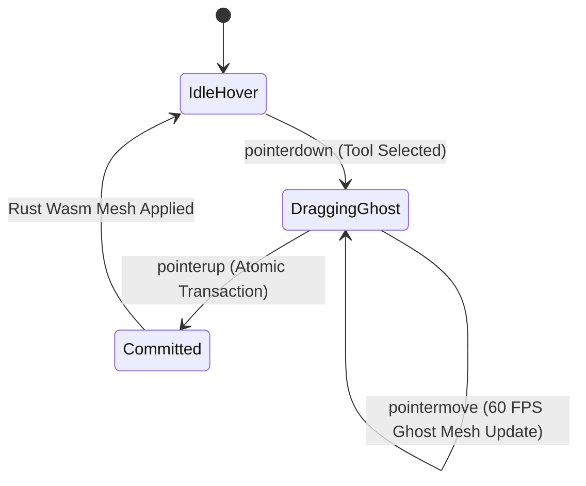
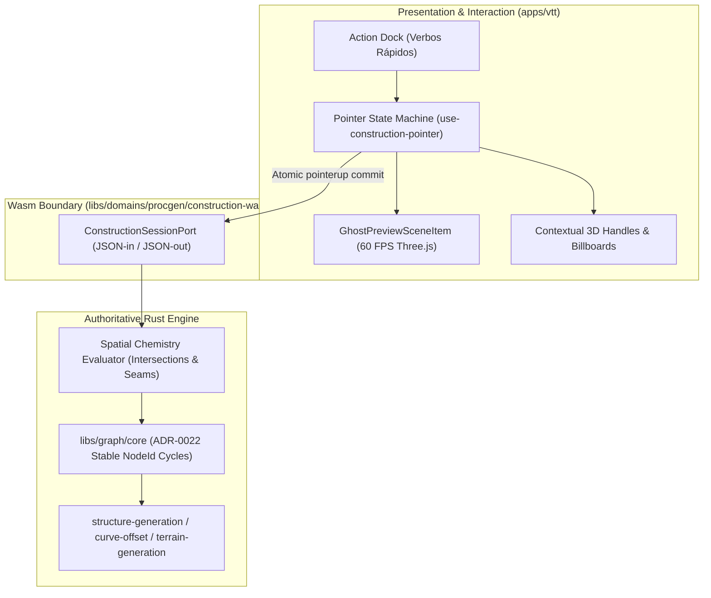

# VTT Construction & Editing Mode: Direct Manipulation, Real-Time Preview, and Spatial Chemistry Specification

Specification-ID: `VTT-CONSTRUCT-001`  
Status: Accepted  
Date: 2026-09-08  
Audience: Implementation agents, human maintainers  
Authority: `ADR-0022`/`DEC-060` (Graph, Mesh, Surface, Cloud, Asset), `ADR-0023`/`DEC-061` (VTT Application Architecture), `VTT-PRODUCT-001`  
Related Documents:
- `docs/research/vtt-reactive-construction-and-tiny-glade-ui-model.md`
- `docs/research/vtt-tiny-glade-open-source-ecosystem.md`
- `docs/architecture/vtt-reactive-construction-execution-plan.md`

---

## 1. Executive Summary & Core Philosophy

This specification establishes the authoritative behavioral and interaction model for the **VTT Construction and Editing Mode**. It formalizes the design direction inspired by *Tiny Glade* and *Sketch & Build*, defining how world geometry is created, edited, previewed, and mutated with **zero category bloat, zero nested menus, and zero cognitive friction**.

### 1.1 The Substrate Rule: The Graph is Invisible
1. The Rust graph core (`grafting-graph-core`, `ADR-0022`) is the **internal computational substrate**. It guarantees stable node identities (`NodeId`), non-destructive cycles, repair-on-delete semantics, and deterministic topological integrity across client and server.
2. **Neither the casual GM nor the professional cartographer is exposed to graph terminology.** The user never sees "nodes", "edges", "cycles", or "WFC seeds". They interact strictly with **Architectural & Environmental Primitives**:
   - **Rooms & Buildings** (enclosed footprints, walls, floors, roofs);
   - **Bridges, Paths & Corridors** (elevated or grounded spline-ribbons);
   - **Openings** (doors, windows, archways, portcullises);
   - **Terrain & Water** (elevations, cliffs, riverbeds, shorelines);
   - **Dressing & Atmosphere** (materials, clutter, lighting, foliage).

### 1.2 Phased Sequencing: Mechanics First, Aesthetics Second
Per project direction, development is strictly staged:
* **Stage 1 (This Slice): Core Construction & Direct Editing Mode.**
  Footprint sketching, extrusion, real-time 60 FPS ghost previews, contextual 3D gizmos/handles directly on geometry, topological mutations, and spatial chemistry reactions.
* **Stage 2 (Subsequent Slice): Aesthetic, Material & Dressing Layers.**
  PBR shaders, procedural stone/wood textures, weather/seasonal palettes, dynamic foliage scattering, and fine decorative clutter.

---

## 2. The Minimalist Action Dock (Verbs, Not Categories)

The interface completely rejects nested category tabs, drawer menus, and modal dialogs. Interaction is anchored by a centered bottom dock containing direct **action verbs**:

```text
 ┌─────────────────────────────────────────────────────────────────────────────────┐
 │ [🏠 Room/Building] [🧱 Wall] [🌉 Bridge/Path] [🚪 Opening] [⛰️ Terrain] [🎨 Style] [🔨 Demolish] │
 └─────────────────────────────────────────────────────────────────────────────────┘
```

| Tool Verb | Primary Mouse Action (Canvas) | Generated Geometric Primitives |
| :--- | :--- | :--- |
| **🏠 Room / Building** | Click-drag footprint $\to$ release or pull up | Polygonal floor slab + perimeter extruded walls + auto hip/gable roof |
| **🧱 Wall / Fence** | Click-drag centerline or freehand curve | Vertical masonry wall (or auto-fence if height $< 1.2m$) |
| **🌉 Bridge / Path** | Click-drag spline curve across ground or gap | Extruded roadway + side parapets + vertical support stilts/piers over chasms |
| **🚪 Opening** | Single click on any wall surface | Cutout aperture + sill + lintel (door if near floor, window if elevated) |
| **⛰️ Terrain & Water** | Brush drag over terrain plane | Continuous heightfield deformation (reveals water plane if carved below $Y=0$) |
| **🎨 Style & Palette** | Click on any structure | Summons a lightweight floating popover to swap theme (e.g., Stone, Timber, Ruin) |
| **🔨 Demolish** | Click or drag through any structure | Deletes targeted element cleanly via `ADR-0022` cycle repair |

---

## 3. Real-Time Preview & The Construction Cycle

The creation loop is instantaneous and reactive, driven by a 3-state pointer machine in `apps/vtt`:



### 3.1 Step 1: Hover & Snapping
* As the pointer moves over the terrain or existing geometry, a subtle ring cursor raycasts the 3D surface.
* **Smart Magnetic Snapping:** When drawing near existing wall corners, room edges, or bridge endpoints, the cursor snaps magnetically with an optical highlight ring, ensuring clean watertight joins without requiring grid restrictions.

### 3.2 Step 2: Live Ghost Preview (`DraggingGhost`)
* While the pointer is held down and dragged:
  - The client Three.js scene updates an unlit, translucent **Ghost Preview** (`GhostPreviewSceneItem`) at 60 FPS.
  - Footprint polygons triangulate in real time (`earcut`).
  - No heavyweight Wasm transaction is committed yet; the ghost gives immediate optical feedback on size, angle, and position.

### 3.3 Step 3: Atomic Transaction (`Committed`)
* Upon `pointerup`, the interaction payload is packaged into an atomic `ConstructionSession` command (`libs/domains/procgen/construction-wasm`).
* Rust generates the authoritative node cycle in `grafting-graph-core`, synthesizes the mesh, updates spatial chemistry seams, and invalidates the affected map chunk.

---

## 4. Direct 3D Manipulation & Contextual Handles (Edition Mode)

There is no separate "Enter Edit Mode" button. **Hovering or clicking any existing object immediately activates contextual 3D handles (Gizmos)** rendered directly on the target geometry.

```text
                       ▲ [1. Roof Pitch / Terrace Handle]
                      ╱█╲
                     ╱ █ ╲
      [2. Eaves]◄────┴───┴────► [2. Eaves Overhang Handle]
                    ┌─────┐
      ▲ [3. Wall    │ [D] │   ▲ [6. Window/Door Scale]
      │  Height     │     │   ▼
      ▼  Handle]    └─────┘   ◄──► [5. Opening Lateral Slide]
                    ▲
                    │ [4. Under-Stilt / Pier Elevation Handle]
                    ▼
```

### 4.1 Handle Directory by Entity Type

#### A. Rooms & Buildings
1. **Roof Apex Handle (Vertical $Y$):** Dragging up steepens the roof pitch; dragging all the way down flattens the roof into a walkable castellated parapet or terrace.
2. **Eaves Overhang Handle (Horizontal $XZ$):** Pulling outward extends the roof eaves over walls; pulling flush creates clean gable edges.
3. **Wall Height Handle (Vertical $Y$):** Pulling upward adds stories; pulling down reduces height to a low foundation wall.
4. **Stilt / Pier Elevation Handle (Vertical $Y$):** Lifting the building off the ground automatically derives wooden stilts, brick piers, or stone arches underneath to bridge the gap to the terrain.
5. **Contour Corner Nodes:** Dragging corner vertices deforms the footprint polygon. The Rust core relocates the stable `NodeId` and recalculates adjacent wall angles seamlessly.

#### B. Bridges & Paths
1. **Crown Arch Handle:** Dragging vertically at the center of a bridge curves the deck into an arched Roman bridge or drops it flat.
2. **Width Handle:** Pulling laterally widens or narrows the roadway.
3. **Spline Tangent Handles:** Dragging spline control points bends corridors and bridges smoothly through terrain.

#### C. Openings (Doors & Windows)
1. **Lateral Slide:** Dragging an opening slides it along the wall facade with real-time lintel regeneration.
2. **Dimension Handles:** Scaling handles adjust width and height.

---

## 5. The Spatial Chemistry Matrix (Emergent Reactions)

A key defining trait of this model is **emergent spatial chemistry**: neighboring elements automatically recognize and resolve topological collisions without user micromanagement.

```text
┌───────────────────────────┬───────────────────────────┬────────────────────────────────────────┐
│ Entity A                  │ Intersecting Entity B     │ Emergent Generative Reaction           │
├───────────────────────────┼───────────────────────────┼────────────────────────────────────────┤
│ Bridge / Path Spline      │ Wall Segment              │ Wall automatically carves an Archway/  │
│                           │                           │ Portcullis at the intersection point.  │
├───────────────────────────┼───────────────────────────┼────────────────────────────────────────┤
│ Bridge / Path Spline      │ Building Exterior Facade  │ Facade carves an Entry Door + Stone    │
│                           │                           │ Threshold Step.                        │
├───────────────────────────┼───────────────────────────┼────────────────────────────────────────┤
│ Path Spline               │ Sloped Terrain Step       │ Spline generates stone steps/stairs.   │
├───────────────────────────┼───────────────────────────┼────────────────────────────────────────┤
│ Building Volume A         │ Building Volume B         │ Merges floor footprints (Boolean       │
│                           │                           │ Union), drops internal wall, and emits │
│                           │                           │ unified intersecting straight-skeleton.│
├───────────────────────────┼───────────────────────────┼────────────────────────────────────────┤
│ Wall Segment              │ Height reduced < 1.2m     │ Automatically transitions into a stone │
│                           │                           │ parapet, balustrade, or picket fence.  │
├───────────────────────────┼───────────────────────────┼────────────────────────────────────────┤
│ Window Opening            │ Moved adjacent to Window  │ Snaps together and merges into a       │
│                           │                           │ unified Bay Window (Oriel).            │
├───────────────────────────┼───────────────────────────┼────────────────────────────────────────┤
│ Elevated Room / Bridge    │ Air (Chasm / Steep Slope) │ Synthesizes structural stone/timber    │
│                           │                           │ support columns down to ground level.  │
├───────────────────────────┼───────────────────────────┼────────────────────────────────────────┤
│ Terrain Excavation        │ Carved below $Y = 0$      │ Reveals reactive water plane and wet   │
│                           │                           │ shoreline sand boundary.               │
└───────────────────────────┴───────────────────────────┴────────────────────────────────────────┘
```

---

## 6. Ergonomics for Both User Personas (Zero Category Clutter)

Both the **Casual Daily GM** and the **Professional Cartographer** operate within the exact same visual canvas and dock, without separate siloed modes or nested settings trees:

1. **The Casual GM (Speed & Flow):**
   - Uses the default dock tools.
   - Sketches a room, drags a path, places an opening, selects a preset style.
   - Relies completely on automatic chemistry (stairs, gates, stilts emerge on their own).
   - Finishes an immersive 3D encounter map in under 3 minutes.
2. **The Professional Cartographer (Precision & Authoring):**
   - Uses the **exact same verbs**, but engages precision modifiers:
     - Holding `Alt` / activating the **Skeleton Overlay** reveals the underlying polygon control vertices, spline tangents, and numerical dimension badges directly in 3D.
     - Clicks handles to type exact measurements if desired (e.g. `H: 3.5m`, `W: 1.5m`).
     - Uses `Demolish` surgically on specific sub-faces.
     - Exports finalized maps into clean, distributable scene packages.

---

## 7. Architecture & Runtime Integration



1. **`apps/vtt`** owns user input, direct pointer raycasting, camera orbit suspension during drag, and ghost visual rendering.
2. **`construction-wasm`** receives single semantic mutations (`add_room`, `move_handle`, `carve_opening`, `delete_surface`).
3. **Rust Kernel** guarantees:
   - Node identity persistence (`ADR-0022`).
   - Seamless chemistry recalculation.
   - Rapid mesh buffers streamed back to WebAssembly linear memory.
