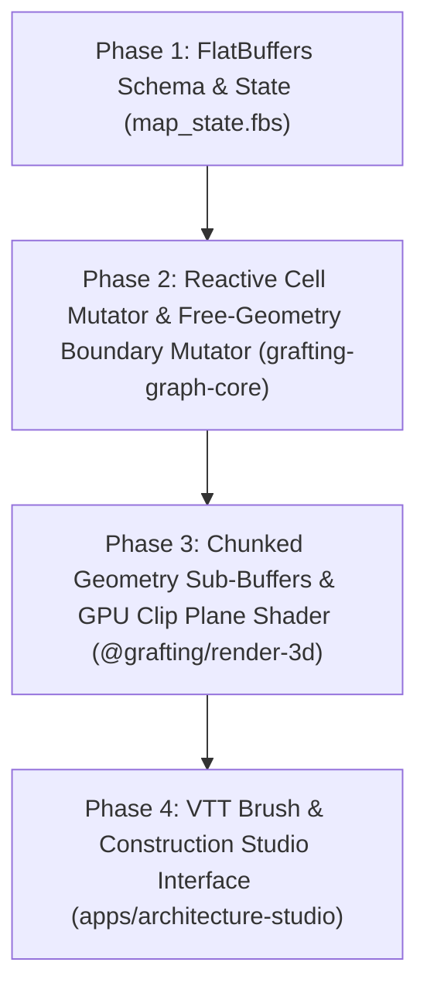

# VTT Map Construction Architecture & Implementation Roadmap

> **Authoritative Technical Spec & Roadmap**  
> Formulated via `/grill-me` Socratic Architectural Interview.  
> Governed by `GRAFTING_MASTER_SOURCE.md` (§0), DEC-049, DEC-052, DEC-060, ADR-0013, ADR-0014.

---

## 1. Architectural Decisions Summary

| Topic | Decision / Mechanism | Rationale |
| --- | --- | --- |
| **Construction Trigger** | **Two-Phase Hybrid** | Batch macro-terrain (seed/heightmap) + local reactive brush edits. |
| **Terrain Cell Mutation** | **Reactive per-cell patch** | Contiguous Rust arena updates in $O(k)$ over the 6-slot neighborhood for module/rotation/elevation edits; instant Undo/Redo. This is the solver's own vocabulary (one module per cell) — it never carries wall/door semantics. |
| **Boundary Representation** | **Free geometry, not a grid address** | A wall, door, window, or other construction-layer boundary is a `BoundarySegment` in world coordinates with explicit vertical extent and behavioral flags — never a cell or `(cell, face)` pair. The grid is an authoring aid (snapping) and a spatial-index shape, never the address (DEC-060, `ADR-0022-wall-representation-free-geometry.md`). No persisted record holds a `CellId` — it is a positional index into one solve, not a stable identity. |
| **Domain Decoupling** | **Neutral per-cell grammar for generation, free geometry for semantics** | The solver's socket-compatibility grammar (module choice, corner joins) stays a neutral, reusable mechanism outside the VTT. Generation *derives* and emits `BoundarySegment`s from a chosen module's faces alongside the cell assignment; semantics reference that geometry by its own stable id, never by `CellId`. VTT applies presentation/theme over these neutral mechanisms (DEC-052) — DEC-052 governs presentation neutrality only, not boundary storage, which is DEC-060's concern. |
| **GPU Render Pipeline** | **Chunked Sub-Buffers** | 3D mesh chunking; WASM sends incremental `ChunkGeometryUpdate` without WebGL scene recreation. |
| **Floor Cutaway View** | **GPU Clip Plane Shader** | WebGL shader applies physical plane clip ($Y < Y_{\text{limit}}$) driven by active camera height level. |
| **Map Persistence & Sync** | **FlatBuffers (`GraftingMapState.fbs`)** | Binary zero-copy serialization between Rust, WASM, and filesystem (DEC-049). Wire schema stores terrain cell assignments and free-geometry boundary segments as separate tables — see Phase 1. |

---

## 2. Sequenced Implementation Phases (Actionable Backlog)

### Phase 1: FlatBuffers Schema & Binary State Contract
- **Objective**: Define the wire contract in `libs/engine/domain-core/contracts/map_state.fbs`.
- **Deliverables**:
  - `PrismCellAssignment` table: per-cell `(module_id, rotation, layer, x, y, vertex_shift)` — the solver's own snapshot-scoped vocabulary, never referenced elsewhere by index (DEC-060 corollary).
  - `BoundarySegment` table: free geometry in world coordinates (`start`, `end`, vertical extent), a `BoundaryKind` (`Wall`, `Door`, `Window`, `Opening`), behavioral flags (`blocks_movement`, `blocks_vision`), and a stable `id` that is never a `CellId`.
  - `BoundaryPatch` table keyed by `BoundarySegment.id` (add/update/remove + `sequence`) for Undo/Redo — no `cell_id` field.
  - Rust codegen (`flatc`) integration already wired via `tools/scripts/generate-contracts.ps1`.

### Phase 2: Reactive Cell Mutator & Free-Geometry Boundary Mutator (`libs/graph/core`)
- **Objective**: Implement reactive $O(k)$ terrain-cell mutation and a separate free-geometry boundary mutator in Rust.
- **Deliverables**:
  - `apply_cell_patch(...)` on `PrismGridMesh` for terrain/module edits — 6-slot neighbor recompute, scoped to the current solve.
  - `apply_boundary_patch(patch: BoundaryPatch)` operating directly on `BoundarySegment`s, independent of cell topology so it survives re-partitioning.
  - Generation derives and emits `BoundarySegment`s from a chosen module's faces (per `docs/research/vtt-wall-representation-options.md` Finding 1) instead of assigning a `CellRole`.
  - A spatial index (grid-bucketed or R-tree) over `BoundarySegment`s as the query accelerator DEC-060 requires — "which room am I in" becomes a geometry query, not a graph walk.
  - WASM binding export in `libs/domains/procgen/generation-wasm`.

### Phase 3: Chunked Sub-Buffers & Clip Plane Shader (`packages/render-3d`)
- **Objective**: Implement high-fps incremental 3D mesh updates and multi-level floor cutaway shader.
- **Deliverables**:
  - Spatial 3D chunk manager partitioning the prism grid into renderable VBO chunks.
  - Incremental `ChunkGeometryUpdate` WASM listener in `RenderEngine`.
  - WebGL vertex/fragment shader clipping plane for $Y < Y_{\text{limit}}$ floor cutaway navigation.

### Phase 4: VTT Interactive Construction Brush (`apps/architecture-studio`)
- **Objective**: Build the visual editing interface in the Studio (`/lab`).
- **Deliverables**:
  - Interactive 3D Brush tool (Place Wall, Erase, Elevate Level, Create Opening) — wall/door placement is free-form with grid snapping as an authoring aid, not a cell toggle.
  - Undo/Redo stack wired to `BoundaryPatch` (walls/doors) and cell-patch (terrain) history.
  - Active level height slider driving the WebGL clip plane shader.
