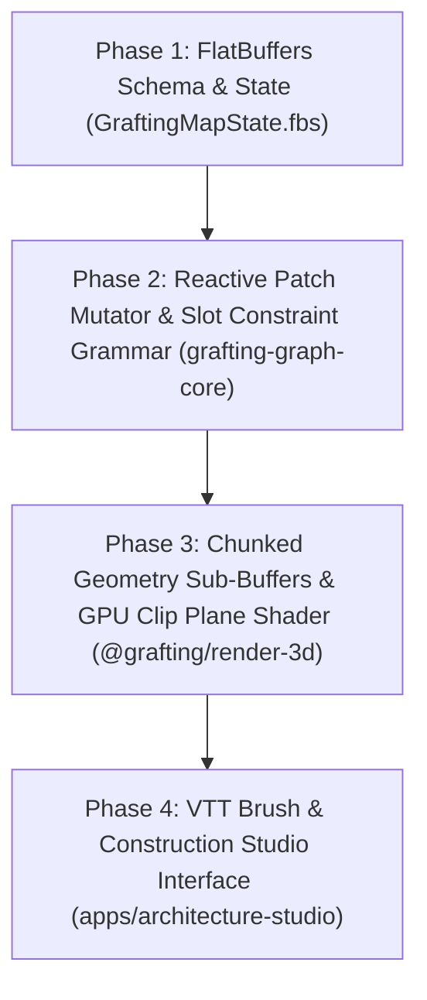

# VTT Map Construction Architecture & Implementation Roadmap

> **Authoritative Technical Spec & Roadmap**  
> Formulated via `/grill-me` Socratic Architectural Interview.  
> Governed by `GRAFTING_MASTER_SOURCE.md` (§0), DEC-049, DEC-052, DEC-060, ADR-0013, ADR-0014.

---

## 1. Architectural Decisions Summary

| Topic | Decision / Mechanism | Rationale |
| --- | --- | --- |
| **Construction Trigger** | **Two-Phase Hybrid** | Batch macro-terrain (seed/heightmap) + local reactive brush edits. |
| **Graph Mutation Model** | **Reactive `CellStatePatch`** | Contiguous Rust arena updates in $O(k)$ over 6-slot neighborhood; instant Undo/Redo. |
| **Domain Decoupling** | **Slot Constraint Grammar** | Graph operates on neutral roles (`Boundary`, `Passage`, `Surface`, `Opening`); VTT applies presentation theme (DEC-052). |
| **GPU Render Pipeline** | **Chunked Sub-Buffers** | 3D mesh chunking; WASM sends incremental `ChunkGeometryUpdate` without WebGL scene recreation. |
| **Floor Cutaway View** | **GPU Clip Plane Shader** | WebGL shader applies physical plane clip ($Y < Y_{\text{limit}}$) driven by active camera height level. |
| **Map Persistence & Sync** | **FlatBuffers (`GraftingMapState.fbs`)** | Binary zero-copy serialization between Rust, WASM, and filesystem (DEC-049). |

---

## 2. Sequenced Implementation Phases (Actionable Backlog)

### Phase 1: FlatBuffers Schema & Binary State Contract
- **Objective**: Define `GraftingMapState.fbs` in `docs/architecture/` / `contracts/`.
- **Deliverables**:
  - `CellRole` enum (`Surface`, `Boundary`, `Passage`, `Opening`).
  - `PrismCell` vector with 6-slot adjacency pointers and freeform vertex displacement offsets.
  - Rust codegen (`flatc`) integration in `libs/graph/core`.

### Phase 2: Reactive Patch Mutator & Slot Constraint Grammar (`libs/graph/core`)
- **Objective**: Implement reactive $O(k)$ graph mutation logic and slot rules in Rust.
- **Deliverables**:
  - `apply_cell_patch(patch: CellStatePatch)` method on `PrismGridMesh`.
  - Automatic 6-slot constraint resolution for wall corners, openings, and level steps.
  - WASM binding export in `libs/domains/procgen/generation-wasm`.

### Phase 3: Chunked Sub-Buffers & Clip Plane Shader (`packages/render-3d`)
- **Objective**: Implement high-fps incremental 3D mesh updates and multi-level floor cutaway shader.
- **Deliverables**:
  - Spatial 3D chunk manager partitioning the prism grid into renderable VBO chunks.
  - Incremental `ChunkGeometryUpdate` WASM listener in `RenderEngine`.
  - WebGL vertex/fragment shader clipping plane for $Y < Y_{\text{limit}}$ floor cutaway navigation.

### Phase 4: VTT Interactive Construction Brush (`apps/architecture-studio`)
- **Objective**: Build the visual editing interface in the Studio (`/lab`).
- **Deliverables**:
  - Interactive 3D Brush tool (Place Wall, Erase, Elevate Level, Create Opening).
  - Undo/Redo stack wired to `CellStatePatch` history.
  - Active level height slider driving the WebGL clip plane shader.
