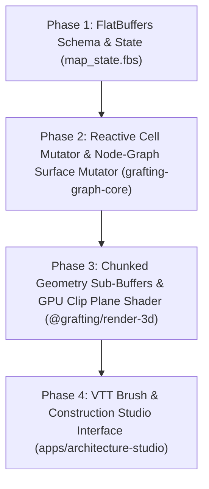

# VTT Map Construction Architecture & Implementation Roadmap

> **Authoritative Technical Spec & Roadmap**  
> Formulated via `/grill-me` Socratic Architectural Interview.  
> Governed by `GRAFTING_MASTER_SOURCE.md` (§0), DEC-049, DEC-052, DEC-060, ADR-0013, ADR-0014.

---

## 1. Architectural Decisions Summary

| Topic | Decision / Mechanism | Rationale |
| --- | --- | --- |
| **Construction Trigger** | **Two-Phase Hybrid** | Batch macro-terrain (seed/heightmap) + local reactive brush edits. |
| **Terrain Cell Mutation** | **Reactive per-cell patch** | Contiguous Rust arena updates in $O(k)$ over the 6-slot neighborhood for module/rotation/elevation edits; instant Undo/Redo. This is the solver's own vocabulary (one module per cell) — it never carries wall/door semantics. |
| **Construction Surface Model** | **Graph nodes → mesh → surface → asset** | A construction surface (wall, door, window, floor panel, terrain patch — every domain, not just structure) is defined by a set of `grafting-graph-core` graph nodes (a cycle), referenced by their stable `NodeId` — **revised 2026-08-10**, reversing this roadmap's original free-geometry design (DEC-060, `ADR-0022-wall-representation-free-geometry.md`, rewritten in place). `Mesh` derives pure geometric parameters from the node cycle's current positions (any polygon a cycle describes, not only a rectangle). `Surface` is the semantic record: `{ type (open/extensible, never a fixed enum — see `BoundaryKind` correction below), physical: bool, mesh }`. `Asset` fills the mesh by replication (a small unit tiled to size) or stretch/fit (a single unique asset scaled to the mesh's exact dimensions), and owns vision-blocking/rendering behavior — never the surface. `tileset-wfc::CellId` remains forbidden as a persisted identity, unconditionally; this reversal applies only to `grafting-graph-core::NodeId`, which is a stable, caller-assigned identity, not a positional index. |
| **Domain Decoupling** | **Neutral per-cell grammar for generation; node-graph for the persisted surface** | The solver's socket-compatibility grammar (module choice, corner joins) stays a neutral, reusable mechanism outside the VTT. Generation *derives* geometry from a chosen module's faces and expresses it as a node cycle; the persisted `Surface` references that cycle by stable `NodeId`, never by `CellId`. VTT applies presentation/theme over these neutral mechanisms (DEC-052) — DEC-052 governs presentation neutrality only, not surface storage, which is DEC-060's concern. |
| **GPU Render Pipeline** | **Chunked Sub-Buffers** | 3D mesh chunking; WASM sends incremental `ChunkGeometryUpdate` without WebGL scene recreation. |
| **Floor Cutaway View** | **GPU Clip Plane Shader** | WebGL shader applies physical plane clip ($Y < Y_{\text{limit}}$) driven by active camera height level. |
| **Map Persistence & Sync** | **FlatBuffers (`GraftingMapState.fbs`)** | Binary zero-copy serialization between Rust, WASM, and filesystem (DEC-049). Wire schema stores terrain cell assignments and free-geometry boundary segments as separate tables — see Phase 1. |

---

## 2. Sequenced Implementation Phases (Actionable Backlog)

### Phase 1: FlatBuffers Schema & Binary State Contract
- **Objective**: Define the wire contract in `libs/engine/domain-core/contracts/map_state.fbs`. **Revised 2026-08-10** — supersedes the `BoundarySegment`/`BoundaryPatch` shape merged via PR #73, which implemented the now-reversed free-geometry design; this is tracked as a required follow-up task (non-Markdown, needs `ia-graft task new` + PR), not performed by editing this document.
- **Deliverables**:
  - `PrismCellAssignment` table: per-cell `(module_id, rotation, layer, x, y, vertex_shift)` — the solver's own snapshot-scoped vocabulary, never referenced elsewhere by index (DEC-060 corollary, unchanged by the revision). Unaffected by this revision.
  - `GraphNode` table: a stable `NodeId` plus its current spatial position (`Vec3`) — the wire form of `grafting-graph-core::Node`.
  - `GraphEdge`/adjacency table: which node ids are connected, mirroring `grafting-graph-core::Edge` — this is what lets a cycle (and therefore a surface's mesh) be reconstructed from the wire format.
  - `ConstructionSurface` table: an ordered list of `NodeId`s forming the cycle, an open/extensible `type` identifier (never a fixed enum — the `BoundaryKind` mistake from the pre-revision schema must not recur), and a `physical: bool` flag. No `mesh` or `asset` field: mesh is derived at load time from the referenced nodes' positions, and asset is resolved externally via a visual-kind-style registry keyed on `type` (DEC-059 pattern) — **provisional**, pending `E1.1`'s recomputation-cost measurement; if that measurement shows on-demand derivation is too expensive, this table may need to cache computed mesh data instead, which would be a schema amendment at that point, not assumed now.
  - Node-operation records (move/add/delete/merge/split) for Undo/Redo, keyed by `NodeId`/surface — replaces the old `BoundaryPatch` shape; exact fields depend on `vtt-roadmap.md` Epic 1's `E1.2` trait design and are not finalized here.
  - Rust codegen (`flatc`) integration already wired via `tools/scripts/generate-contracts.ps1`.

### Phase 2: Reactive Cell Mutator & Node-Graph Surface Mutator (`libs/graph/core`)
- **Objective**: Implement reactive $O(k)$ terrain-cell mutation and the node-graph surface model in Rust. **Blocked on `vtt-roadmap.md` Epic 1** (`E1.1`'s measurement spike and `E1.2`'s trait-based graph-operations reconciliation) — this phase cannot start correctly before those land, since the surface model *is* the graph-core reconciliation's output.
- **Deliverables**:
  - `apply_cell_patch(...)` on `PrismGridMesh` for terrain/module edits — 6-slot neighbor recompute, scoped to the current solve. Unaffected by this revision.
  - Node operations on `grafting-graph-core`: move (always safe — recalculates every surface referencing the moved node via graph adjacency, no full scan), add, delete (with the neighbors-form-a-cycle repair rule — see `ADR-0022`), merge, split, duplicate-a-surface (never a single node alone).
  - `Surface` construction from a node cycle: `{ type, physical, mesh-derived-on-demand }`, per the revised `ADR-0022`.
  - Generation derives node cycles (and therefore surfaces) from a chosen module's faces, instead of assigning a `CellRole` or emitting a `BoundarySegment`.
  - WASM binding export in `libs/domains/procgen/generation-wasm`.

### Phase 3: Chunked Sub-Buffers & Clip Plane Shader (`packages/render-3d`)
- **Objective**: Implement high-fps incremental 3D mesh updates and multi-level floor cutaway shader.
- **Deliverables**:
  - Spatial 3D chunk manager partitioning the prism grid into renderable VBO chunks.
  - Incremental `ChunkGeometryUpdate` WASM listener in `RenderEngine`.
  - WebGL vertex/fragment shader clipping plane for $Y < Y_{\text{limit}}$ floor cutaway navigation.

### Phase 4: VTT Interactive Construction Brush (`apps/architecture-studio`)
- **Objective**: Build the visual editing interface in the Studio (`/lab`).
- **Deliverables**:
  - Interactive 3D Brush tool (Place Wall, Erase, Elevate Level, Create Opening) — wall/door placement is node-graph editing (add/move/merge/split nodes to define a surface's cycle), not free-form segment drawing and not a cell toggle.
  - Undo/Redo stack wired to node-operation history (move/add/delete/merge/split, per the revised `ADR-0022`) for walls/doors, and cell-patch history for terrain.
  - Active level height slider driving the WebGL clip plane shader.
