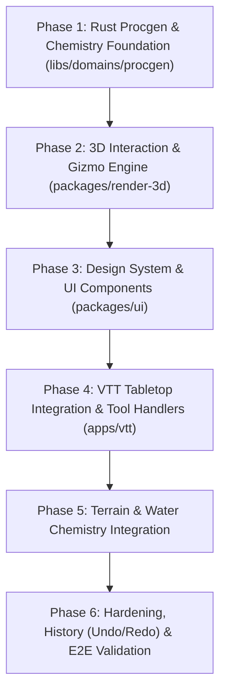

# VTT Reactive Construction: Detailed Engineering Plan & Implementation Roadmap

> **Authoritative Execution Plan**  
> **Status:** Open for execution  
> **Governed by:** `GRAFTING_MASTER_SOURCE.md`, DEC-049, DEC-052, DEC-060, ADR-0013, ADR-0014, ADR-0022, ADR-0023.  
> **Conceptual Foundation:** `docs/research/vtt-reactive-construction-and-tiny-glade-ui-model.md` and `docs/research/vtt-tiny-glade-open-source-ecosystem.md`.

---

## 1. Overview & Architectural Goals

This roadmap translates the *Tiny Glade-inspired* reactive construction model into an **incremental, milestone-driven execution plan** for the Grafting Monorepo.

### Core Tenets:
1. **Clean Separation of Layers:** UI and presentations in TypeScript (`apps/vtt`, `packages/ui`, `packages/render-3d`); all procedural calculations, geometry synthesis, and chemistry rules in Rust (`libs/domains/procgen`, `libs/graph/core`).
2. **Deterministic & Incremental (`ADR-0022`):** Building modifications do not trigger full destructive re-rolls. Geometry expands by adding/moving nodes, merging surfaces, and updating local seams.
3. **Frictionless In-Canvas UX:** Minimal UI obstruction; primary interactions happen directly on the 3D model via **contextual gizmo handles** and **screen-projected popover palettes**.

---

## 2. Sequenced Implementation Phases (Actionable Backlog)



---

### Phase 1: Rust Procgen & Chemistry Foundation (`libs/domains/procgen`)

- **Objective:** Provide the pure-Rust mathematical generators and spatial reaction evaluator for roofs, varied room layouts, and emergent seams.
- **Tasks & Deliverables:**
  - **T1.1 (`roof-generation` crate):** Create `libs/domains/procgen/roof-generation`. Implement the simple-polygon *Straight Skeleton* algorithm (Felkel & Obdržálek) in pure Rust (`wasm32-unknown-unknown` compatible). Output `StructurePiece`s for hip and gable roofs with eaves welded to existing wall top `NodeId`s.
  - **T1.2 (Squarified Treemaps in `structure-generation`):** Replace the uniform $rows \times cols$ in `room_grid.rs` with `streemap` (MIT/Apache-2.0). Implement zone-weighted room subdivision (Social, Private, Service) and adjacency-graph door emission.
  - **T1.3 (`spatial-chemistry` module):** Add declarative seam evaluation rules in Rust:
    - `PathSpline` $\cap$ `WallSegment` $\rightarrow$ generate `Archway` / `Gate`.
    - `PathSpline` $\cap$ `BuildingExterior` $\rightarrow$ generate `Door` + `Step`.
    - `BuildingVolume` $\cap$ `BuildingVolume` $\rightarrow$ boolean 2D footprint union + unified roof generation.
    - `BuildingVolume` $\cap$ `Air` (elevated) $\rightarrow$ generate support stilts/piers.
  - **T1.4 (`construction-wasm` API Exposure):** Expose new methods: `generate_and_apply_roof_json`, `generate_and_apply_treemap_rooms_json`, and `evaluate_chemistry_transaction_json`.

---

### Phase 2: 3D Interaction & Gizmo Engine (`packages/render-3d`)

- **Objective:** Enable high-precision 3D raycasting, direct handle manipulation, and real-time ghost previews on the Three.js canvas.
- **Tasks & Deliverables:**
  - **T2.1 (`HandleRaycaster` & `GizmoVisual`):** Create 3D gizmo primitives (arrows, rings, corner points) rendered in an overlay scene. Support hover highlights and enlarged invisible hitboxes for easy clicking.
  - **T2.2 (`GhostPreviewVisual` & Billboard Math):** 
    - Implement real-time translucent preview rendering during pointer drag.
    - Implement camera-facing vertical billboard plane projection for vertical ($Y$) drag operations (roof pitch, wall height).
  - **T2.3 (`MaterialPackRegistry`):** Standardize PBR texture loading (Albedo, Normal, Roughness, AO) from CC0 sources (Stone, Brick, Slate, Terracotta, Timber, Water) with automatic mipmapping and texture reuse.

---

### Phase 3: Design System & UI Components (`packages/ui`)

- **Objective:** Build the agnostic, reusable UI primitives for the dock, popovers, and styling selectors.
- **Tasks & Deliverables:**
  - **T3.1 (`ActionDock` Component):** Centered bottom toolbar with fluid spring animations, expandable sub-pills on tool activation, and custom SVG icon slots.
  - **T3.2 (`PopoverInspector` Component):** Floating panel capable of positioning itself either relative to a screen coordinate or projected from a 3D world vector.
  - **T3.3 (`PalettePicker` Molecule):** Grid and carrossel selector for harmonized architectural palettes (wall materials, roof tones, trim styles).
  - **T3.4 (CSS Tokens & Aesthetics):** Dark glassmorphism (`backdrop-filter: blur(12px)`), neutral slate tones, accessible focus rings, and micro-animations.

---

### Phase 4: VTT Tabletop Integration & Tool Handlers (`apps/vtt`)

- **Objective:** Replace legacy hotbars and drawers with the unified reactive editing workflow in `apps/vtt`.
- **Tasks & Deliverables:**
  - **T4.1 (`ConstructionDock` Widget):** Replace `construction-hotbar.tsx` with the new `ActionDock`, binding tools (`building-volume`, `freeform-wall`, `openings`, `stairs`, `paths`, `terrain-water`, `foliage`, `palette`, `demolish`).
  - **T4.2 (Pointer State Machine Refactor):** Refactor `use-construction-pointer.ts` into a clean 3-state cycle:
    1. *Hover:* Highlight target object and project contextual 3D handles.
    2. *Drag:* Lock camera orbit, update `GhostPreviewVisual` on `pointermove` (60 FPS).
    3. *Commit:* Execute single transaction on `pointerup` via `ConstructionSessionPort`.
  - **T4.3 (Tool Handlers in `composition/tabletop/tools/`):**
    - `building-volume-tool.ts`: Drag base rect/circle + extrude height.
    - `path-spline-tool.ts`: Draw spline ribbons with immediate seam proposals.
    - `openings-tool.ts`: Click wall to place window/door with live slide & merge.
    - `palette-style-tool.ts`: Click structure to summon `PopoverInspector`.

---

### Phase 5: Terrain & Water Chemistry Integration

- **Objective:** Integrate terrain sculpting, water table excavation, and reactive shoreline vegetation into the unified graph.
- **Tasks & Deliverables:**
  - **T5.1 (Terrain & Water Brush):** Implement water excavation: lowering terrain below base water level reveals the water plane and changes surface physics.
  - **T5.2 (Reactive Shoreline Dressing):** Automatically generate pebbles, wet sand bands, and aquatic flora (reeds, lilies) where terrain intersects the water plane.
  - **T5.3 (Cliff/Foundation Seam Welding):** Buildings placed on slopes automatically generate stone foundation skirts to meet irregular terrain cells without gaps.

---

### Phase 6: Hardening, History (Undo/Redo) & E2E Validation

- **Objective:** Ensure rock-solid performance, clean transaction rollbacks, and flawless browser execution.
- **Tasks & Deliverables:**
  - **T6.1 (History Transaction Batching):** Ensure gizmo drags commit exactly **one** undo/redo record on `pointerup`, never polluting the stack with intermediate `pointermove` frames.
  - **T6.2 (Camera Lock Integration):** Ensure camera pan/orbit is strictly disabled while dragging a 3D gizmo handle or drawing a path spline.
  - **T6.3 (Automated Test Suite & Browser Verification):**
    - Unit tests in Rust for `roof-generation` and `spatial-chemistry`.
    - Component tests in `packages/ui` for `ActionDock` and `PopoverInspector`.
    - Live browser validation checklist across Desktop and Touch viewports.

---

## 3. Implementation Checklist & Dependency Order

```text
[ ] Milestone 1: Rust roof-generation crate & streemap room generator
[ ] Milestone 2: Spatial chemistry evaluator in Rust/WASM
[ ] Milestone 3: HandleRaycaster & 3D Gizmo overlays in packages/render-3d
[ ] Milestone 4: ActionDock & PalettePicker in packages/ui
[ ] Milestone 5: apps/vtt pointer state machine & ConstructionDock wiring
[ ] Milestone 6: Terrain/Water chemistry & shoreline synthesis
[ ] Milestone 7: Undo/Redo hardening, camera locking & E2E validation
```
