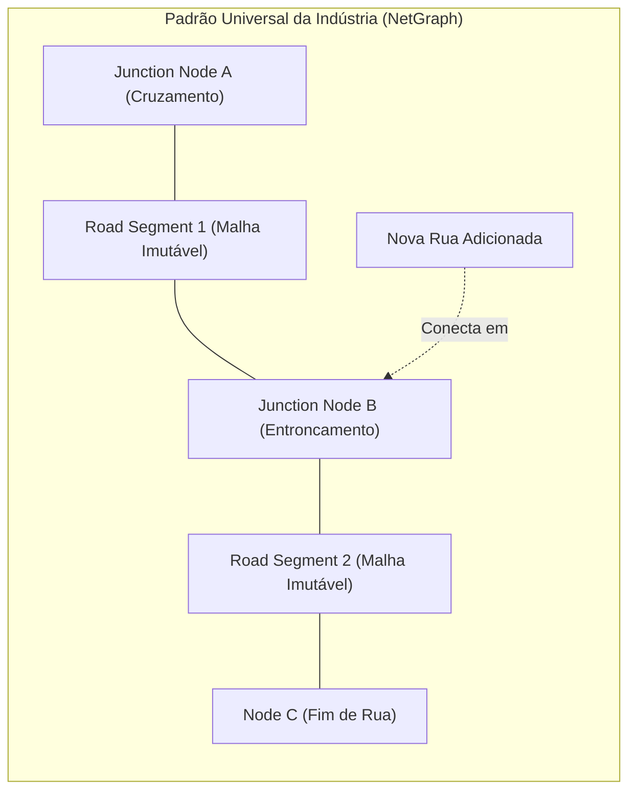

# VTT Road Networks & Procedural Intersections: Industry Survey & Architecture Blueprint

- Status: **Approved Architecture Proposal**
- Date: 2026-09-13
- Related: [`vtt-path-spine-network-design.md`](vtt-path-spine-network-design.md), [`bezier-roads-design.md`](bezier-roads-design.md), [ADR-0013](../../docs/adr/ADR-0013-rust-graph-core-and-api-contracts.md)

---

## 1. O Problema Fundamental no Grafting Hoje

### Por que as faces (e customizações) somem ao adicionar novas ruas?
No sistema atual do Grafting, as estradas utilizam uma **união planar 2D monolítica** (`planSpineContour` / `unionBandLayer`):
1. Quando uma nova rua é desenhada e se conecta a uma rede existente, o motor agrupa **todos os corredores conectados** na mesma nuvem (`changedSpineCloud`).
2. Todos os ribbons de todas as estradas da nuvem são passados juntos para a união booleana 2D.
3. A união produz um ou mais polígonos unificados totalmente novos.
4. O motor declara **todas as faces anteriores da nuvem** como `sourceSurfaceKeys` (consumidas/apagadas) e gera novas faces com novos IDs (`road-cloud:[...]:band-0:0`, etc.).

**Consequência**:
Mesmo uma rua desenhada a 200 metros de distância, se estiver conectada à mesma rede viária, faz com que as faces de toda a malha existente sejam deletadas e re-geradas do zero. Qualquer customização de textura, elevação ou seleção sobre as faces anteriores é perdida, além de gerar custo computacional desnecessário.

---

## 2. Como os Jogos da Indústria Resolvem Redes Viárias

Nenhum jogo de simulação moderno (como *Cities: Skylines*, *Transport Fever* ou motores como *Unreal Engine*) reconstrói uma malha de estrada inteira ao conectar uma nova rua. A abordagem universal da indústria baseia-se em **decomposição estrita de Grafo: Segmentos vs. Junções**.

Quando a `Nova Rua` é conectada ao `Node B`:
- `Segment 1` **NÃO é tocado nem reconstruído**.
- `Segment 2` **NÃO é tocado nem reconstruído**.
- **Apenas a malha do nó `Node B` (o cruzamento)** é recalculada para acomodar a nova entrada.

---

### 2.1. *Cities: Skylines I & II* (Colossal Order / Unity)

*Cities: Skylines* possui a arquitetura de estradas procedural mais estudada e robusta da indústria (*NetManager*):

1. **Estrutura Dual: `NetNode` vs `NetSegment`**:
   - **`NetSegment`**: Representa a pista entre dois nós. É modelado como uma curva cúbica de Bézier com vetor de direção e largura definidos.
     - A malha do segmento é um **loft/extrusão procedural independente** (ou malha deformada por spline) gerada *uma única vez*.
     - Cada segmento tem seus próprios vértices, UVs e buffers de colisão.
   - **`NetNode`**: Representa pontos de conexão (grau 1 = cul-de-sac/fim de rua; grau 2 = emenda de curvatura/troca de elevação; grau 3+ = cruzamento/entroncamento em T, X, rotatória).
     - Quando 3 ou mais segmentos se encontram, o `NetNode` calcula um **polígono de preenchimento (Intersection Cap)** conectando os cantos dos ribbons de cada segmento adjacente.

2. **Isolamento de Atualização**:
   - Adicionar ou deletar uma rua afeta *no máximo* os dois `NetNodes` nas suas pontas e os segmentos imediatamente divididos.
   - Ruas a 1 quarteirão de distância nunca recebem chamadas de re-renderização.

---

### 2.2. *Unreal Engine* (Landscape Splines & City Sample)

Na Unreal Engine:
1. **Spline Mesh Components para Segmentos**:
   - Cada trecho de estrada é uma instância de malha deformada (`USplineMeshComponent`) definida por um vetor inicial, tangente inicial, vetor final e tangente final.
   - Vantagem: É uma entidade geométrica atômica, imutável e renderizada via instancing na GPU.
2. **Procedural Junction Meshes**:
   - Nos cruzamentos, o sistema instancia uma malha especial de cruzamento (ex: malha em T de 3 saídas ou em cruz de 4 saídas) ou gera dinamicamente uma triangulação Delaunay/Ear-clipping plana ajustada às tangentes das splines que convergem para aquele ponto.
3. **World Partitioning**:
   - As estradas são particionadas espacialmente em células de grid. A adição de um elemento só suja o grafo local daquela célula.

---

### 2.3. *Transport Fever 2* (Urban Games)

O foco em trens e estradas de tráfego intenso exige precisão milimétrica em cruzamentos e agulhas de trilho:
1. **Pistas e Vias Orientadas a Lanes (Faixas)**:
   - A espinha da estrada não gera apenas um polígono visual, mas sim uma hierarquia de *Lanes* (faixas de rolamento).
   - O cruzamento é matematicamente modelado calculando as interseções das bordas laterais (*curb lines*) das ruas que chegam ao nó.
2. **Conexões por Curva de Concordância (Fillets)**:
   - Os cantos de esquinas usam arcos circulares ou curvas de Bézier cúbicas suaves interligando as bordas externas das duas ruas.
   - O centro do cruzamento é preenchido como uma face fechada convexa.

---

### 2.4. *Manor Lords* (Unreal Engine 5)

*Manor Lords* destaca-se por estradas orgânicas e medievais na terra:
1. **Conformação com Heightmap**:
   - A espinha Bézier da estrada projeta suas estações diretamente sobre o relevo, com amortecimento de declive (*slope smoothing*).
2. **Hibridismo Malha + Decal Virtual**:
   - Para estradas de terra orgânicas, em vez de criar topologia complexa que recorte o terreno, o jogo projeta a estrada via **Virtual Texture Decals** ou ribbons flutuantes (*clamped to ground*).
   - Isso elimina qualquer risco de erros topológicos não-manifold ou furos na malha do mundo.

---

### 2.5. Engenharia Civil / BIM (*AutoCAD Civil 3D*, *Bentley OpenRoads*)

Em softwares profissionais de infraestrutura:
1. **Alinhamento Horizontal (Espinha XZ) + Perfil Vertical (Elevação Y)**:
   - Uma via é a combinação de uma curva horizontal com um perfil de elevação longitudinal.
2. **Corredor & Montagem de Seção Transversal (Cross-Section Assembly)**:
   - A estrada é gerada por seções transversais estocadas a intervalos regulares ao longo da curva.
3. **Regiões de Interseção (Intersection Regions)**:
   - Ao criar um cruzamento, o software define linhas de bordo de pavimento (*curb returns*) independentes.
   - O cruzamento é uma região separada da via principal, mantendo a via principal intacta até a linha de tangência.

---

## 3. Lições e Diretrizes para o Grafting Monorepo

| Abordagem Atual (Monolítica) | Abordagem Recomendada (Segmentada em Grafo) |
| :--- | :--- |
| **União 2D global de todas as fitas**: Junta todas as estradas em um único polígono. | **Separação Segmento vs. Junção**: Cada aresta Bézier gera sua própria fita de malha. |
| **Destruição em cascata**: Ao encostar em uma estrada, toda a nuvem conectada é apagada. | **Isolamento de Impacto**: Conectar uma estrada só afeta o nó de junção e a nova fita. |
| **Manifold frágil**: União 2D de polígonos adjacentes gera arestas duplicadas e erros `already used 2 times`. | **Topologia limpa**: Segmentos possuem arestas privadas; apenas o nó de junção costura os pontos de contato. |

---

## 4. Plano de Ação Estruturado para o Grafting

### Fase 1: Estabilização e Preservação de Performance (Concluída)
- Manter a soldagem espacial rápida via **Buckets de Grid** em `contour-patch.ts` ($O(1)$ em vez de $O(N^2)$).
- Manter a projeção analítica de altura de curva em `curve-projection.ts`.
- Manter as otimizações em Rust (AABB culling, solda de tangentes suaves, threshold de auto-interseção corrigido).
- Reverter as heurísticas improvisadas de escopo que tornavam o sistema instável.

### Fase 2: Pesquisa e Prototipagem da Nova Arquitetura de Nuvem (Próximo Passo)
- **Definição de Tipos Topológicos**:
  - `PathSegment`: Aresta Bézier com malha de fita retangular/strip invariante.
  - `PathJunction`: Face poligonal fechada criada apenas quando $\text{grau}(\text{nó}) \ge 3$ ou em cruzamento em nível.
- **Transação Isolada**:
  - `ApplyPatchReplacementRequest` passa a declarar como `sourceSurfaceKeys` apenas a junção tocada, nunca os segmentos vizinhos.
