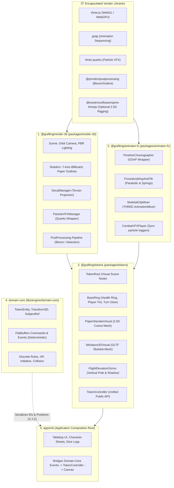
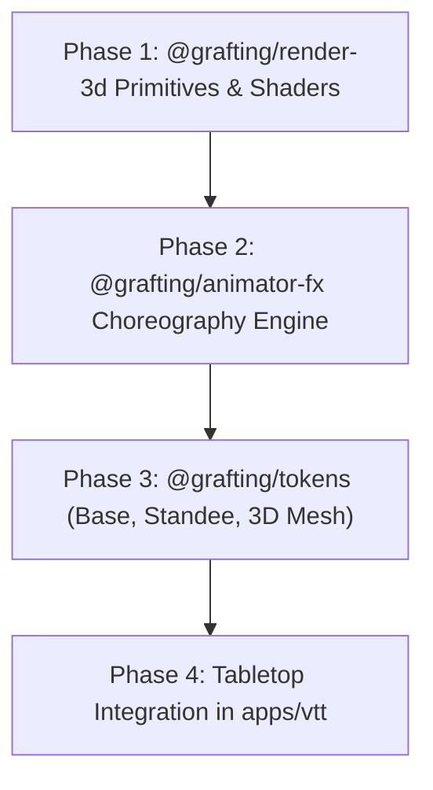

# VTT Token System & Animation Architecture (3D, 2.5D Standees & Modular Packages)

> **Authoritative Architectural Design & Execution Plan**  
> **Status:** Registered & Open for execution (Roadmap Epic 5 & Epic 6)  
> **Governed by:** `GRAFTING_MASTER_SOURCE.md`, DEC-049, DEC-052, DEC-060, [ADR-0011](docs/adr/ADR-0011-package-autonomy-and-external-isolation.md), [ADR-0014](docs/adr/ADR-0014-composable-capability-packages.md), [ADR-0022](docs/adr/ADR-0022-wall-representation-free-geometry.md), [ADR-0023](docs/adr/ADR-0023-vtt-application-architecture.md), `VTT-VISIBILITY-001`.  
> **Related Documents:** `docs/architecture/vtt-apertures-doors-and-windows-plan.md`, `docs/architecture/vtt-reactive-construction-execution-plan.md`.

---

## 1. Executive Summary & Design Vision

This document establishes the architecture for the **Token & Animation Ecosystem** within the Grafting Monorepo VTT.

### Core Architectural Principles:
1. **Unified 2.5D & 3D Pipeline (Zero Rework):** A 2.5D Standee (*Paper Mini*) is structurally a 3D object whose visual body is an alpha-cutout plane with a vertical billboard constraint. Both 2.5D and 3D tokens share **100% of the movement physics, combat timelines, aura decals, health rings, and selection logic**.
2. **Strict Package Autonomy ([ADR-0011](docs/adr/ADR-0011-package-autonomy-and-external-isolation.md) & [ADR-0014](docs/adr/ADR-0014-composable-capability-packages.md)):** No game logic or token concepts in the graphics layer; no graphics or vendor types in the domain layer. Every capability package is isolated and reusable in future games or tactical simulators.
3. **Tactile Procedural Movement:** Tokens do not slide mechanically across the grid; they exhibit organic **parabolic hops, directional tilt/lean, and spring damping (*squash & stretch*)** upon landing.

---

## 2. Package Separation & Dependency Flow



---

## 3. Package Responsibilities & Boundaries

### 3.1 `@grafting/render-3d` (`packages/render-3d`)
* **Role:** Pure, domain-agnostic 3D rendering infrastructure.
* **Encapsulated Scope:**
  - `SceneManager`: Render loop (60 FPS), camera control, shadow maps, tone mapping.
  - `Shaders`: Custom GLSL materials (Y-Axis cylindrical billboard, white paper outline cutout, screen-door transparency for stealth).
  - `DecalProjector`: Wrapper around `DecalGeometry` to conform auras, circular rings, and impact marks onto uneven 3D terrain meshes.
  - `VFXManager`: Wrapper around `three.quarks` to instantiate and manage particle emitters without leaking vendor types.

### 3.2 `@grafting/animator-fx` (`packages/animator-fx`)
* **Role:** Motion design, procedural physics mathematics, and choreography timelines.
* **Encapsulated Scope:**
  - `ActionTimeline`: Typed wrapper over `GSAP` orchestrating multi-phase combat sequences:
    $$\text{Wind-up (Anticipation)} \longrightarrow \text{Lunge / Leap} \longrightarrow \text{Impact & VFX Trigger} \longrightarrow \text{Recovery}$$
  - `ProceduralHopAndTilt`: Pure mathematical functions for parabolic hop arcs, directional leaning based on velocity vector $\vec{v}$, and spring-damped landing oscillations.
  - `SkeletalMixer`: Smooth animation crossfading (`Idle` $\leftrightarrow$ `Walk` $\leftrightarrow$ `Attack` $\leftrightarrow$ `Hurt` $\leftrightarrow$ `Death`) wrapping `THREE.AnimationMixer`.

### 3.3 `@grafting/tokens` (`packages/tokens`)
* **Role:** The complete tactical tabletop miniature component (3D and 2.5D).
* **Encapsulated Scope:**
  - `TokenRoot`: The container 3D group anchoring the base, visual body, and auras.
  - `BaseRing`: The circular base shader featuring:
    - **Health Ring:** Circular arc shader transitioning from Green $\to$ Yellow $\to$ Red based on current HP percentage.
    - **Player Signature Tint:** Outer rim colored according to the controlling player's identity.
    - **Active Turn Glow:** Animated pulsing emissive border when the combatant is active.
  - `PaperStandeeVisual`: 2.5D cutout plane with Y-axis camera lock and cardboard rim extrusion.
  - `Miniature3DVisual`: 3D rigged GLTF/GLB loader with material mapping and bone attachment points (weapons, shields, hands).
  - `FlightElevationGizmo`: Vertical light guide, ground shadow decal, and floating altitude badge (e.g., `+9m` / `+30ft`).
  - `TokenController`: High-level facade exposing unified operations to `apps/vtt`.

---

## 4. Unified Scene Graph Hierarchy

```
[ THREE.Group: TokenRoot ]
   ├── [ BaseMesh: BaseRing ]              <-- Shared 3D Cylinder Base (Health Ring Shader + Player Tint)
   │     └── [ ProjectedDecal: Auras ]     <-- Projected onto terrain via DecalGeometry
   ├── [ ElevationGizmo: FlightPole ]      <-- Visible only when elevation > 0 (Light beam + Ground Disc)
   └── [ BodySlot: VisualBody ]            <-- Polymorphic Body Container:
         ├── If 3D Miniature:   GLTF Skeletal Mesh (Mixamo / Hero Forge rigged)
         └── If 2.5D Standee:   Y-Axis Cylindrical Billboard Quad (Alpha Cutout + Outline)
```

---

## 5. Movement, Combat & Animation Choreography

### 5.1 Procedural Hop & Tilt Movement
When moving along a waypoint trajectory, the token evaluates local vertical elevation:
* **Parabolic Hop Arc:**
  $$\text{Elevation}(t) = \text{TerrainY}(x, z) + 4 \cdot h_{\text{hop}} \cdot t(1 - t)$$
* **Directional Tilt Angle:**
  $$\theta_{\text{lean}} = \text{clamp}(\|\vec{v}\| \cdot k_{\text{tilt}}, -\theta_{\text{max}}, \theta_{\text{max}})$$
* **Impact Squash & Stretch:** On completion of each cell transition, local scale applies a damped spring:
  $$\text{Scale}_y(t) = 1.0 - A \cdot e^{-\gamma t} \cdot \cos(\omega t)$$

### 5.2 Melee & Spell Attack Choreography
Both 3D and 2.5D tokens execute the same timeline phases:

| Phase | Duration | 3D Miniature Action | 2.5D Standee Action | VFX / Audio Trigger |
| :--- | :---: | :--- | :--- | :--- |
| **1. Rotate & Aim** | 0.15s | Face target coordinates (Yaw) | Face target coordinates (Yaw) | — |
| **2. Anticipation** | 0.20s | Play `Attack_Windup` clip | Tilt standee back $-20^\circ$ | Weapon draw sound |
| **3. Strike (Lunge)**| 0.15s | Play `Attack_Slash` clip + advance 0.4m | Snap standee forward + scale stretch | Whoosh audio |
| **4. Impact** | 0.05s | Hit frame reached | Standee contacts target boundary | `three.quarks` slash/sparks + Target shakes |
| **5. Recovery** | 0.25s | Crossfade back to `Idle` + return | Reset rotation + spring dampen | — |

---

## 6. TypeScript & Rust Data Contracts

### 6.1 Rust Canonical Domain (`libs/engine/domain-core/src/tokens.rs`)

```rust
use serde::{Deserialize, Serialize};

#[derive(Debug, Clone, PartialEq, Serialize, Deserialize)]
pub enum TokenVisualSpec {
    PaperStandee {
        texture_url: String,
        aspect_ratio: f32,
    },
    Miniature3D {
        model_url: String,
        scale: f32,
        default_idle_clip: String,
    },
}

#[derive(Debug, Clone, PartialEq, Serialize, Deserialize)]
pub struct TokenEntity {
    pub id: String,
    pub subject_ref: Option<String>,
    pub owner_player_id: Option<String>,
    pub position: [f32; 3],
    pub rotation_yaw: f32,
    pub elevation: f32,
    pub footprint_radius: f32,
    pub visual: TokenVisualSpec,
    pub health_percentage: f32,
    pub is_active_turn: bool,
}
```

### 6.2 TypeScript Token Controller Interface (`packages/tokens`)

```typescript
export interface ITokenController {
  readonly id: string;
  readonly rootGroup: THREE.Group;

  /** Smooth movement with hop, tilt, and terrain snapping */
  moveTo(destination: THREE.Vector3, options?: { hopHeight?: number; speed?: number }): Promise<void>;

  /** Full attack choreography with target interaction and particle VFX */
  performAttack(targetPosition: THREE.Vector3, vfxPreset: "melee_slash" | "magic_missile" | "arrow_projectile"): Promise<void>;

  /** Visual hurt reaction: red emissive flash + horizontal shake */
  takeDamage(newHealthPercentage: number, damageAmount: number): void;

  /** Controls vertical altitude with flight pole and ground indicator */
  setElevation(altitudeMeters: number): void;

  /** Toggles active turn highlight ring */
  setActiveTurn(isActive: boolean): void;

  /** Updates or attaches a range aura projected onto the 3D terrain */
  setAura(auraId: string, radiusMeters: number, color: THREE.Color): void;
}
```

---

## 7. Phased Implementation Roadmap



### Phase 1: `@grafting/render-3d` Primitives & Shaders
- **T1.1:** Implement Y-Axis Cylindrical Billboard vertex shader in custom shader material.
- **T1.2:** Integrate `DecalGeometry` wrapper for projecting auras onto irregular terrain.
- **T1.3:** Setup `three.quarks` particle manager with presets (`slash_spark`, `fireball_burst`, `heal_glow`).

### Phase 2: `@grafting/animator-fx` Choreography Engine
- **T2.1:** Implement `ActionTimeline` wrapper over GSAP for structured multi-stage action execution.
- **T2.2:** Implement procedural `HopAndTilt` math module with spring damping.
- **T2.3:** Implement `SkeletalClipMixer` with automated crossfading and event triggers.

### Phase 3: `@grafting/tokens` Component Library
- **T3.1:** Implement `BaseRing` with dynamic Health Arc and Player Color GLSL shaders.
- **T3.2:** Implement `PaperStandeeVisual` with white paperboard edge outline.
- **T3.3:** Implement `Miniature3DVisual` with GLTF loading, bone attachment slots, and clip binding.
- **T3.4:** Implement `FlightElevationGizmo` with height-adjusted light column and ground disc.
- **T3.5:** Implement unified `TokenController` class.

### Phase 4: `apps/vtt` Integration & Tabletop Tools
- **T4.1:** Connect `domain-core` token events (`MoveToken`, `TokenDamaged`) to live `TokenController`s.
- **T4.2:** Build drag-to-move pointer interaction with real-time waypoint ruler and grid snapping.
- **T4.3:** Build action bar triggers (Attack, Cast, Dodge) triggering synced visual choreography.
