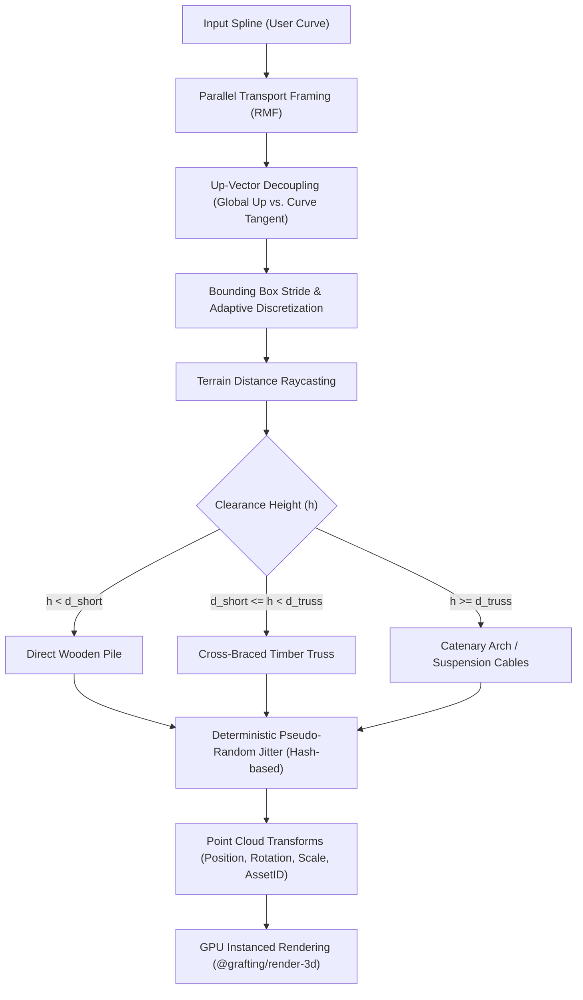
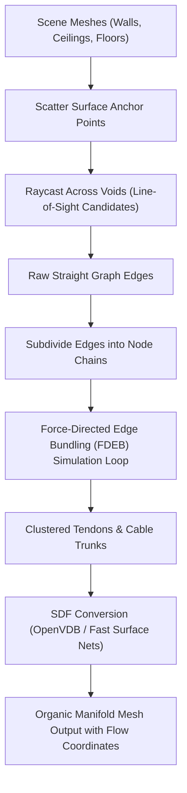
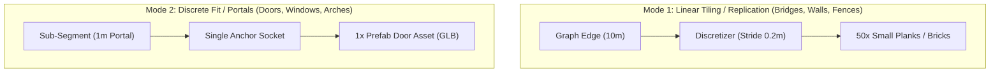
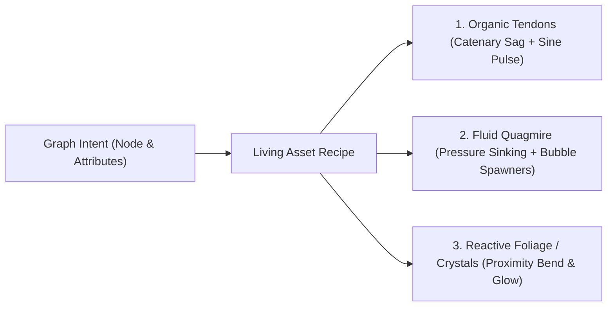
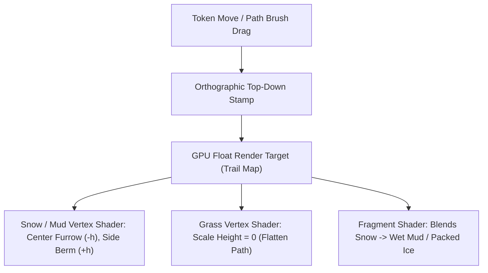

# VTT Procedural Tech Art Patterns: Deconstructing Julian Bragagna's Workflows (Project Skylark & Project GROT)

- **Research Date:** 2026-09-26
- **Status:** Reference only — Architectural & Algorithmic Pattern Guide
- **Source Prior Art:** Julian Bragagna ([@JooleanBoolean](https://www.youtube.com/@JooleanBoolean), Technical Artist at Cloud Imperium Games, formerly SideFX contributor)
  - *Project Skylark* (Procedural Wooden & Stone Bridges, Pathways, Modular Fences, Adaptive Scatter)
  - *Project GROT* (Procedural Flesh, Tendons, Ruin Erosion, Force-Directed Edge Bundling)
  - ArtStation Technical Breakdowns: [julianbragagna/blog](https://www.artstation.com/julianbragagna)
- **Target Application:** Grafting Monorepo VTT Construction Engine
  - `libs/graph/core` (Canonical Rust Graph Engine)
  - `libs/domains/procgen/discretize` (Spline Discretization & Framing)
  - `libs/domains/procgen/surface-mesh` (Procedural Meshing & Lofting)
  - `packages/render-3d` (Chunked Instanced Rendering Engine)
  - `apps/vtt` & `apps/architecture-studio` (Interactive Construction Brushes)
- **Related Normative References:** `GRAFTING_MASTER_SOURCE.md` (§0), DEC-049 (Autonomy & Isolation), DEC-051 / ADR-0013 (Rust Graph Core), DEC-052 / ADR-0014 (Neutral Capabilities), DEC-060 / ADR-0022 (Node-Graph Surface Representation), `docs/architecture/vtt-map-construction-roadmap.md`.

---

## 1. Executive Summary & The Convergence of Ideas

In building the initial prototypes for Grafting's VTT in Architecture Studio (`/lab`), an intuitive structural decomposition emerged:
1. **The Generation Graph:** The topological skeleton defining *where* structures exist.
2. **The Surface / Mesh ("Camada de Efeito"):** A neutral parameter-driven effect layer shaping geometric envelopes.
3. **The Asset Layer:** Instanced, high-fidelity visual representations filling that geometry.

This intuition matches the exact procedural paradigm developed by elite technical artists in the game and VFX industries. Specifically, the workflows popularized by Julian Bragagna in SideFX's **Project Skylark** and **Project GROT** offer battle-tested solutions to the exact technical hurdles faced by real-time tabletop and map editors:
* **Anti-Pattern:** Generating heavy, monolithic boolean meshes at runtime whenever the user clicks to place a bridge, wall, or organic web. This destroys frame rates, makes serialization brittle, and wastes memory.
* **Pro-Pattern:** Decoupling the input into a **lightweight topological curve/graph**, running **deterministic mathematical discretization**, evaluating **spatial raycasts against the environment**, and emitting **Point Cloud Transforms (matrices + asset IDs)** for high-efficiency GPU instancing.

This document dissects Julian Bragagna's two core technical projects and provides the concrete mathematical and architectural formulas needed to implement them natively within Grafting's Rust core and WebGL/WebGPU renderers.

---

## 2. Project Skylark: Infrastructure, Bridges & Pathways

*Project Skylark* addresses hard-surface, modular infrastructure built over arbitrary 3D terrain. A user draws a single 3D spline across a canyon, and the procedural engine resolves decks, railings, adaptive vertical pillars, trusses, and hardware fasteners.



### 2.1 The Framing Dilemma: Frenet-Serret vs. Rotation Minimizing Frames (RMF)

When extruding geometry or aligning modular planks along a 3D curve $\mathbf{C}(u)$, the standard Frenet-Serret frame:
$$\mathbf{T}(u) = \frac{\mathbf{C}'(u)}{\|\mathbf{C}'(u)\|}, \quad \mathbf{N}(u) = \frac{\mathbf{T}'(u)}{\|\mathbf{T}'(u)\|}, \quad \mathbf{B}(u) = \mathbf{T}(u) \times \mathbf{N}(u)$$
is fatal for road and bridge generation. At inflection points where curvature $\kappa \to 0$, $\mathbf{N}(u)$ flips instantaneously by $180^\circ$, causing bridge decks and railings to twist and turn inside out.

#### The Skylark Solution: Parallel Transport / Bishop Frame
Skylark utilizes **Rotation Minimizing Frames (RMF)** (also known as the Bishop frame or Parallel Transport):
1. Compute the tangent $\mathbf{T}_0$ at the curve start and choose an initial reference normal $\mathbf{R}_0 \perp \mathbf{T}_0$.
2. For each step $i$ along the discretized curve, compute the reflection or incremental rotation that maps $\mathbf{T}_i$ to $\mathbf{T}_{i+1}$ around the binormal axis $\mathbf{T}_i \times \mathbf{T}_{i+1}$:
$$\mathbf{R}_{i+1} = \mathbf{R}_i - \frac{2}{\|\mathbf{v}_i\|^2} \langle \mathbf{v}_i, \mathbf{R}_i \rangle \mathbf{v}_i, \quad \text{where } \mathbf{v}_i = (\mathbf{C}_{i+1} - \mathbf{C}_i) + \|\mathbf{C}_{i+1} - \mathbf{C}_i\| \mathbf{T}_i$$
This guarantees continuous, twist-free orientation across straight lines, vertical loops, and sharp curves.

### 2.2 Up-Vector Decoupling (Gravity vs. Trajectory)

A classic flaw in naive bridge generators is aligning the vertical support pillars with the curve's local normal $\mathbf{N}$. When a bridge climbs a steep slope, the pillars lean forward, defying gravity.

Julian's decoupling rule:
* **Longitudinal Components (Decks, Planks, Ropes, Rails):** Oriented along the curve frame $[\mathbf{T}, \mathbf{R}, \mathbf{S}]$.
* **Gravitational Components (Posts, Vertical Pilings, Foundation Footings):**
  * The vertical axis is strictly locked to world up: $\mathbf{Y}_{\text{pillar}} = (0, 1, 0)$.
  * The facing direction $\mathbf{Z}_{\text{pillar}}$ is projected onto the horizontal ground plane:
    $$\mathbf{Z}_{\text{pillar}} = \text{normalize}\left(\mathbf{T} - \langle \mathbf{T}, \mathbf{Y}_{\text{world}} \rangle \mathbf{Y}_{\text{world}}\right)$$
  * The lateral axis is derived via cross-product: $\mathbf{X}_{\text{pillar}} = \mathbf{Y}_{\text{pillar}} \times \mathbf{Z}_{\text{pillar}}$.

### 2.3 Adaptive Terrain Raycasting & Conditional Structural Topologies

Instead of treating bridges as static templates, the substructure dynamically adapts to the underlying topography using vertical raycasts:
At each structural node $x_i$ along the bridge:
1. Cast a ray downward from the deck: $\mathbf{r}(t) = \mathbf{P}_i - t \cdot (0, 1, 0)$.
2. Detect the intersection distance $h_i = \|\mathbf{P}_i - \mathbf{P}_{\text{ground}}\|$.
3. **Branching Grammar:**
   * **Case A: Ground Contact ($h_i < \epsilon$):** Place stone abutment / ramp transition module.
   * **Case B: Shallow Clearance ($h_i < d_{\text{short}}$):** Single vertical log or post.
   * **Case C: Medium Ravine ($d_{\text{short}} \le h_i < d_{\text{truss}}$):** Vertical pair of posts braced with diagonal cross-timbers ($X$-braces) stacked in increments of module height $H_{\text{brace}}$.
   * **Case D: Deep Abyss / Bottomless ($h_i \ge d_{\text{truss}}$ or no hit):** Pillar generation is suppressed; the system switches to an **undercarriage arch truss** or **suspension catenary ropes** anchored only at the abutments.

### 2.4 Bounding-Box Modular Discretization (Zero-Stretch)

Rather than stretching 3D meshes (which causes distorted wood textures and warped nails), Skylark measures the exact Axis-Aligned Bounding Box (AABB) of the modular asset:
* Asset Length: $L_{\text{plank}}$, Desired Gap: $G$.
* Total Stride: $S = L_{\text{plank}} + G$.
* If the curve total length is $L_{\text{total}}$, the number of integer planks is $N = \lfloor L_{\text{total}} / S \rfloor$.
* The remainder length $R = L_{\text{total}} - (N \cdot S)$ is distributed uniformly as an adjustment $\Delta G = R / N$ to the gap, keeping the geometry completely unscaled while preventing fractional seams.

### 2.5 Deterministic Pseudo-Random Jitter (Hash-based `@id`)

To give hand-crafted, weathered charm to procedural wood:
* Never use stateful or unseeded `rand()`.
* Every discretized plank has a persistent integer `id` based on its graph topological coordinate.
* Run a MurmurHash3 or FNV-1a hash over `(seed, id)` to derive normalized floats in $[-1.0, 1.0]$:
  * $\Delta \theta_y$ (yaw jitter): $\pm 1.5^\circ$ (crooked boards).
  * $\Delta \theta_z$ (pitch jitter): $\pm 0.8^\circ$ (uneven settlement).
  * $\Delta z$ (lateral shift): $\pm 3\text{cm}$ (staggered plank edges).
  * Boolean drop chance: If $\text{hash}(id, \text{hole}) > 0.98$, omit the board entirely (rotted/missing plank).

---

## 3. Project GROT: Organic Networks, Tendons & Edge Bundling

*Project GROT* demonstrates the opposite end of the procedural spectrum: soft, fleshy, fungal, or web-like structures spanning alien caverns or gothic dungeons.



### 3.1 Surface-to-Surface Anchor Raycasting

To generate webbing, vines, or fleshy sinews across rooms:
1. Distribute seed points $P_A$ across high-curvature or ceiling surfaces (using Poisson disk sampling).
2. Disperse random directional rays into the negative space: $\mathbf{d} \sim \mathcal{S}^2$.
3. Raycast against opposing walls/floors to find hit points $P_B$.
4. Validate candidates based on maximum tension length $L_{\text{max}}$ and line-of-sight clearance. This produces a set of straight edges $E = \{(P_A, P_B)\}$.

### 3.2 Force-Directed Edge Bundling (FDEB) Algorithm

Straight edges spanning a room look artificial and rigid. In biology, muscle fibers, veins, tree roots, and spiderwebs merge into unified structural trunks before branching out.

Julian implements **Force-Directed Edge Bundling**:
1. Discretize each edge $e \in E$ into $K$ internal points: $\mathbf{p}_{e, 0}, \mathbf{p}_{e, 1}, \dots, \mathbf{p}_{e, K-1}$.
2. In each iteration of the relaxation loop, compute two competing forces for each point $\mathbf{p}_{e, i}$:
   * **Spring Force (Elastic Continuity):** Pulls the point toward its neighbors along the same edge to prevent tearing:
     $$\mathbf{F}_{\text{spring}} = k_s \left( (\mathbf{p}_{e, i-1} - \mathbf{p}_{e, i}) + (\mathbf{p}_{e, i+1} - \mathbf{p}_{e, i}) \right)$$
   * **Electrostatic Attraction (Bundling Force):** Points on neighboring edges pull each other closer if the edges are mutually compatible (similar direction and proximity):
     $$\mathbf{F}_{\text{attract}} = \sum_{e' \neq e} \frac{C(e, e')}{\|\mathbf{p}_{e, i} - \mathbf{p}_{e', i}\|^2 + \epsilon} \cdot \frac{\mathbf{p}_{e', i} - \mathbf{p}_{e, i}}{\|\mathbf{p}_{e', i} - \mathbf{p}_{e, i}\|}$$
3. Compatibility factor $C(e, e') \in [0, 1]$ prevents bundling of opposing or perpendicular paths:
   $$C(e, e') = C_{\text{angle}} \times C_{\text{scale}} \times C_{\text{position}} \times C_{\text{visibility}}$$
   where $C_{\text{angle}} = |\langle \mathbf{T}_e, \mathbf{T}_{e'} \rangle|$.
4. Update positions using damped integration: $\mathbf{p}_{e, i} \leftarrow \mathbf{p}_{e, i} + \Delta t (\mathbf{F}_{\text{spring}} + \mathbf{F}_{\text{attract}})$.

#### Why This is Domain-Neutral in Grafting Monorepo
Per `AGENTS.md` and DEC-049/DEC-051: *Never name or couple code to a single consumer.*
**Edge Bundling is not "flesh code".** It is a pure graph topology algorithm:
* When applied to biological anchors $\rightarrow$ **Fleshy webs, sinews, alien tendrils**.
* When applied to river runoff networks $\rightarrow$ **River confluence and stream deltas**.
* When applied to player movement history / pathfinding desire lines $\rightarrow$ **Eroded footpaths converging onto paved roads**.
* When applied to city infrastructure $\rightarrow$ **High-voltage overhead wire bundling and highway corridors**.

It belongs strictly in `libs/graph/core` as a generic topological relaxation pass.

### 3.3 Implicit Volume Surfacing (SDF)

Once bundled curves are settled:
1. Assign a thickness radius $r(i)$ along each curve (thick at the bundled center trunk, tapering toward endpoints).
2. Evaluate a Signed Distance Field (SDF) around the curve primitives:
   $$\Phi(\mathbf{x}) = \min_{e, i} \left( \|\mathbf{x} - \text{segment}(\mathbf{p}_{e, i}, \mathbf{p}_{e, i+1})\| - r(i) \right)$$
3. Blend overlapping fields with smooth minimum ($\text{smin}$):
   $$\text{smin}(a, b, k) = -k \cdot \ln\left( e^{-a/k} + e^{-b/k} \right)$$
4. Extract the polygonal isosurface using `Fast Surface Nets` or `Marching Cubes`.

---

## 4. Integration Blueprint for Grafting Monorepo

Here is how these techniques map directly to the four existing layers of Grafting's VTT architecture (`vtt-map-construction-roadmap.md` & `ADR-0022`):

| Layer | Monorepo Crate / Package | Role & Responsibility in this Pattern |
| :--- | :--- | :--- |
| **1. Topology / Graph** | `libs/graph/core` | Stores `NodeId` cycles and edge graphs. Houses the generic **Edge Bundling** relaxation solver and cycle traversal. Has zero knowledge of wood, flesh, or textures. |
| **2. ProcGen & Discretization** | `libs/domains/procgen/discretize` | Takes splines and node cycles; executes **Rotation Minimizing Frames (RMF)**, up-vector decoupling, modular bounding-box strides, and deterministic hash jittering. |
| **3. Surface & Meshing** | `libs/domains/procgen/surface-mesh` | Handles continuous surfaces (curved roads, organic volume skinning, SDF meshing) when geometry cannot be represented by discrete instanced assets. |
| **4. Render & Spatial State** | `packages/render-3d` | Receives chunked buffers of **Instanced Point Transforms** (`Matrix4x4` + `AssetId`) via WASM, rendering thousands of planks, posts, nails, and rocks in single draw calls. |
| **5. Studio UI & Brushes** | `apps/architecture-studio` (`/lab`) & `apps/vtt` | Exposes intuitive brushes (e.g., "Bridge Tool", "Path Tool", "Webbing Tool") where the DM clicks two points and the procedural pipeline handles the rest. |

---

## 5. Algorithmic Code Blueprints (Rust)

### Blueprint A: Parallel Transport Frame (Rotation Minimizing Frame)

Located in: `libs/domains/procgen/discretize/src/framing.rs`

```rust
use glam::{DQuat, DVec3};

#[derive(Debug, Clone, Copy)]
pub struct OrientedFrame {
    pub position: DVec3,
    pub tangent: DVec3,
    pub normal: DVec3,
    pub binormal: DVec3,
}

/// Computes Rotation Minimizing Frames (RMF) along a sequence of 3D sample points.
/// Eliminates the gimbal-lock and 180-degree flip artifacts of Frenet-Serret.
pub fn compute_rotation_minimizing_frames(points: &[DVec3], initial_up: DVec3) -> Vec<OrientedFrame> {
    let n = points.len();
    if n < 2 {
        return Vec::new();
    }

    let mut frames = Vec::with_capacity(n);

    // 1. Initialize first frame
    let t0 = (points[1] - points[0]).normalize();
    let mut r0 = initial_up - t0 * initial_up.dot(t0);
    if r0.length_squared() < 1e-6 {
        // Fallback if initial_up is parallel to tangent
        r0 = DVec3::X - t0 * DVec3::X.dot(t0);
    }
    let r0 = r0.normalize();
    let s0 = t0.cross(r0).normalize();

    frames.push(OrientedFrame {
        position: points[0],
        tangent: t0,
        normal: r0,
        binormal: s0,
    });

    // 2. Propagate along curve using double reflection method (Wang et al. 2008)
    for i in 0..(n - 1) {
        let p_i = points[i];
        let p_next = points[i + 1];
        let t_i = frames[i].tangent;
        let r_i = frames[i].normal;

        let v1 = p_next - p_i;
        let c1 = v1.dot(v1);

        // Reflection 1: Reflect across plane bisecting p_i and p_next
        let r_i_reflected = r_i - (2.0 / c1) * v1.dot(r_i) * v1;
        let t_i_reflected = t_i - (2.0 / c1) * v1.dot(t_i) * v1;

        // Tangent at p_next
        let t_next = if i + 2 < n {
            (points[i + 2] - p_next).normalize()
        } else {
            (p_next - p_i).normalize()
        };

        let v2 = t_next - t_i_reflected;
        let c2 = v2.dot(v2);

        // Reflection 2: Align reflected tangent with t_next
        let r_next = if c2 > 1e-8 {
            (r_i_reflected - (2.0 / c2) * v2.dot(r_i_reflected) * v2).normalize()
        } else {
            r_i_reflected.normalize()
        };

        let s_next = t_next.cross(r_next).normalize();

        frames.push(OrientedFrame {
            position: p_next,
            tangent: t_next,
            normal: r_next,
            binormal: s_next,
        });
    }

    frames
}
```

### Blueprint B: Deterministic Hash Jitter (Zero-State Procgen)

Located in: `libs/domains/procgen/discretize/src/jitter.rs`

```rust
/// Computes a stable float in [min, max] using 64-bit integer hashing.
/// Guarantees that moving plank #4 does not alter the random jitter of plank #5.
#[inline]
pub fn deterministic_hash_range(seed: u64, id: u64, salt: u32, min: f64, max: f64) -> f64 {
    let mut h = seed ^ (id.rotate_left(17)) ^ ((salt as u64).rotate_left(32));
    h ^= h >> 33;
    h = h.wrapping_mul(0xff51afd7ed558ccd);
    h ^= h >> 33;
    h = h.wrapping_mul(0xc4ceb9fe1a85ec53);
    h ^= h >> 33;

    let normalized = (h as f64) / (u64::MAX as f64);
    min + normalized * (max - min)
}
```

### Blueprint C: Force-Directed Edge Bundling Step

Located in: `libs/graph/core/src/algorithms/edge_bundling.rs`

```rust
use glam::DVec3;

#[derive(Clone, Debug)]
pub struct BundledEdge {
    pub points: Vec<DVec3>,
}

/// Executes one relaxation iteration over a set of discretized curve edges.
pub fn step_edge_bundling(
    edges: &mut [BundledEdge],
    spring_k: f64,
    attraction_c: f64,
    dt: f64,
) {
    let num_edges = edges.len();
    if num_edges < 2 {
        return;
    }

    let sub_divisions = edges[0].points.len();
    let mut forces: Vec<Vec<DVec3>> = vec![vec![DVec3::ZERO; sub_divisions]; num_edges];

    for e_idx in 0..num_edges {
        for p_idx in 1..(sub_divisions - 1) {
            let p = edges[e_idx].points[p_idx];
            let p_prev = edges[e_idx].points[p_idx - 1];
            let p_next = edges[e_idx].points[p_idx + 1];

            // 1. Spring Force (Elastic tension between adjacent nodes on the same curve)
            let f_spring = spring_k * ((p_prev - p) + (p_next - p));

            // 2. Attraction Force from compatible edges
            let mut f_attract = DVec3::ZERO;
            for other_idx in 0..num_edges {
                if other_idx == e_idx {
                    continue;
                }
                let other_p = edges[other_idx].points[p_idx];
                let delta = other_p - p;
                let dist = delta.length();
                if dist > 1e-4 && dist < 5.0 {
                    // Force inversely proportional to distance
                    f_attract += delta.normalize() * (attraction_c / (dist + 0.1));
                }
            }

            forces[e_idx][p_idx] = f_spring + f_attract;
        }
    }

    // Apply forces (preserving endpoints)
    for e_idx in 0..num_edges {
        for p_idx in 1..(sub_divisions - 1) {
            edges[e_idx].points[p_idx] += forces[e_idx][p_idx] * dt;
        }
    }
}
```

---

## 6. Summary of Actionable Takeaways for VTT Map Construction

1. **Shift Focus to Transform Payloads:** The VTT should never send thousands of raw triangle vertices across the WASM bridge for modular assets. It must send compact `InstancedTransform` arrays ($[x, y, z, q_x, q_y, q_z, q_w, s_x, s_y, s_z, \text{asset\_id}]$).
2. **Standardize on RMF in `discretize`:** Replace any naive tangent/normal sampling in curve discretization with Parallel Transport / Rotation Minimizing Frames.
3. **Decouple Gravity from Trajectory:** Always enforce that structural supports (bridge pilings, fence posts, stair risers) project to world up (`0, 1, 0`) while decking adheres to curve tangent.
4. **Generalize Edge Bundling in `graph-core`:** Treat Julian's "Procedural Flesh" as a generic graph bundling pass. Reuse it for river deltas, pathway desire lines, tree root systems, and dungeon web hazards without duplicating code across domains.

---

## 7. The Socket Architecture: Tiling Replication vs. Discrete Fit (The Door Case Study)

A foundational architectural question is: *Do downstream layers remain graphs, and how do pre-authored assets like doors, windows, and props fit into this procedural pipeline?*

Downstream layers **do not** remain graphs. The Graph exists strictly in **Layer 1** as the topological authority. The intermediate product emitted by Layer 2 is a **Flat Socket Stream** (spatial bounding frames and alignment matrices).



### 7.1 How a Door Enters the Graph
When the user places a door on a wall connecting Node $A$ and Node $B$:
1. **Topological Split:** The graph performs an edge subdivision, inserting two portal nodes:
   $$A \xrightarrow[\text{Wall Segment}]{2.5\text{m}} P_1 \xlongequal[\text{Portal / Opening}]{1.0\text{m}} P_2 \xrightarrow[\text{Wall Segment}]{2.5\text{m}} B$$
2. **Discretizer Output:**
   * $A \to P_1$ and $P_2 \to B$ emit arrays of repeating brick/timber wall instances.
   * $P_1 \to P_2$ emits a single `PortalSocket`:
     ```rust
     pub struct PortalSocket {
         pub transform: DMat4,
         pub opening_width: f64,
         pub opening_height: f64,
         pub socket_type: PortalType, // Door, Window, Arch
     }
     ```
3. **Asset Binding & VTT Behavior:**
   The asset manager resolves `socket_type` to a prefab model (`wooden_door_dungeon.glb`). Beyond visual rendering, the door instance binds VTT behavioral traits:
   * Dynamic collision boundary.
   * Dynamic line-of-sight / vision occlusion blocker (toggled by `is_open: bool` to update Fog of War in real time).

---

## 8. Open-Source Algorithmic References & Implementations Catalog

To avoid hand-rolling every equation from scratch, the following open-source implementations, papers, and libraries serve as canonical references:

### 8.1 Rotation Minimizing Frames (RMF / Parallel Transport)
* **Canonical Paper:** Wang, W., Jüttler, B., Zheng, D., & Liu, Y. (2008). *"Computation of Rotation Minimizing Frames."* ACM Transactions on Graphics (TOG), 27(1), 1-18. (The double reflection method implemented in Blueprint A).
* **Rust Reference Implementation:** `glam` / `ultraviolet` vector math routines combined with the curve discretizer in `libs/domains/procgen/discretize`.
* **Three.js / Web Reference:** `THREE.TubeGeometry` / `THREE.Curve.computeFrenetFrames` (examine how Bishop frames are propagated to prevent singular flips).

### 8.2 Force-Directed Edge Bundling (FDEB)
* **Canonical Paper:** Holten, D., & van Wijk, J. J. (2009). *"Force-Directed Edge Bundling for Graph Visualization."* Computer Graphics Forum, 28(3), 983-990.
* **C++ / Web Implementations:**
  * D3.js: `d3-hierarchy` (Hierarchical Edge Bundling using B-spline controls).
  * WebGL Edge Bundling: [upphiminn/d3.ForceBundle](https://github.com/upphiminn/d3.ForceBundle) (JavaScript implementation of Holten's FDEB algorithm).
* **Rust Graph Port:** `petgraph` combined with the relaxation step provided in Blueprint C (`libs/graph/core/src/algorithms/edge_bundling.rs`).

### 8.3 Spatial Raycasting & Terrain Conformance
* **Rust Spatial Acceleration:**
  * **`parry3d`** (Dimforge / Rapier ecosystem): The industry-standard Rust crate for BVH acceleration, ray-mesh queries, and point projection.
  * **`bvh`** crate: Fast, lightweight pure-Rust Bounding Volume Hierarchy for ray-triangle intersection over heightmaps.
* **JavaScript / WebGL Acceleration:**
  * **`three-mesh-bvh`** (Gareth Cross): High-performance BVH for Three.js, executing thousands of raycasts per frame in the browser for live brush previews.

### 8.4 Official SideFX & Julian Bragagna Projects (Free Downloads)
* **Project Skylark (Bridges, Pathways & Fences):**
  * Official learning repository: [SideFX Tech Demos: Project Skylark](https://www.sidefx.com/learn-main-menu/tech-demos/project-skylark/)
  * Complete `.hip` project files, VEX snippets, and modular bridge HDA networks.
* **Project GROT (Procedural Flesh, Tendons & Ruins):**
  * Official tutorial series: [SideFX Learning Library: Project GROT Procedural Flesh](https://www.sidefx.com/tutorials/project-grot-procedural-flesh/)
  * Includes the original raycast distribution graph, curve bundling VEX solver, and VDB volume skinning setups.

---

## 9. Living & Reactive Terrain Assets ("Assets Vivos")

Rather than treating terrain as static geometry with painted textures, "Living Assets" are parametric behavioral recipes that adapt to topology and player presence:



1. **Organic / Physiological (Carne & Tendons):**
   * **Graph State:** Stores topological anchors and abstract fields: `{ "surface_intent": "corrupted_flesh", "activity_level": 0.8 }`.
   * **Asset Behavior:** Curves stretch between anchors, droop under simulated gravity, and evaluate a periodic sine shader ($\sin(t \cdot \omega)$) for rhythmic blood-pulsing or bioluminescence.
2. **Fluid / Reactive (Lamaçal & Pântanos):**
   * **Graph State:** Declares fluid intent: `{ "surface_intent": "quagmire", "viscosity": 0.9 }`.
   * **Asset Behavior:** Local surface depression based on token weight, periodic procedural gas-bubble emitters at nodes, and ephemeral slime strands connecting feet to ground.
3. **Crystalline & Foliage (Grama e Cristais Reativos):**
   * **Graph State:** Declares density: `{ "density": 0.7, "resonance": 1.0 }`.
   * **Asset Behavior:** Instanced meshes that align to surface normals and bend away from token colliders in vertex shaders, or brighten their emissive intensity as tokens approach.

---

## 10. Dynamic Path Cutting & Terrain Furrows (The Unified GPU Trail Mask)

The classic effect of cutting a trench through deep snow, leaving muddy ruts, or opening a path through tall grass (*Tiny Glade* / *Red Dead Redemption 2*) relies on an orthographic **Trail Mask Render Target**:



### 10.1 The Dual-Impulse Stamp (Furrow + Berm)
A naive depression looks unnatural. Real snow/mud displacement conserves mass through a dual-impulse stamp:
* **Center Trench:** Negative offset ($-1.0 \times \Delta h$) pushing vertices down into the furrow.
* **Lateral Berms:** Positive offset ($+0.3 \times \Delta h$) pushing vertices up on the outer edges, creating the snow mound pushed aside by movement.

### 10.2 Foliage Trampling & Clearing
The same trail texture drives foliage suppression:
$$\mathbf{Scale}_{\text{grass}}.y = \mathbf{Scale}_{\text{base}}.y \times (1.0 - \text{TrailValue})$$
This cleanly opens a walkable path through tall grass or crops without recomputing instanced geometries.

---

## 11. Core Architectural Distillations for Grafting Monorepo

To prevent architectural bloat, all findings from this research distill into three concrete operational rules:

1. **The Single GPU Trail Mask (One Mechanism for Five Effects):**
   Implement a single orthographic Render Target in `packages/render-3d`. It universally powers:
   * Snow furrows and footsteps.
   * Path cutting through tall grass.
   * Mud tracks and quagmire displacement.
   * Blood splatters and acid trails.
   * Trampled foliage bending.
2. **The Permanent vs. Ephemeral Boundary:**
   * **Permanent Data $\rightarrow$ Graph (`libs/graph/core`):** Walls, bridges, roads, door sockets, and topological cycles. This is the only state persisted to disk and synchronized over WebSockets.
   * **Ephemeral Data $\rightarrow$ GPU Buffer (`packages/render-3d`):** Snow trenches, footprints, blade bending, and fluid ripples. This never pollutes graph state and runs purely in 60 FPS framebuffers.
3. **Math-Driven Shaders over Rigid Physics:**
   Never attach heavy collision dynamics or CPU physics engines (Rapier/PhysX) to foliage blades, snow particles, or bridge planks. Vertex and fragment shaders driven by simple math (RMF frames, sine pulses, and displacement masks) deliver identical visual fidelity at zero CPU cost.


