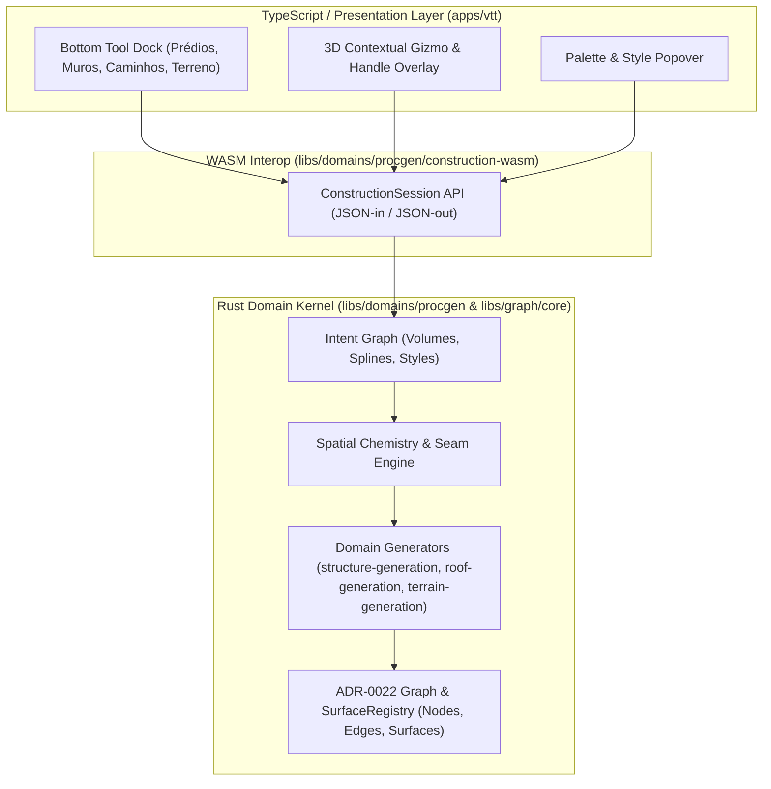

# VTT Reactive Construction and Tiny Glade-Inspired UI Interaction Model

- **Date:** 2026-08-16
- **Status:** Architectural Research & Interaction Blueprint (In-depth reference)
- **Author/Context:** Owner-directed research on adapting the construction UX, contextual gizmos, bottom toolbar, and procedural chemistry of *Tiny Glade* into Grafting Monorepo's VTT editor.
- **Related Documents:**
  - `docs/research/vtt-tiny-glade-open-source-ecosystem.md`
  - `docs/research/vtt-board-construction-mode-ui-references.md`
  - `docs/research/vtt-world-model-and-grid-layers.md`
  - `docs/adr/ADR-0022-wall-representation-free-geometry.md` (DEC-060)

---

## 1. Executive Summary & Product Vision

This document details the complete interaction and construction architecture inspired by *Tiny Glade*, breaking down its **multi-layered UI, contextual 3D handles (gizmos), material palettes, and procedural reaction matrix ("construction chemistry")**.

### Owner's Strategic Vision & Core Deviations

1. **Strong Inspiration without Cloning:** We adopt the frictionless, gridless, and joyful interaction paradigm of *Tiny Glade*, but map it directly to our authoritative Rust/WASM graph core (`grafting-graph-core` / `ADR-0022`).
2. **First-Class Procedural Terrain:** While *Tiny Glade* focuses primarily on micro-castles and cottages over a static/locally deformed heightfield, our VTT treats **Terrain as a first-class, procedurally generated and editable domain** (`terrain-generation`, `PrismGridMesh`, `discretize`, `fast-surface-nets-rs`). Both terrain and structures coexist seamlessly as editable surfaces and nodes.
3. **Clarification on Water vs. Foliage:**
   - **In *Tiny Glade*:** Water is generated through the **Terrain & Water category** (lowering the terrain level below the water table or using the dedicated pond/river brush).
   - **Vegetation is a reactive consumer:** Flora (reeds, cattails, water lilies, algae, moss) and fauna (ducklings) spawn automatically along shorelines and water surfaces as a procedural dressing layer, rather than requiring manual placement under the foliage tool.

---

## 2. Layer 1: The Bottom Toolbar (Verbs of Construction)

The bottom toolbar is a minimalist, centered action dock housing the primary construction verbs.

```text
 ┌─────────────────────────────────────────────────────────────────────────────────┐
 │ [🏠 Building] [🧱 Wall] [🚪 Openings] [🪜 Stairs] [🛤️ Path] [🌲 Foliage] [🎨 Palette] [🔨 Demolish] │
 └─────────────────────────────────────────────────────────────────────────────────┘
```

### Detailed Tool Specification

| Tool Category | Sub-tools / Modes | Generative Behavior on Click / Drag |
| :--- | :--- | :--- |
| **1. Buildings & Towers** | • Rectangular Volume<br>• Cylindrical Tower | Click-drag on ground sets footprint ($X, Z$); release extrudes height ($Y$). Intersecting an existing building automatically merges footprints and creates a unified roof. |
| **2. Freeform Walls & Fences** | • Straight Line<br>• Bezier Curve | Draws wall centerlines. If height is dragged below threshold ($\approx 1.2m$), it automatically transitions into a stone parapet, balustrade, or wooden picket fence. |
| **3. Openings** | • Single Window<br>• Double / Ornate Window<br>• Arched / Rustic Door | Clicking on a wall surface projects a cutout. The engine synthesizes lintels, sills, and masonry surrounds around the opening. |
| **4. Stairs** | • Stone Steps<br>• Timber Staircase | Snaps between two different elevations (e.g., ground to raised door, or lower terrace to upper cliff). |
| **5. Paths & Pavements** | • Dirt Track<br>• Cobblestone Path | The most reactive tool: draws a ground spline. Crossing a wall creates an archway/gate; passing through high grass flattens the vegetation; reaching a ledge spawns steps. |
| **6. Terrain & Water** | • Elevate / Lower<br>• Plateau / Flatten<br>• Pond / River Basin | Deforms the heightfield or scalar field. Carving deep pockets exposes the water plane and spawns shoreline stones and wet sand. |
| **7. Foliage & Dressing** | • Trees (Broadleaf, Pine)<br>• Flower Clusters<br>• Wall Ivy & Lanterns | Scatter brushes that apply decor without obstructing pathways, doors, or windows. |
| **8. Style & Palette** | • Seasonal Themes<br>• Material Sets (Stone/Wood/Tile) | Opens contextual styling popovers on selected structures. |
| **9. Demolish (Hammer)** | • Element Eraser | Removes selected building components or restores terrain to natural state. |

---

## 3. Layer 2: Contextual 3D Direct Manipulation (Handles & Gizmos)

When hovering over an entity or entering edit mode (Right-Click / Advanced Mode), **contextual 3D handles** appear directly on the geometry.

```text
                      ▲ [Roof Pitch Handle (Height)]
                     ╱█╲
                    ╱ █ ╲
      [Eaves Handle]◄─────► [Eaves Handle (Overhang)]
                   ┌─────┐
     ▲ [Wall       │ [J] │   ▲ [Window Vertical Scale]
     │  Height     │     │   ▼
     ▼  Handle]    └─────┘
                   ◄─────► [Footprint Width/Depth Handle]
```

### Handle Mechanics by Structure Type

#### A. Buildings, Houses & Towers
1. **Roof Apex Handle:** Dragging vertically modifies roof pitch ($\theta$); dragging all the way down flattens the roof into a crenelated parapet or walkout terrace.
2. **Eaves / Overhang Handle:** Dragging horizontally pulls roof edges outward over facades or pulls them flush into a gable wall.
3. **Wall Height Handle:** Adds/removes vertical stories; lowering completely converts the building into an open foundation or walled courtyard.
4. **Stilt / Elevation Handle:** Lifting the entire building off the ground automatically derives **supporting wooden stilts, brick piers, or stone arches** underneath.
5. **Tower Radius Handle:** Pulling radially expands/shrinks the tower cylinder while maintaining procedural shingle distribution.

#### B. Windows & Doors
1. **Vertical Scale Handle:** Pulling upwards smoothly transitions a slit window into a tall mullioned arch or church stained-glass window.
2. **Free Translation:** Moving the opening along the wall slides it with instant real-time lintel regeneration; placing two windows in close proximity **merges them into a combined bay window**.

#### C. Freeform Walls
1. **Midpoint Curvature Handle:** Dragging curve tangents bends straight walls into organic arcs.
2. **Cycle Closure:** Snapping a wall endpoint back to its origin automatically seals the loop, generating a roof and converting the enclosure into a room.

---

## 4. Layer 3: Contextual Style, Material & Color Popovers

Selecting an object with the **Palette Tool (🎨)** summons a floating popover inspector directly above the target piece:

```text
   ┌────────────────────────────────────────┐
   │ 🎨 Structure Styling Inspector         │
   ├────────────────────────────────────────┤
   │ Wall Material:                         │
   │  [🪨 Rubble Stone] [🧱 Brick] [🪵 Timber]│
   │                                        │
   │ Roof Tone:                             │
   │  [🔴 Terracotta] [🔵 Slate] [🟢 Mossy] │
   │                                        │
   │ Surface Embellishments:                │
   │  ☑️ Wall Ivy   ☑️ Window Flowerboxes   │
   │  ☑️ Corner Quoins / Timber Beams       │
   └────────────────────────────────────────┘
```

### Themed Harmonic Palettes
* Rather than unconstrained RGB color wheels (which risk jarring aesthetic clashes), customization is driven by **Harmonized Palettes**:
  - **Global Environment Theme:** Summer, Autumn, Winter, Forgotten / Olden.
  - **Material Stacking Rules:** Foundation (heavy stone) $\rightarrow$ Mid-level (plaster/brick) $\rightarrow$ Gable (exposed timber framing) $\rightarrow$ Roof (shingles/slate).

---

## 5. The "Construction Chemistry" Procedural Reaction Matrix

The hallmark of this architecture is declarative, emergent spatial reactions between coexisting entities:

| Entity A | Intersecting Entity B | Emergent Generative Reaction |
| :--- | :--- | :--- |
| **Path Spline** | **Wall Segment** | Carves an **Arched Gateway / Iron Portcullis**. |
| **Path Spline** | **Building Exterior** | Spawns a **Threshold Step and Entry Door**. |
| **Path Spline** | **Terrain Elevation Step** | Synthesizes **Stone Stair Steps**. |
| **Building A** | **Building B** | Merges boundary loops, drops interior wall, computes **interlocking hip/gable roof**. |
| **Building Volume** | **Air (Suspended Elevation)** | Generates **Under-structure Stilts / Vaulted Arches**. |
| **Wall Segment** | Height drops below $1.2m$ | Transforms into **Picket Fence / Low Drystone Wall**. |
| **Window Opening** | Positioned near roofline | Morphs into a **Gabled Dormer Window (*Mansarda*)**. |
| **Chimney Prop** | Placed on sloped roof | Extends masonry base to meet slope, starts particle smoke. |
| **Water Body** | **Terrain Shoreline** | Spawns **Pebbles, Wet Sand, Reeds, and Lily Pads**. |

---

## 6. Monorepo Integration Architecture (`grafting-graph-core` / `ADR-0022`)



### Data Pipeline Contracts:

1. **`IntentGraph` (Authoritative User Input):**
   - Stores purely high-level spatial intents: `BuildingIntent { footprint, height, roof_pitch, style }`, `PathIntent { points, width }`, `TerrainDeformIntent { center, radius, delta }`.
2. **`SpatialChemistry::evaluate(&IntentGraph)`:**
   - Computes 2D/3D intersections and topological adjacencies across domains.
   - Emits derived seam elements (`DoorOpening`, `Archway`, `WeldConstraint`).
3. **`ProcgenDerivation` (Isolated Rust Crates):**
   - `structure-generation`: Wall/door/opening meshes.
   - `roof-generation`: Straight-skeleton roof meshes with welded eaves.
   - `terrain-generation`: Quad/Prism cell surfaces.
4. **`ConstructionSession` (`ADR-0022` Compliance):**
   - Applies operations through `move_node`, `add_node`, `split_surface`, `duplicate_surface`, preserving node identity welding across sessions without destructive re-rolls.
